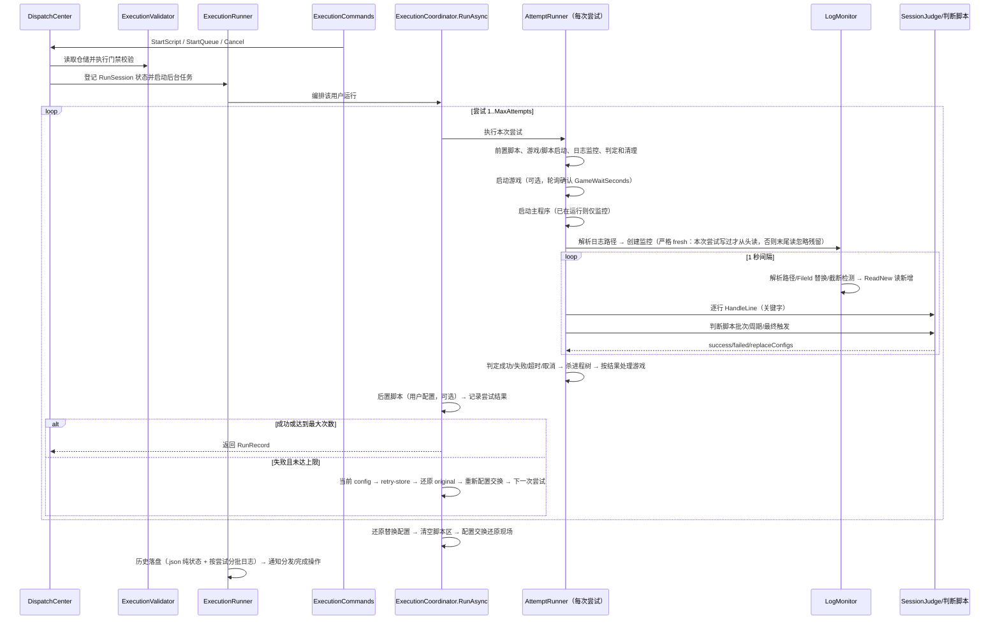
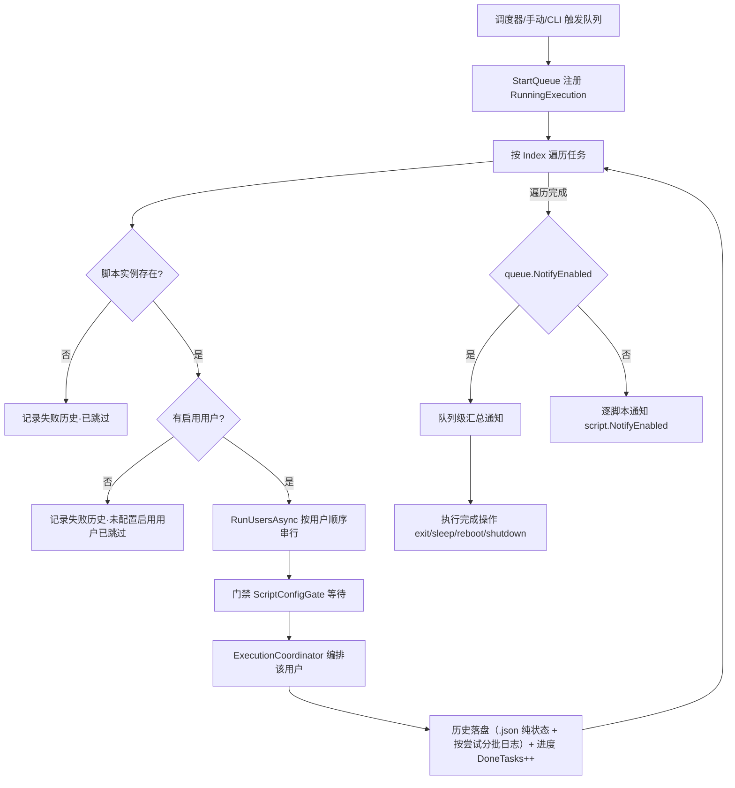
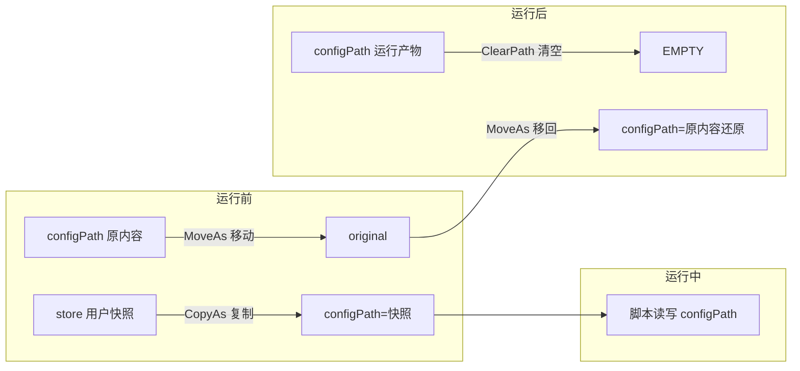
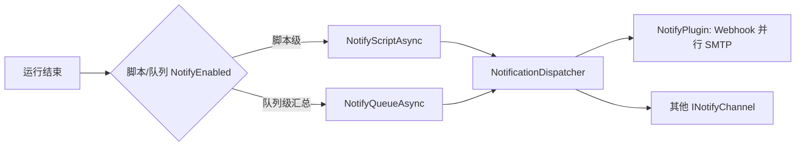

# NexusPipeline（枢链）核心设计说明

> 本文档解释 NexusPipeline 的**设计理念**与**核心功能运行的具体步骤**：机制为什么这样设计、运行时会发生什么。
> 开发者导航（模块边界/依赖方向/扩展落点）见 [ARCHITECTURE.md](ARCHITECTURE.md)；版本历史见 [CHANGELOG.md](../CHANGELOG.md)；用户操作说明见 [README.md](../README.md)。

---

## 目录

1. [设计理念](#1-设计理念)
2. [核心概念](#2-核心概念)
3. [核心运行流程](#3-核心运行流程)
4. [配置交换机制](#4-配置交换机制)
5. [完成判定机制](#5-完成判定机制)
6. [日志监控机制](#6-日志监控机制)
7. [通知与数据落盘](#7-通知与数据落盘)
8. [已知行为与边界](#8-已知行为与边界)
9. [相关文档](#9-相关文档)

---

## 1. 设计理念

NexusPipeline 定位为**本地游戏自动化脚本管家**：一个常驻托盘的 Windows 服务，代替用户按计划启动/重试/关闭任意外部脚本（exe / bat / cmd 等），并管理多账号配置、判定脚本运行结果、推送通知。核心理念：

- **本地优先、零外部依赖**：所有能力内置于单个 exe（.NET 8 WinForms 托盘 + HttpListener + 零构建静态 Web UI）。不依赖任何云平台、数据库或运行时环境，部署即拷贝。
- **直接接管脚本进程**：宿主以管理员身份创建进程、捕获输出、监控日志、强制清理进程树，脚本自身无需任何改造；bat 经 `cmd /d /s /c` 包装以规避 ShellExecute 弹窗陷阱。
- **多用户配置隔离（配置交换）**：同一脚本实例可为多个账号（用户）各存一份配置；运行前把该用户的配置快照交换到 configPath，运行后还原现场。数据保全序：**original（原配置）> config（运行时生效）> store（用户快照，可重建）**。
- **判定交给用户**：运行结果由「完成判定」驱动——优先判断脚本（用户自写 JS/Python，专用插件判定由插件固化脚本驱动），其次成功/失败关键字；未配置任何判定时按「进程自行退出」判成功。判定输入为**本次尝试日志段**，跨尝试互不污染。
- **日志即真相**：宿主通过监控脚本**日志文件**判定运行状态，不只看进程退出码，因此日志监控对文件「重建/截断/追加」三种形态都必须可靠——v0.5.2 起用**文件身份（FileId）检测**替代创建时间检测，根治句柄残留。
- **失败可重试、崩溃可自愈**：每次尝试失败按 `MaxAttempts` 自动重试；判断脚本可返回 `replaceConfigs` 替换配置后再试；配置交换用 `.session` 标记 + swap-backup 双保险，宿主启动时或后台延迟自动还原。
- **可扩展插件**：通用插件（内置 `IPlugin` + 独立 capability 接口）扩展程序能力；专项插件为**数据化目录形态**（v0.6.3+：`plugin.json` + `data/` 推导配置与判断脚本），v0.7.9 起数据 capability 通过 `capabilities` key 登记，旧 `supportsEmulator` 继续兼容。

## 2. 核心概念

| 概念 | 说明 |
|---|---|
| 脚本实例（ScriptInstance） | 一次可运行的脚本单元：主程序/参数/根目录/配置路径/日志路径/游戏配置/运行设置/完成判定/用户列表 |
| 用户（ScriptUser） | 脚本实例下的账号：名称 + 独立配置快照 + 可选前置/后置脚本；同一实例可多用户，运行按序串行轮换 |
| 调度队列（DispatchQueue） | 按 Index 顺序链式执行一组脚本实例（每实例内仍按用户串行）；可定时/启动时自动运行，结束可执行完成操作 |
| 尝试（RunAttempt） | 一次尝试 = 一次完整的进程启动→监控→判定→清理；失败按 MaxAttempts 重试 |
| 运行（RunRecord） | 一次「脚本实例 × 用户」的完整运行（含全部尝试），落盘历史（.json 纯状态 + 按尝试分批日志） |
| 运行状态（RunSession） | 一次运行的状态/元数据对象；不再承担完整流程，流程由 `ExecutionCoordinator` 编排 |
| 执行门禁（ExecutionValidator） | 执行前的脚本/队列/用户/进程冲突与限制校验；不创建运行任务 |
| 执行运行器（ExecutionRunner） | 负责后台脚本/队列生命周期、用户串行、历史落盘、通知和完成操作调度 |
| 系统操作执行器（SystemActionExecutor） | 负责 sleep/reboot/shutdown 的 pending 状态、真实 60 秒倒计时与取消 |
| 尝试执行（AttemptRunner） | 单次尝试执行边界，承接前/后置脚本、脚本监控、判定和资源清理调用 |
| 完成判定（SessionJudge） | 判断脚本/关键字两模式的判定状态机，每尝试独立实例 |
| 运行预算（RunBudget） | 贯穿一次完整运行的总超时预算；重试、前置/后置脚本和命令超时共享剩余时间 |
| 配置交换（ConfigSwap） | 运行前 configPath ↔ 用户快照的交换机制（见第 4 节） |
| 配置事务（ConfigurationTransaction） | 封装 prepare/retry/sync/replace/rollback 原语；保持现有 ConfigSwap 磁盘协议 |
| 配置运行作用域（ConfigRunSession） | 编排一次运行的事务动作并固定最终收尾顺序 |
| 日志监控（LogMonitor） | 对脚本日志文件的增量读取器，支持追加/截断/替换三种文件形态（见第 6 节） |
| 插件 capability | 与插件身份/元数据分离的可查询能力；C# 按接口注册，数据化插件按 key 登记 |
| 应用命令（ExecutionCommands） | Web、Scheduler 与常驻服务 CLI 通道共享的启动/取消入口 |

## 3. 核心运行流程

### 3.1 脚本运行完整链路

一次「脚本实例 × 用户」的运行由 `ExecutionRunner` 驱动，先经 `ExecutionValidator` 完成门禁，再由 `ExecutionCoordinator.RunAsync` 编排（队列/手动/CLI 均经 `ExecutionCommands` → `DispatchCenter` 汇聚到此处）；`RunSession` 只保存状态，单次尝试经 `AttemptRunner` 进入：



**分步细节（AttemptRunner 单次尝试边界内）：**

1. **前置检查**：`IsScriptRunning` 检测运行时启动目标是否已在运行（按解析后的进程名，含自重启产物兜底）；已运行 → 先按启动目标强制结束并确认退出，再重新启动监管。
2. **启动游戏（可选）**：`LaunchGame=true` 且已填游戏路径时，校验可执行 → 启动（bat 经 cmd 包装并接管输出）→ 每 1 秒轮询 `GameWaitSeconds` 秒确认进程出现 → 超时本次尝试失败。未填写路径则跳过并提示。
3. **启动主程序**：`ResolveLaunchTarget` 解析运行时启动目标（Args 以显式路径开头时=管理端/执行端分离场景，`?` 后为参数）→ CreateProcess 重定向 stdio（无窗口）→ bat 自动 `cmd /d /s /c` 包装（规避 0x800700E8）→ 740（要求管理员）明确报错、禁止降级提权。
4. **日志监控初始化**：脚本启动后按 `LogPath` 格式严格解析（`LogPattern.ResolveFile`，文件不存在返回 null）；文件存在时按**尝试开始前长度快照**判定（v0.6.5+：尝试开始前不存在的文件才从头读；已存在残留从「尝试开始时长度」续读，残留被启动后追加写刷新 LastWriteTime 不再误判从头读，旧内容不进入判定输入）——无松弛窗口，忽略运行前已有内容。
5. **监控循环（每 1 秒）**：
   - 重新解析日志路径；路径变化（日期轮换/通配取新）→ 重新监控；
   - 同路径文件被**替换**（move 归档后重建/删除重建，`LogMonitor.FileReplaced` 对比卷序列号+文件索引）→ 重开从头读；
   - 文件被**截断**（`ReadNew` 检测 `Length < position`）→ v0.6.9+：部分截断（缩短未归零）从新文件尾续读（避免已读旧行重复进入判定）；长度归零从头重读；
    - 读取新增内容 → 逐行送入判定（关键字）→ 追加运行日志与 UI 日志。
6. **判定分支**：
   - 失败关键字命中 → 立即终止本次尝试（杀进程树）；
   - 成功关键字命中 → 等待脚本自行退出（最多 60 秒，超时杀进程仍判成功）；
   - 判断脚本模式 → 批次触发/周期触发/最终触发（见第 5 节）；
   - 无任何判定且进程退出 → 按「进程自行退出」判定成功（未配置判定时）；配置了判定但无命中 → 失败。
7. **超时**：启动后 `LogStallTimeoutMinutes` 无任何日志条目、或日志超过该时长无更新、或未找到日志文件 → 失败；`RunBudget` 集中计算 `TotalTimeoutMinutes` 的 elapsed/remaining，按**整个运行（含全部重试与前置/后置脚本）**计时，超时判定失败且不再重试；判断脚本执行仍保持独立 30 秒上限。
8. **尝试结束清理**：`RunAttemptFinalizer` 统一承载进程树清理和游戏/模拟器策略（v0.6.5+ 自实现 Toolhelp 快照 + BFS 逐进程强杀，**与 `GameExe` 同名的进程树排除在外**、生杀归游戏管理）；**任务失败时无条件强制结束游戏进程**；成功时按 `ForceCloseGame` 设置决定是否关闭游戏。
9. **重试**：失败且未达 `MaxAttempts` → 将最终 config 保存到运行期 `retry-store`，恢复 original 真实现场，再重新执行完整配置交换；每尝试独立 LogMonitor 与 SessionJudge；判断脚本返回的 `replaceConfigs` 在**尝试收尾、杀进程确认退出后**应用（v0.6.9+ P6），供下一轮工作快照使用。
10. **运行收尾（finally）**：`ConfigRunSession` 固定执行自动更新配置收尾同步（config → store 全量镜像，v0.7.6，仅开关开时）→ 还原配置替换（swap-backup → config）→ 清空判断脚本目录 → 配置交换还原现场（original → config）——顺序固定：同步先于插队还原与配置交换还原（config 此刻为脚本最终态），再避免替换还原覆盖交换还原的现场（v0.5.2 BUG #1 修复；同步语义与时序见 4.5）。

### 3.2 队列执行链路



- 队列任务按 `Index` 升序；每脚本实例内按**启用用户添加顺序**串行轮换；不同队列当前也必须全局串行，任一用户取消则中断后续。
- 队列级汇总通知只在 `queue.NotifyEnabled=true` 时发送（忽略实例级）；`false` 时逐脚本按各自 `NotifyEnabled` 发送。
- 完成操作（退出/休眠/重启/关机）仅在无取消时执行（v0.7.1+ 文档化，KN-54：**任务失败（failed）不跳过完成操作**——队列全部任务执行完毕即视为完成，仅存在「取消」才跳过并告警；语义经用户确认保留）；休眠/重启/关机执行前 Web 界面显示 60 秒倒计时卡片可取消（v0.6.3+：重启/关机走 Windows 倒计时 `shutdown /t 60`，`shutdown /a` 取消；休眠走应用内 60 秒延迟，取消后不执行；倒计时为真实墙钟不随测试时间加速缩放；exit 退出软件立即执行不可取消）。

### 3.3 手动执行脚本

- 指定用户：只运行该用户；未指定：按启用用户顺序全部运行一次。
- 冲突检查：脚本已在运行（进程名检测）→ 先杀掉并确认退出后重新启动监管；队列运行时任一任务脚本在运行 → 队列跳过该队列并记录失败历史。
- 取消：`Cancel` 通过 CancellationToken 中断当前尝试（杀进程树）并标记 cancelled，后续任务不再执行。

## 4. 配置交换机制

### 4.1 数据目录

```
data/{脚本Id}/{用户名}/
├── store/          用户配置快照（添加用户时从 configPath 复制；v0.7.6 起运行后自动更新回写——任务完成记录/计数保留延续；可重建）
├── store.previous/ 上一份完整用户快照（自动更新事务保留，崩溃恢复用）
├── store.tmp       自动更新事务临时目录
├── retry-store/    当前运行重试轮临时快照，不等同于用户永久 store
├── original/       运行前 configPath 原内容（移动进来，运行后移回；崩溃恢复保底）
├── script/         判断脚本工作目录（运行期间可读写，结束后清空）
├── swap-backup/    配置替换备份（首次替换前复制原文件 + .meta 清单）
├── edit-hidden/    编辑会话隐藏配置暂存（编辑期间 config 同目录其他配置暂移至此，会话结束/重启恢复时移回）
└── .session        会话标记（崩溃恢复用）
```

### 4.2 运行前（PrepareForRun）与运行后（RestoreAfterRun）



1. **运行前**：`.session` 标记先行写入 → configPath 内容整体**移动**到 original → store 快照**复制**回 configPath（运行生效配置）。任一步失败自动回滚并还原现场。
2. **运行后**：清空 configPath（删除运行产物）→ original **移动**还原 → 清除标记。
3. **编辑配置**复用同一机制（PrepareForEdit/CommitEdit/CancelEdit），运行与编辑经 `ScriptConfigGate` 互斥。

### 4.3 插队替换配置（replaceConfigs）

- 判断脚本返回 `failed` + `replaceConfigs`（相对 script 目录路径）时：宿主把 script 目录内对应文件复制覆盖到 config 对应位置——**v0.6.9+（P6）在尝试收尾、杀进程确认退出后应用**（此前判断脚本触发时进程可能仍在运行，复制覆盖 config 存在文件占用/半写窗口）；**首次替换前**备份原文件到 swap-backup（`.meta` 记录 configPath 与新增文件清单）。
- config 为单文件时，replaceConfigs 项必须等于该文件名（忽略大小写）才允许替换。
- 本次尝试失败后先将最终 config 保存到 retry-store，恢复 original 真实现场，再重新执行完整配置交换加载下一轮；可多轮替换，计入 MaxAttempts。
- 运行结束从 swap-backup 还原全部被替换文件、删除替换期间新增的文件、清空 script 目录（有用户时配置交换亦还原，备份为双保险）。

### 4.4 崩溃恢复（自愈）

- **启动恢复（RecoverInterrupted）**：扫描全部残留 `.session` 标记与 swap-backup，自动还原；cache（原配置区）为空时——`GeneratedTemplate`（编辑会话模板产物）执行 `DoRestore` 清理（恢复编辑前状态），非模板会话仅清标记、现场未动（v0.6.9+ P2 语义对齐）。
- **后台延迟重试**：还原失败（文件被孤儿进程占用）时进入待办队列，每 10 秒重试直至成功或进程退出。
- 数据保全序保证：任何时刻崩溃（含移动配置前后）都可从 original 完整还原现场。
- **数据目录命名迁移（v0.6.0）**：启动恢复前将旧版残留目录名迁移到新名（`config`→`store`、`cache`→`original`、`edit-hide`→`edit-hidden`、`replace-backup`→`swap-backup`，幂等；目标名已存在则跳过），保证旧版本崩溃现场仍可完整恢复。
- **Missing 形态还原（v0.6.0）**：`DoRestore` 在 original 空且原形态为 Missing（运行/编辑前 config 位置不存在）时，删除会话期间在 config 位置产生的文件/目录（运行生效的 store 快照、编辑模板），还原为「不存在」——否则运行结束后 store 快照残留 config 位置并污染后续添加用户快照（真机复现修复）；删除失败保留标记交由自愈/后台重试。
- **收尾顺序（v0.6.0）**：运行收尾固定为「杀脚本进程（`KillAndConfirmExited`：进程树 + 轮询按名强杀直至确认退出，处理被杀后自重启的脚本）→ 按设置处理游戏进程 → 配置交换还原」，确保还原前进程已完全退出。

### 4.5 自动更新配置（v0.7.6+）：config → store 反向同步

**解决的问题**：v0.7.6 之前运行结束配置交换还原会把脚本运行产生的配置更改（任务完成记录/运行计数/脚本更新新增任务）全部丢弃，重试/下次运行从旧快照从头开始，违背脚本自身设计（如 BetterGI 一键宏计数、MXU 任务完成状态）。`ScriptInstance.AutoUpdateConfig`（**默认开**，专项脚本由后端强制恒开）允许运行产生的配置更改**反向同步回用户快照 store**（config → store 全量镜像），供下次运行延续。v0.7.8 起同步先写入 `store.tmp`，成功后将旧快照保留为 `store.previous`，再以目录移动完成替换。

**触发时机**：

| 时机 | 条件 | 说明 |
|---|---|---|
| ① 首次检测 | 运行开始 `ScaledSeconds(15)` 后主监控循环内**一次性**同步，`attempt.Number==1` 才执行 | 捕获脚本启动后自行更新的任务配置；**关/开模式共有**；并入主循环避免与收尾还原竞态；前置稳定性双采样（两次采样不一致 = 脚本仍在写 → 跳过，等待下次运行） |
| ② 收尾同步 | 每次运行收尾（成功/失败/达最大次数/**cancelled**/总超时）在 finally 中执行 | 仅 `AutoUpdateConfig=true`；config 此刻为脚本最终态；在**插队还原与配置交换还原之前**执行 |

**同步语义**（`UserConfigManager.SyncConfigToStore` → `ConfigSwapSession`，`WithSwapLock` 内）：

- **事务化全量镜像**：先复制 config → store.tmp（全部文件），复制期间源配置变化则放弃本次同步；成功后将旧 store 移动为 store.previous，再将 store.tmp 移动为 store，避免逐文件写入造成混合快照。
- **插队文件（swap-backup/.meta 清单内）**：有还原描述（`script/config-restore.json`）时**先还原任务启停为初始值再写入**（初始启停 + 运行后计数/其他字段，供下次运行延续）；无还原描述时从旧 store 保留原文件，不写入插队编排产物。
- **还原描述契约**（专项判断脚本首次触发时写入，跨尝试只写一次，随 `CleanupScriptArea` 清空；宿主仅执行不解析插件语义）：`{"files":[{"file":"相对config路径","toggles":[{"type":"array","path":"instances[id=main].tasks","keyField":"id","enabledField":"enabled","initial":{...}}|{"type":"map","path":"TaskEnabledList","initial":{...}}]}]}`——array 按 keyField 匹配 initial 设 enabledField（**未覆盖元素不动**）、map 逐键设布尔（**未覆盖键不动**）；路径 DSL 支持 `标识符[下标].标识符` 与 `标识符[key=value].标识符`。契约全文见 `plugins/README.md`「配置还原描述」。

**守护机制**（v0.7.8 强化，防坏态入库永久污染快照）：

1. **会话有效性**：`.session` 存在且 Phase=run 才同步（防 15s 首次检测与收尾还原的时序异常）。
2. **内容有效性**：config 缺失/为空/文件数骤降一半以上 → 跳过；明确 JSON 内容执行语法校验，非 JSON 文本不强行解析；解析失败视为脚本被杀瞬间半写 → 跳过整个同步，保留旧快照。
3. **稳定性检查**：短间隔两次采样不一致，或复制期间源配置再次变化（脚本或外部守护进程仍在写）→ 放弃本次事务，保留旧快照。
4. 同步失败仅告警，**不阻断**收尾还原；临时目录清理失败或旧快照替换失败时保留 `store.tmp`/`store.previous`，下次启动恢复。

**与既有机制的关系**：收尾顺序固定为「自动更新同步 → 插队还原（swap-backup → config）→ 配置交换还原（original → config）」——同步读的是脚本最终态，插队/交换还原在同步之后把 config 还原为运行前现场；store 则保留同步后的「启停还原 + 计数延续」内容供下次运行。

## 5. 完成判定机制

### 5.1 判定优先级

判断脚本（启用即优先，忽略关键字）→ 成功/失败关键字（组内逗号 AND——整个尝试日志中分别出现即命中（v0.7.1+，跨行累积与顺序无关）、换行 OR）→ 无任何配置按「进程自行退出」判定成功。

> **v0.6.0+ 专用插件判定**：专项脚本实例的判断脚本由插件固化（`ApplyProfile` 保存时覆盖 `JudgeScriptEnabled/Language/JudgeScript`，用户不可编辑），判定走脚本模式，同时强制清空自定义关键字字段。

### 5.2 判断脚本输入与触发

- **输入 JSON**：脚本字段 + 用户 + `config`（运行时生效配置，只读）与 `script` 目录（可读写）全递归文件清单 + `scriptDir` + **本次尝试日志段**（v0.5.2+：按尝试切片，上次尝试的失败/成功行不跨尝试污染判定；超过 4MB 仅提供尾部并置 `logTruncated=true`）。
- **触发时机**：① 每次日志新增批次触发一次（串行不叠加）；② 日志阻塞（进程存活、已有日志但 30 秒无新内容）周期触发一次（不重置无更新超时）；③ 主进程退出且本次尝试无判定结果时**最终触发一次**（日志超时/未找到日志文件失败路径同样补最终触发，判断脚本可借此返回替换配置再重试）。
- **输出契约**：stdout 尾行 JSON `{"status":"success|failed","reason":"必填","notifyText":"可选","replaceConfigs":[...]}`；无输出/非 JSON/缺字段 = 继续运行；单次执行 30 秒上限；执行错误 = 警告 + 继续运行。
- **边界**：JS 内置 Jint 引擎（`nexus.readFile` 限 config/script 范围、单文件 2MB；`nexus.writeFile` 防 `../` 与绝对路径逃逸；无 Node 库）；Python 用系统 `python.exe`（`sys.argv[1]` 输入 JSON 路径）。

### 5.3 关键字模式

- 成功/失败关键字：每行一组，组内逗号分隔为 AND、换行之间为 OR；失败命中立即终止本次尝试，成功命中等待退出 60 秒。无任何配置时按「进程自行退出」判定成功。
- 专用插件判定：v0.6.0+ 判断脚本由插件固化（用户不可编辑，前端专项弹窗不渲染自定义完成标志区；后端 `ApplyProfile` 兜底清空关键字字段），判定完全由插件固化判断脚本驱动。

## 6. 日志监控机制

### 6.1 日志路径解析（LogPattern.ResolveFile）

- 严格按用户给出的格式匹配：目录 → 目录内最新文件（旧配置兼容）；无占位符无通配 → 精确文件；`{YYYY-MM-DD}` 等日期占位符 → 当天精确匹配；`*` 通配 → 目录内通配取最新修改。**禁止格式外猜测**；文件不存在返回 null。

### 6.2 增量读取与三种文件形态

LogMonitor 持有文件句柄（`FileShare.ReadWrite | FileShare.Delete`）按 position 增量读取：

| 文件形态 | 场景 | 检测机制 | 处理 |
|---|---|---|---|
| 追加 | 脚本持续写入 | 正常 ReadNew | 增量读取 |
| 截断 | `type nul > log.txt` / 脚本自清空 | `_stream.Length < _position` | v0.6.9+（P8）：部分截断（缩短未归零）从新文件尾续读（避免已读旧行重复进入判定）；长度归零从头重读 |
| **替换** | move 归档后重建 / 删除重建 | `FileReplaced`：`GetFileInformationByHandle` 对比**卷序列号+文件索引（FileId）**；FileId 不可用时回退创建时间 | 重开文件从头读 |

- **为什么不用创建时间（FileStamp）检测替换**：实测 move+重建后新文件 CreationTime 可能与旧文件相同，检测失效导致监控句柄指向被改名的旧文件、ReadNew 恒空（v0.5.2 根因 RC-1）。FileId 是文件的唯一身份，追加写不改变、替换必然改变，无歧义。
- **忽略运行前已有内容**：尝试开始前记录日志文件快照（存在性 + 长度，v0.6.5+）——尝试开始前不存在的文件才从头读；已存在的残留日志从「尝试开始时长度」续读（残留被启动后追加写刷新 LastWriteTime 不再误判从头读），残留内容不进入判定输入与运行日志。
- **监控循环检测顺序**：路径变化（轮换）→ FileId 替换 → 截断 → 读新增。

### 6.3 超时语义

- `LogStallTimeoutMinutes`：启动后未产生任何日志条目 / 日志超过该时长无更新 / 配置了日志路径但未找到文件 → 本次尝试失败。
- `TotalTimeoutMinutes`：按**整个运行**（含全部重试与前置/后置脚本）计时，超时判定失败且不再重试。

## 7. 通知与数据落盘

### 7.1 通知分发



- **脚本实例级**：实例开启通知后，在最终运行阶段（一次成功/多次尝试后成功/多次失败后）发送该实例运行状态。
- **队列级**：队列开启通知后忽略实例级，统一在队列结束后汇总发送所有脚本状态（`· {ScriptName}：成功（...）/失败（...）`，按 record.Status 非 FinalStatus）。
- 判断脚本返回的 `notifyText` 替换脚本级通知正文（`CustomNotifyText`，不落盘）；队列级汇总不使用。
- 多通道并存（内置 Webhook/SMTP 独立开关并行），单通道异常隔离不阻塞；密钥 DPAPI 加密（`enc:` 前缀）存 settings.json。

### 7.2 历史与日志落盘

- 每次「脚本实例 × 用户」运行结束保存（v0.5.3 精简：纯状态 + 按尝试分批日志）：
  - `history/YYYY-MM-DD/HH-mm-ss.json`：**纯运行状态**（PascalCase，Attempts/FinalStatus/每次尝试详情（含各尝试 `LogFile` 引用）等，**不含任何日志内容**；同秒冲突加 `-1` 后缀）；
  - `history/YYYY-MM-DD/HH-mm-ss-{尝试号}.log`：**每次尝试一个独立日志文件**，保存脚本日志全文（20MB 截断；空日志写「（未配置日志路径或未监控到脚本日志）」兜底）——重试失败按尝试分批标号，排查清晰；
  - 控制台输出（stdout/stderr）**不再落盘**（运行中实时显示仍保留）；历史详情按尝试展示各日志文件尾部。
- `FinalStatus`：success（一次成功且日志无错误关键字）/ partial（重试>1 或日志含 ERROR|错误|异常|失败）/ failed / cancelled。
- 保留天数 `HistoryRetentionDays`（默认 7）每日清理一次（启动时 + 调度器每日首次 tick）；上限由 `config/limits.json` 的 `MaxHistoryRetentionDays` 约束（v0.6.6+，默认 180、允许 1-365）；管理器日志 `logs/nexus-pipeline-YYYY-MM-DD.log` 同样按保留天数清理。
- 审计行 `[审计] 来源 | 操作（详情）`，来源 web/manage/cli/scheduler/system；`GET /api/status` 轮询豁免不记录。

## 8. 已知行为与边界

以下行为属**设计语义**（如实记录，非缺陷）：

1. **配置交换清除运行产物**：运行结束时 `DoRestore` 清空 configPath 再还原现场，**运行期间脚本写入 configPath 内的文件（含脚本日志文件）会被删除**。日志文件的安全保存依赖宿主历史落盘（.json + 按尝试分批 .log），脚本自身文件请避免放在 configPath 内。**例外（v0.7.6+）**：自动更新配置开启时，脚本写入的任务完成记录/运行计数/新增任务会在收尾同步进用户快照 store——配置本体仍还原为运行前现场，但快照内容延续到下次运行（详见 4.5）。
2. **同一用户尝试间的日志残留**：配置还原只在**整个运行结束**时执行，尝试之间 log.txt 保留（监控已按末尾读+严格 fresh 处理，无害）。
3. **配置 JSON 无事务锁**：服务运行期间不建议另一个实例同时修改配置。
4. **定时触发为每分钟秒级检测**：服务在该分钟内处于运行状态即可触发，错过整点不补跑；触发时队列内任一脚本已在运行则跳过该队列并记录失败历史。
5. **管理员权限强制**：正式版构建 requireAdministrator，非管理员拒绝运行（exit 2）；开机自启为计划任务（onlogon + highest）。
6. **远程访问**：默认仅绑定 `127.0.0.1`；开启后绑定 `http://+:{port}/`（禁止 `0.0.0.0`），远程请求须 `Authorization: Bearer <token>`，自动添加防火墙入站规则；局域网设备须用本机局域网 IP 访问。
7. **进程名检测的权衡**：`IsExeRunning` 按进程名（不含扩展名）检测，同名无关进程可能误报（防重复启动的保守权衡）；bat 经 cmd 包装无法按名检测，直接放行。
8. **判断脚本输入为本次尝试日志段**：跨尝试的失败/成功行不进入判定输入（v0.5.2 起）；如确需跨尝试信息，请通过 `script` 目录的持久文件自行记录。

## 9. 相关文档

- [README.md](../README.md)：用户文档（功能、安装、快速上手、常见问题）
- [ARCHITECTURE.md](ARCHITECTURE.md)：开发者导航（模块边界、依赖方向、扩展落点）
- [DEVELOPMENT.md](DEVELOPMENT.md)：开发环境搭建与调试指南（编译、测试、Debug）
- [RELEASING.md](RELEASING.md)：发布流程手册（tag / release / 资产）
- [CONTRIBUTING.md](../CONTRIBUTING.md)：协作规范（Issue / PR / 提交信息 / 测试流程）
- [ROADMAP.md](ROADMAP.md)：版本路线与后续开发清单
- [KNOWN-ISSUES.md](KNOWN-ISSUES.md)：已知问题台账
- [CHANGELOG.md](../CHANGELOG.md)：版本历史
- [plugins/README.md](../plugins/README.md)：专项插件（数据化形态）开发指南
