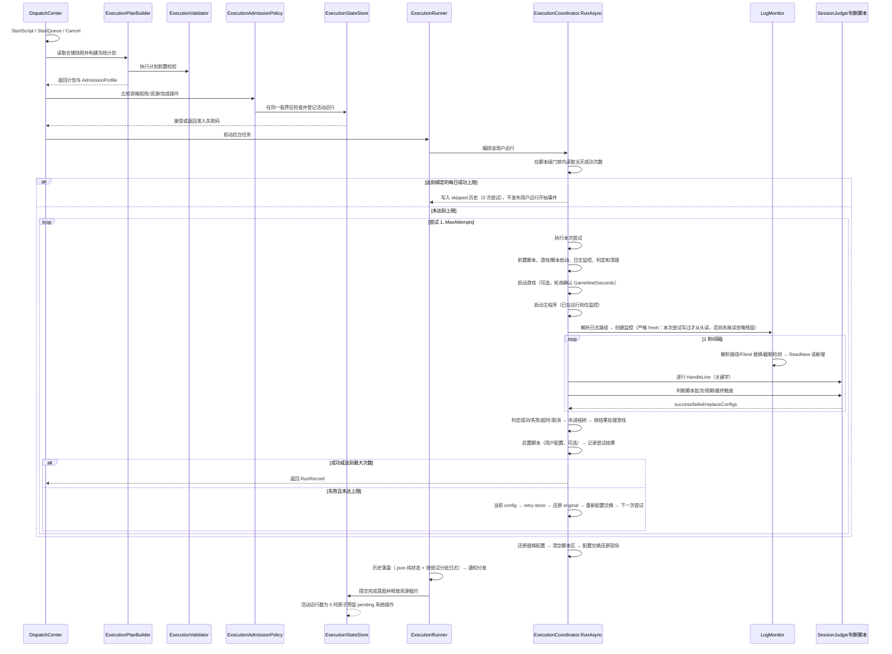
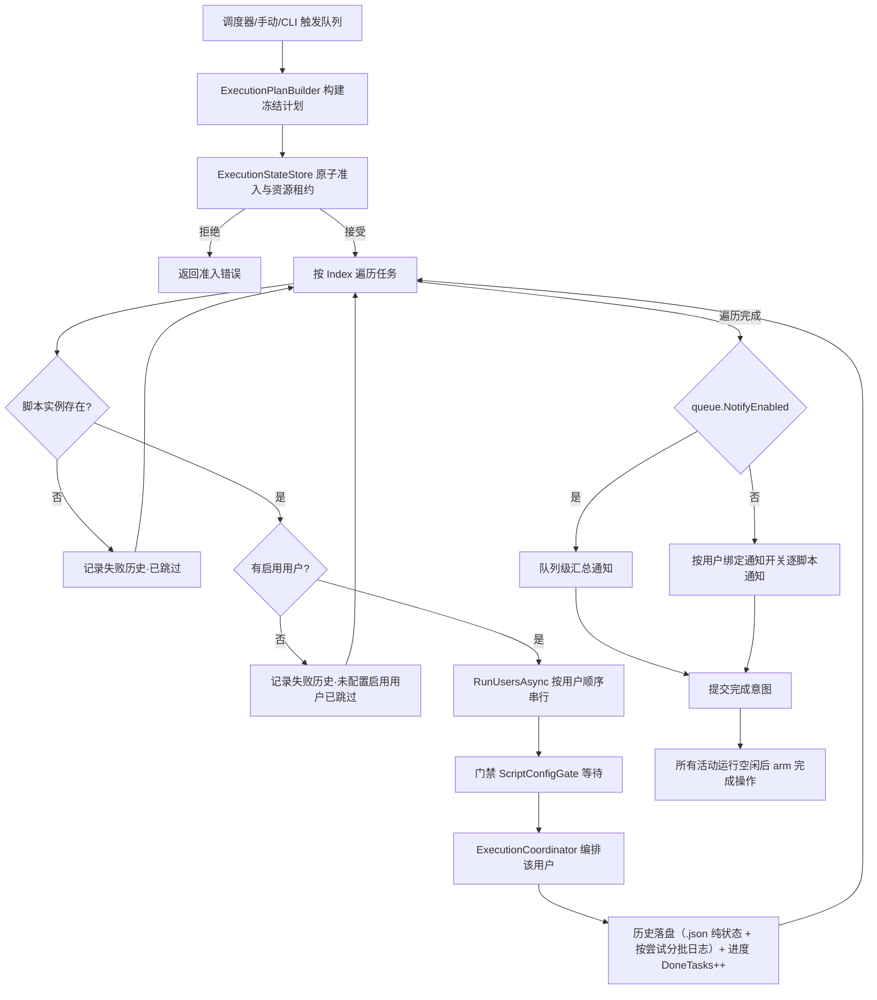
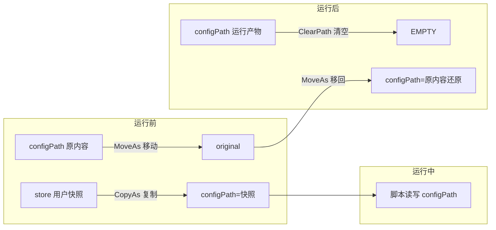
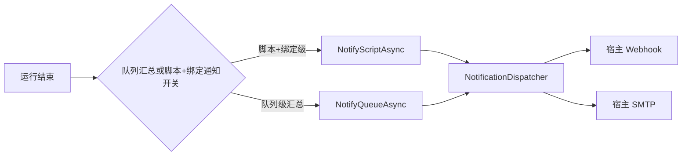

# NexusPipeline（枢链）核心设计说明

> 本文档解释 NexusPipeline 的**设计理念**与**核心功能运行的具体步骤**：机制为什么这样设计、运行时会发生什么。
> 开发者导航（模块边界/依赖方向/扩展落点）见本文件第 10 节；版本历史见 [CHANGELOG.md](../CHANGELOG.md)；用户操作说明见 [README.md](../README.md)。

---

## 目录

1. [设计理念](#1-设计理念)
2. [核心概念](#2-核心概念)
3. [核心运行流程](#3-核心运行流程)
   - [3.5 MCP Agent 控制面](#35-mcp-agent-控制面)
4. [配置交换机制](#4-配置交换机制)
5. [完成判定机制](#5-完成判定机制)
6. [日志监控机制](#6-日志监控机制)
7. [通知与数据落盘](#7-通知与数据落盘)
8. [已知行为与边界](#8-已知行为与边界)
9. [相关文档](#9-相关文档)
10. [架构与模块定位（开发者导航）](#10-架构与模块定位开发者导航)

---

## 1. 设计理念

NexusPipeline 定位为**本地游戏自动化脚本管家**：一个常驻托盘的 Windows 服务，代替用户按计划启动/重试/关闭任意外部脚本（exe / bat / cmd 等），并管理多账号配置、判定脚本运行结果、推送通知。核心理念：

- **本地优先、少外部依赖**：所有产品能力内置于单个 exe（.NET 8 WinForms 托盘 + HttpListener + 零构建静态 Web UI）。不依赖云平台、数据库或前端构建环境；发布物为框架依赖的单文件，运行机器需安装 .NET 8 Desktop Runtime。
- **直接接管脚本进程**：宿主以管理员身份创建进程、捕获输出、监控日志、强制清理进程树，脚本自身无需任何改造；bat 经 `cmd /d /s /c` 包装以规避 ShellExecute 弹窗陷阱。
- **多用户配置隔离（配置交换）**：全局用户通过脚本绑定参与多个脚本实例；每个绑定各存一份配置快照，运行前把绑定快照交换到 configPath，运行后还原现场。数据保全序：**original（原配置）> config（运行时生效）> store（用户快照，可重建）**。
- **判定交给用户**：运行结果由「完成判定」驱动——优先判断脚本（用户自写 JS/Python，专用插件判定由当前 profile 指向的插件脚本驱动），其次成功/失败关键字；未配置任何判定时按「进程自行退出」判成功。判定输入为**本次尝试日志段**，跨尝试互不污染。
- **日志即真相**：宿主通过监控脚本**日志文件**判定运行状态，不只看进程退出码，因此日志监控对文件「重建/截断/追加」三种形态都必须可靠；同路径文件替换使用**文件身份（FileId）检测**，避免旧句柄继续指向已归档文件。
- **失败可重试、崩溃可自愈**：每次尝试失败按 `MaxAttempts` 自动重试；判断脚本可返回 `replaceConfigs` 替换配置后再试；配置交换用 `.session` 标记 + swap-backup 双保险，宿主启动时或后台延迟自动还原。
- **可扩展插件**：managed-code 插件通过独立 `NexusPipeline.Plugin.Abstractions` Plugin API v1.4 使用宿主通用用户数据、声明式 UI、作用域数据、历史展示、插件 Web API、用户列表徽章、用户运行事件、HTTP、日志、通知和调度端口；启用且兼容的插件可通过独立 Frontend API 1.2 加载同源 ES module/CSS，扩展页面路由、导航、slot、主题、服务端同步壁纸和运行画面 sidecar；专项插件继续采用**数据化目录形态**（`plugin.json` + `data/` 推导配置与判断脚本），数据 capability 通过 `capabilities` key 登记。
- **插件分发与运行解耦**：插件仓库以固定官方 `catalog.json` 提供版本和 SHA256，安装包在本地完成校验后以 pending 事务跨重启交换；宿主更新只替换宿主文件，用户插件目录持续保留。
- **宿主网络出口可控**：外部 HTTP 请求统一经过可即时读取设置的网络出口，支持无代理、系统代理和自定义 HTTP/HTTPS 代理；本机控制面、MCP、SMTP 与插件子进程保持原有网络边界。

## 2. 核心概念

| 概念 | 说明 |
|---|---|
| 脚本实例（ScriptInstance） | 一次可运行的脚本单元：主程序/参数/根目录/配置路径/日志路径/游戏配置/运行设置；参与运行的用户由全局用户绑定解析 |
| 全局用户（NexusUser） | 具有稳定 `UserId` 的账号实体：可改用户名、全局优先级、头像和插件用户设置；可绑定多个脚本实例 |
| 用户脚本绑定（UserScriptBinding） | 用户与脚本的运行关系：参与运行开关、运行天数、每日成功次数上限、配置快照、前置/后置脚本、用户通知开关和 SMTP 收件人覆盖 |
| 调度队列（DispatchQueue） | 按 Index 顺序链式执行一组脚本实例（每实例内仍按用户串行）；可定时/启动时自动运行，结束可执行完成操作 |
| 尝试（RunAttempt） | 一次尝试 = 一次完整的进程启动→监控→判定→清理；失败按 MaxAttempts 重试 |
| 运行（RunRecord） | 一次「脚本实例 × 全局用户绑定」的完整运行（含全部尝试），落盘历史（.json 纯状态 + 按尝试分批日志） |
| 运行状态（RunSession） | 一次运行的状态/元数据对象；不再承担完整流程，流程由 `ExecutionCoordinator` 编排 |
| 执行计划（ScriptExecutionPlan / QueueExecutionPlan） | 从仓储快照构建并冻结本次脚本/队列的任务、脚本、用户、资源和完成操作描述；运行期间不回读共享仓储 |
| 执行准入 profile（ExecutionAdmissionProfile） | 描述脚本/队列的并行分类、资源集合和完成操作；队列分类在计划创建时固定 |
| 执行门禁（ExecutionValidator） | 执行前的脚本/队列/用户/进程冲突与限制校验；不创建运行任务 |
| 执行准入策略（ExecutionAdmissionPolicy） | 纯逻辑比较资格矩阵、重复目标、资源冲突、完成操作兼容性和待执行系统操作 |
| 执行状态存储（ExecutionStateStore） | 在同一临界区完成准入检查、活动运行登记、profile 资源租约释放和完成意图协调 |
| 执行运行器（ExecutionRunner） | 负责后台脚本/队列生命周期、用户串行、历史落盘、通知和完成意图提交 |
| 系统操作执行器（SystemActionExecutor） | 负责运行组空闲后的完成操作 arm、真实 60 秒倒计时与取消 |
| 尝试执行 | `ExecutionCoordinator` 直接承接前/后置脚本、脚本监控、判定和资源清理调用 |
| 完成判定（SessionJudge） | 判断脚本/关键字两模式的判定状态机，每尝试独立实例 |
| 运行预算（RunBudget） | 贯穿一次完整运行的总超时预算；重试、前置/后置脚本和命令超时共享剩余时间 |
| 配置交换（ConfigSwap） | 运行前 configPath ↔ 用户快照的交换机制（见第 4 节） |
| 配置运行作用域（ConfigRunSession） | 编排一次运行的事务动作并固定最终收尾顺序 |
| 日志监控（LogMonitor） | 对脚本日志文件的增量读取器，支持追加/截断/替换三种文件形态（见第 6 节） |
| 插件 capability | 与插件身份/元数据分离的可查询能力；C# 按接口注册，数据化插件按 key 登记 |
| 插件仓库 catalog | 固定官方源发布的插件索引；客户端校验 schema、名称、SemVer、宿主兼容性、包 URL、大小和 SHA256 |
| 插件 pending 事务 | 插件包下载并校验后写入 staging 与 `pending.json`，下次启动在插件扫描前完成安装、更新或卸载 |
| 宿主外部 HTTP 出口 | 依据 `ProxyMode` 选择无代理、系统代理或自定义代理；外部请求读取最新设置，loopback 强制直连 |
| 执行应用端口（IExecutionService / IFrozenQueueExecutionService） | Web、Scheduler 与常驻服务 CLI 通道共享的启动/取消入口，由 `DispatchCenter` 直接实现 |
| 控制面（Control API） | 常驻服务拥有运行时数据与执行状态；Web、CLI、manage 通过本机 HTTP 控制 API 提交查询与变更 |

## 3. 核心运行流程

### 3.1 脚本运行完整链路

一次「脚本实例 × 用户」的运行由 `ExecutionRunner` 驱动。入口先由 `ExecutionPlanBuilder` 从仓储快照构建计划，再经 `ExecutionValidator` 完成运行前校验；`DispatchCenter` 将计划 profile 交给 `ExecutionStateStore`，由 `ExecutionAdmissionPolicy` 在同一临界区完成资格矩阵、资源租约和完成操作兼容性判断。通过后由 `ExecutionCoordinator.RunAsync` 编排，队列、手动和 CLI 入口均直接汇聚到 `DispatchCenter`；`RunSession` 只保存状态，单次尝试由协调器直接执行：



**分步细节（ExecutionCoordinator 单次尝试流程内）：**

1. **前置检查**：`IsScriptRunning` 检测运行时启动目标是否已在运行（按解析后的进程名，含自重启产物兜底）；已运行 → 先按启动目标强制结束并确认退出，再重新启动监管。
2. **启动游戏（可选）**：`LaunchGame=true` 且已填游戏路径时，校验可执行 → 启动（bat 经 cmd 包装并接管输出）→ 每 1 秒轮询 `GameWaitSeconds` 秒确认进程出现 → 超时本次尝试失败。未填写路径则跳过并提示。
3. **启动主程序**：`ResolveLaunchTarget` 解析运行时启动目标（Args 以显式路径开头时=管理端/执行端分离场景，`?` 后为参数）→ CreateProcess 重定向 stdio（无窗口）→ bat 自动 `cmd /d /s /c` 包装（规避 0x800700E8）→ 740（要求管理员）明确报错、禁止降级提权。
4. **日志监控初始化**：脚本启动后按 `LogPath` 格式严格解析（`LogPattern.ResolveFile`，文件不存在返回 null）；文件存在时按**尝试开始前长度快照**判定：尝试开始前不存在的文件从头读，已有残留从尝试开始时长度续读；残留被启动后追加写也不会进入判定输入——无松弛窗口，忽略运行前已有内容。
5. **监控循环（每 1 秒）**：
   - 重新解析日志路径；路径变化（日期轮换/通配取新）→ 重新监控；
   - 同路径文件被**替换**（move 归档后重建/删除重建，`LogMonitor.FileReplaced` 对比卷序列号+文件索引）→ 重开从头读；
   - 文件被**截断**（`ReadNew` 检测 `Length < position`）→ 部分截断（缩短未归零）从新文件尾续读，避免已读旧行重复进入判定；长度归零从头重读；
    - 读取新增内容 → 逐行送入判定（关键字）→ 追加运行日志与 UI 日志。
6. **判定分支**：
   - 失败关键字命中 → 立即终止本次尝试（杀进程树）；
   - 成功关键字命中 → 等待脚本自行退出（最多 60 秒，超时杀进程仍判成功）；
   - 判断脚本模式 → 批次触发/周期触发/最终触发（见第 5 节）；
   - 无任何判定且进程退出 → 按「进程自行退出」判定成功（未配置判定时）；配置了判定但无命中 → 失败。
7. **超时**：`LogStallTimeoutMinutes=-1` 时跳过日志无更新超时检查，其余有效值在启动后无任何日志条目、日志超过该时长无更新或未找到日志文件时判定失败；`RunBudget` 集中计算 `TotalTimeoutMinutes` 的 elapsed/remaining，按**整个运行（含全部重试与前置/后置脚本）**计时，`TotalTimeoutMinutes=-1` 时不设总时长上限，其余有效值到时判定失败且不再重试；判断脚本执行仍保持独立 30 秒上限。
8. **尝试结束清理**：`RunAttemptFinalizer` 统一承载进程树清理和游戏/模拟器策略（Toolhelp 快照 + BFS 逐进程强杀，**与 `GameExe` 同名的进程树排除在外**、生杀归游戏管理）；**任务失败时无条件强制结束游戏进程**；成功时按 `ForceCloseGame` 设置决定是否关闭游戏。
9. **重试**：失败且未达 `MaxAttempts` → 将最终 config 保存到运行期 `retry-store`，恢复 original 真实现场，再重新执行完整配置交换；每尝试独立 LogMonitor 与 SessionJudge；判断脚本返回的 `replaceConfigs` 在**尝试收尾、杀进程确认退出后**应用，供下一轮工作快照使用。
10. **运行收尾（finally）**：`ConfigRunSession` 固定执行自动更新配置收尾同步（config → store 全量镜像，仅开关开时）→ 还原配置替换（swap-backup → config）→ 清空判断脚本目录 → 配置交换还原现场（original → config）。同步先于插队还原与配置交换还原，确保 store 看到脚本最终态，同时避免恢复动作覆盖用户快照。

### 3.2 队列执行链路



- 队列任务保存时按 `Index` 升序对 `ScriptInstanceId` 去重，同一脚本实例只保留排序列表中的第一项；运行时按任务顺序执行，每脚本实例内按**全局用户顺序过滤出已启用绑定**后串行轮换；队列之间按准入矩阵并行，任一用户取消则中断当前队列后续任务。
- 队列定时列表保存时按列表顺序处理；同一启用状态且执行时间相同的定时列表合并星期选择并集，保留排序列表中的第一项，后续重复项移除。
- 调度中心启用实时画面时，日志卡片与实时画面卡片共享拉伸高度并对齐上下边界；日志最小高度跟随实时画面卡片最小高度，最大高度为该最小高度的 2.5 倍。
- 队列任务数大于零、全部引用可解析脚本实例、每个脚本 `GameMode == "emulator"`、ADB 端点格式有效且专项插件声明支持模拟器时归类为 `EmulatorOnly`；任意数量 `EmulatorOnly` 可并行，最多一个 `Standard` 队列。空队列、缺失引用、无效端点和其他无法证明为纯模拟器的情况归类为 `Standard`。
- 独立脚本不占用 `Standard` 队列名额，但与队列共同申请脚本 ID、用户数据键、解析后的启动目标、进程基名、配置路径、日志路径模式、前/后置脚本可执行文件和模拟器 ADB 端点资源租约；同一资源或配置父子路径冲突时准入失败，无法证明日志模式互不重叠时按冲突处理。
- 队列级汇总通知只在 `queue.NotifyEnabled=true` 时发送；用户级脚本通知由有效绑定的 `binding.NotifyEnabled=true` 决定，SMTP 收件人为空时继承全局设置。
- 有效绑定的 `MaxSuccessfulRunsPerDay=-1` 表示不限制；达到正数上限后，在脚本级配置门禁内写入 `skipped` 历史，记录 0 次尝试，不发布用户运行开始事件，也不计入成功次数；失败、取消和已跳过记录不计入成功次数。
- 脚本实例绑定的数据化专项插件缺失、类型不匹配或运行态不可用时，前端显示状态徽章并收紧脚本编辑、用户配置和队列任务入口；运行入口保留队列生命周期，写入错误日志与失败历史后跳过该脚本实例，继续处理队列中的后续任务。
- 专项插件可用性门禁在 Application Command 层统一执行：`UserCommands` 的绑定新增/编辑、`ScriptCommands`、配置编辑和队列写入共享同一策略；门禁在配置快照和持久化之前完成。解除绑定、删除脚本和从队列移除任务等清理操作保持可用。
- `ExecutionValidator` 发现专项插件不可用时保留执行计划创建路径，由 `ExecutionRunner` 记录失败历史、写入可读原因并跳过脚本；队列后续任务继续执行。插件启停和安装更新仍按重启后生效的生命周期约定处理。
- 完成操作（退出/休眠/重启/关机）以完成意图提交；第一个非 `none` 意图提交时并行运行组立即进入 `Closing`，后续脚本、队列和 `none` 完成操作队列均不得加入；只有全部活动运行释放后才创建 pending action，执行或取消后才重新开放。相同操作合并，存在不同非空操作时由准入策略拒绝；任务失败仍照常提交完成意图，取消队列跳过。休眠/重启/关机执行前 Web 界面显示 60 秒倒计时卡片可取消（重启/关机走 Windows 倒计时 `shutdown /t 60`，`shutdown /a` 取消；休眠走应用内 60 秒延迟，取消后不执行；倒计时为真实墙钟不随测试时间加速缩放；exit 退出软件立即执行不可取消）。

并行准入发生在 `ExecutionStateStore` 的同一临界区：先检查 pending 系统操作和运行组状态，再由 `ExecutionAdmissionPolicy` 比较队列类别、资源集合与完成操作，最后同时登记 `RunningExecution` 和 profile。执行计划、队列与脚本快照和涉及配置数据的破坏性 CRUD 共享协调域；配置/用户数据正在被活动执行引用时，Web 返回 HTTP 409 及稳定冲突码。执行释放时移除 profile 租约并追加完成意图；最后一个活动运行释放时原子创建 pending 系统操作，新的启动在 pending 清除或取消前保持拒绝。

### 3.3 手动执行脚本

- 指定用户：只运行该用户；未指定：按启用用户顺序全部运行一次。
- 冲突检查：脚本启动目标已在运行时沿用既有进程检测；脚本和队列入口统一走资源租约准入，队列计划中的已运行脚本或与活动执行共享脚本/进程/配置/模拟器端点资源时返回准入错误。
- 取消：`Cancel` 通过 CancellationToken 中断当前尝试（杀进程树）并标记 cancelled，后续任务不再执行。

### 3.4 统一控制面与 CLI

常驻服务是运行时数据、执行状态和持久化写入的拥有者。Web 请求、正式 CLI 和 `manage` 交互菜单都通过同一组 `/api/*` 控制端点进入服务，服务内部继续复用 `DispatchCenter`、`ConfigEditCommands`、执行准入、配置交换和各资源的持久化事务。CLI 进程只承担参数解析、目标解析、请求发送和结果格式化，不持有第二套配置写入路径。

正式 CLI 的协议边界如下：

- 命令采用 `status`、`script`、`user`、`queue`、`run`、`history`、`settings`、`plugin`、`update`、`maintenance` 和 `system-action` 等 noun/subcommand；运行控制统一使用 `run script`、`run queue` 和 `run cancel`。
- 复杂 payload 统一使用 `--file <json 文件>` 或 `--file -`（标准输入），避免把领域对象拆成大量命令行开关。
- `user global-settings` 管理用户的 General、Notification、Advanced BindingOverrides；`plugin store` 管理官方插件仓库事务；`plugin user-settings` 管理通用插件用户设置贡献，命令均通过 Control API 复用宿主服务。
- `--json` 输出稳定 envelope；标准输出只承载协议数据，连接诊断和运行进度转到标准错误。退出码按参数/校验、找不到或歧义、资源冲突、服务不可用、禁止、执行失败、取消/超时和内部错误分层。
- 目标解析先按大小写不敏感的完整 ID 匹配，再按大小写不敏感的唯一名称匹配；名称匹配不唯一时保留候选 ID 并返回 `ambiguous_target`，禁止静默选择首项。
- Control API 服务发现只接受 `/api/status` 返回的 `service=NexusPipeline`、`controlApiVersion=1` 和 `1024–65535` 范围内的 `actualPort`；状态、CRUD 与运行轮询使用短请求超时，通知测试和更新检查使用长同步超时。

轻量模式仍启动 Control API，监听地址固定为 `127.0.0.1`，仅关闭静态 Web UI 与浏览器自动打开。这样命令行自动拉起服务、脚本化调用和本机管理菜单在轻量模式下仍共享同一运行时状态。

### 3.5 MCP Agent 控制面

v0.10.5 在同一个 `nexus-pipeline.exe` 进程内嵌 MCP Server。现有 `HttpListener` 继续承载 Web UI 与 Control API，MCP 使用官方 `ModelContextProtocol.AspNetCore` 的 Streamable HTTP transport，端点为：

```text
http://127.0.0.1:<McpPort>/mcp
```

MCP 的启动条件和运行语义如下：

- `McpEnabled` 默认关闭；关闭时进程不创建 MCP Kestrel listener。
- `McpPort` 默认 `58732`，有效范围为 `1024–65535`。端口是 Agent 配置的一部分，发生占用时记录错误并保持 MCP 不可用，Control API 继续工作，端口不会自动漂移。
- `LightweightMode` 保留 Control API；MCP 是否启动仍由 `McpEnabled` 独立决定，Web UI 继续关闭。
- 宿主停止时按 MCP → Scheduler/恢复任务 → Web → 插件的顺序执行清理；MCP 停止异常只记录诊断，不阻断其余清理步骤。

MCP 只保留面向 Agent 的核心子集（19 个工具）：只读工具覆盖状态、脚本、用户、队列、运行、历史、插件、脱敏设置和更新状态；常规变更工具覆盖运行/取消、脚本与用户的创建、绑定管理和取消系统操作。删除类、密钥、插件安装/开关、商店、服务重启、更新应用和遗留数据清理等高风险或低频运维操作不进入 MCP 工具面，由本地 CLI 与管理页面承担。工具元数据和调用前的应用策略同时参与风险控制，队列完成后的休眠、重启、关机、退出等系统操作保持由本地管理路径配置。

v0.10.6 对 MCP 控制面采用以下行为契约：

- NexusPipeline 信任同一台计算机上的本机进程；loopback、Host、Origin 与请求体限制用于网络和网页边界，MCP 不增加本机进程认证令牌或 SID 鉴权。
- `run_queue` 在提交执行前复核队列快照的 `CompletionAction`；任何非 `none` 动作都返回稳定的 `dangerous_completion_action`，既有 Web/本地队列仍可按本地设置执行完成操作。
- 服务重启统一经过 `HostRestartCoordinator`（入口为 Web 管理页与 CLI）：接受请求时由 `ExecutionStateStore` 原子取得 `HostMaintenanceLease`，租约立即冻结新的运行、配置编辑和宿主配置写入；子进程拉起失败释放租约，子进程已拉起后租约持续到旧进程退出。
- `/api/settings/test` 的通知失败使用非 2xx 与 `notification_test_failed`；CLI 根据服务端错误码生成失败 envelope 和非零退出码。
- `/api/status` 是 Control API 的身份握手，包含 `service=NexusPipeline` 与 `controlApiVersion=1`，CLI 不接受缺少身份或端口越界的其他 HTTP 2xx 响应。
- `list_plugins`、`/api/plugins` 和 `/api/status` 使用共享 `PluginManagementView`，统一表达 schema 2 的 `artifactName`、展示元数据、商店归属和 pending 事务；插件详情通过专用 detail API 提供 README 与完整更新记录。
- 插件用户全局设置与用户级插件设置的读取和写入由 Web/CLI 提供；MCP 不暴露这些低频细粒度入口。
- 执行预览端点按插件声明的 `execution-preview-client`、启用状态和前端存在进行准入，宿主继续负责当前运行目标与截图采集。

MCP 适配层只接收类型化参数，经过 `McpToolContext` 解析稳定 ID/唯一名称，再进入 Application Commands 和已有核心服务。它不复用 Web handler 或 CLI 路由，也不提供万能 CLI/API/shell 工具。运行类调用立即返回 `runId`，Agent 通过 `get_run` 轮询活动或最近完成的运行；业务错误保留在结构化工具结果内：

```json
{
  "ok": false,
  "errorCode": "resource_busy",
  "errorMessage": "脚本正在运行，无法修改",
  "candidates": [],
  "data": null
}
```

MCP 的网络边界独立于 Web 的远程访问设置：Kestrel 只监听 loopback，Host 仅允许 `127.0.0.1`、`localhost` 和 `::1`，Origin 必须为相同 loopback 主机与 MCP 端口，请求体上限为 2 MiB。`get_settings` 对 Webhook、SMTP 和访问令牌只返回空值或 `enc:***` 占位符；secret mutation 只接受显式高风险工具，值经过既有 DPAPI 存储且不会进入返回值或 `Audit.Mcp` 日志。

## 4. 配置交换机制

### 4.1 数据目录

```
data/{脚本Id}/{UserId}/
├── store/            用户配置快照（首次编辑或运行时按当前 configPath 建立；运行后可自动更新回写，任务完成记录/计数保留延续；可重建）
├── store-meta.json   快照归属元数据（配置定位/形态与 profile 指纹）
├── store-archive/    配置定位或形态变化时的旧快照归档
├── store-previous/   上一份完整用户快照（自动更新事务保留，崩溃恢复用）
├── .session          会话主标记（崩溃恢复用）
├── .session.bak      会话冗余标记（主标记损坏时使用）
└── work/             会话事务工作区（仅运行/编辑/同步期间存在；正常收尾与启动清扫后整体消失）
    ├── original/       运行前 configPath 原内容（移动进来，运行后移回；崩溃恢复保底）
    ├── script/         判断脚本工作目录（运行期间可读写，结束后清空）
    ├── swap-backup/    配置替换备份（首次替换前复制原文件 + .meta 清单）
    ├── edit-hidden/    编辑会话隐藏配置暂存（编辑期间 config 同目录其他配置暂移至此，会话结束/重启恢复时移回）
    ├── retry-store/    当前运行重试轮临时快照，不等同于用户永久 store
    └── store-tmp/      自动更新事务临时目录
```

持久层（store、store-meta.json、store-archive、store-previous）与会话标记常驻用户目录顶层；全部会话事务目录收拢在 `work/` 下，**空闲态每用户目录只剩 `store/` 与 `store-meta.json`**（发生过自动更新同步后另保留 `store-previous` 兜底）。v0.13.0 及更早版本散落的顶层事务目录与 dot 后缀命名（store.previous、store.meta.json、store.tmp）由启动时的一次性迁移（`ConfigWorkDirMaintenance`，幂等）归并进 `work/` 并改为 kebab-case 规范名，保证旧崩溃现场仍按原语义恢复；无用户交互的脚本级兜底目录同样收敛为 `data/{脚本Id}/work/{script,swap-backup}`。

通用判断脚本属于宿主配置资产，路径为 `config/judge-scripts/<scriptId>.js|py`。源码通过临时文件原子替换；脚本实例删除、语言切换和未引用资产会进入 `orphaned/` 隔离目录。专项判断脚本保留在插件目录，由 `PluginType + RootPath` 解析当前 profile。

运行期截图保存在内存中的 `RunScreenshotStore`；每次 Attempt 独立保留最多 8 张，超出后按 FIFO 淘汰。运行收尾时，当前各 Attempt 保留的截图与 JSON、Attempt 日志一起写入独立运行目录：

```text
history/YYYY-MM-DD/<用户昵称>/<HH-mm-ss>/
├── HH-mm-ss.json
├── HH-mm-ss-1.log
├── HH-mm-ss-1-s1.jpg
└── HH-mm-ss-2-s1.jpg
```

`NexusUser.Id` 是配置数据目录、运行期配置交换和恢复扫描的唯一存储键；`NexusUser.Name` 用于展示和当前用户查找。配置交换会话使用当前全局用户绑定的 ID 目录，磁盘 `.session` 的 `UserName` 字段记录会话所属用户。

### 4.2 运行前（PrepareForRun）与运行后（RestoreAfterRun）



1. **运行前**：store 快照为空且 configPath 存在时，先把现场配置**复制**为初始快照（v0.12.8：绑定阶段保持现场，复用语义延迟建立）→ `.session` 主/备标记先行写入 → configPath 内容整体**移动**到 original → store 快照**复制**回 configPath（运行生效配置）。当前 profile 的配置定位或文件/目录形态与 `store-meta.json` 不一致时，旧快照先进入 `store-archive/`，新位置缺失则阻断本次运行并保留旧快照。
2. **运行后**：清空 configPath（删除运行产物）→ original **移动**还原 → 清除标记。
3. **编辑配置**：有快照时复用交换机制（PrepareForEdit/CommitEdit/CancelEdit）；无快照的首次编辑须显式选择方式——`fresh`（全新配置：config 存在则移入 original，脚本在空位置生成新配置，done=复制入库+original 移回，cancel=清生成物+original 移回）或 `reuse`（复用配置：全程无文件动作，done=复制入库，cancel=仅清标记）。运行与编辑经 `ScriptConfigGate` 互斥。

### 4.3 插队替换配置（replaceConfigs）

- 判断脚本返回 `failed` + `replaceConfigs`（相对 script 目录路径）时：宿主把 script 目录内对应文件复制覆盖到 config 对应位置；替换在**尝试收尾、杀进程确认退出后应用**，避免进程仍持有配置文件时出现文件占用或半写窗口。**首次替换前**备份原文件到 swap-backup（`.meta` 记录 configPath 与新增文件清单）。
- config 为单文件时，replaceConfigs 项必须等于该文件名（忽略大小写）才允许替换。
- 本次尝试失败后先将最终 config 保存到 retry-store，恢复 original 真实现场，再重新执行完整配置交换加载下一轮；可多轮替换，计入 MaxAttempts。
- 运行结束从 swap-backup 还原全部被替换文件、删除替换期间新增的文件、清空 script 目录（有用户时配置交换亦还原，备份为双保险）。

### 4.4 崩溃恢复（自愈）

- **启动恢复（RecoverInterrupted）**：扫描全部残留 `.session` 标记与 swap-backup，自动还原；原配置区为空时，fresh 编辑会话（原形态 Missing，config 位置为脚本生成物）由 `EditMode` 驱动 `DoRestore` 清理，其余会话只清除标记并保留未改变的现场。
- **后台延迟重试**：还原失败（文件被孤儿进程占用）时进入待办队列，每 10 秒重试直至成功或进程退出。
- 数据保全序保证：任何时刻崩溃（含移动配置前后）都可从 original 完整还原现场。
- **Missing 形态还原**：`DoRestore` 在 original 为空且原形态为 Missing（运行/编辑前 config 位置不存在）时，删除会话期间在 config 位置产生的文件/目录，恢复为“不存在”；删除失败则保留标记交由自愈/后台重试。
- **收尾顺序**：运行收尾固定为「杀脚本进程并确认退出 → 按设置处理游戏进程 → 配置交换还原」，确保还原前进程已完全退出。

### 4.5 自动更新配置：config → store 反向同步

`ScriptInstance.AutoUpdateConfig`（**默认开**，专项脚本由后端强制恒开）允许运行产生的配置更改（任务完成记录、运行计数和脚本新增任务）**反向同步回用户快照 store**（config → store 全量镜像），供下次运行延续。同步先写入 `work/store-tmp`，成功后将旧快照保留为 `store-previous`，再以目录移动完成替换。

**触发时机**：

| 时机 | 条件 | 说明 |
|---|---|---|
| ① 首次检测 | 运行开始 `ScaledSeconds(15)` 后主监控循环内**一次性**同步，`attempt.Number==1` 才执行 | 捕获脚本启动后自行更新的任务配置；**关/开模式共有**；并入主循环避免与收尾还原竞态；前置稳定性双采样（两次采样不一致 = 脚本仍在写 → 跳过，等待下次运行） |
| ② 收尾同步 | 每次运行收尾（成功/失败/达最大次数/**cancelled**/总超时）在 finally 中执行 | 仅 `AutoUpdateConfig=true`；config 此刻为脚本最终态；在**插队还原与配置交换还原之前**执行 |

**同步语义**（`UserConfigManager.SyncConfigToStore` → `ConfigSwapSession`，`WithSwapLock` 内）：

- **事务化全量镜像**：先复制 config → store-tmp（全部文件），复制期间源配置变化则放弃本次同步；成功后将旧 store 移动为 store-previous，再将 store-tmp 移动为 store，避免逐文件写入造成混合快照。
- **插队文件（swap-backup/.meta 清单内）**：有还原描述（`script/config-restore.json`）时**先还原任务启停为初始值再写入**（初始启停 + 运行后计数/其他字段，供下次运行延续）；无还原描述时从旧 store 保留原文件，不写入插队编排产物。
- **还原描述契约**（专项判断脚本首次触发时写入，跨尝试只写一次，随 `CleanupScriptArea` 清空；宿主仅执行不解析插件语义）：`{"files":[{"file":"相对config路径","toggles":[{"type":"array","path":"instances[id=main].tasks","keyField":"id","enabledField":"enabled","initial":{...}}|{"type":"map","path":"TaskEnabledList","initial":{...}}]}]}`——array 按 keyField 匹配 initial 设 enabledField（**未覆盖元素不动**）、map 逐键设布尔（**未覆盖键不动**）；路径 DSL 支持 `标识符[下标].标识符` 与 `标识符[key=value].标识符`。契约全文见 `PLUGIN_API.md`「配置还原描述」。

**守护机制**（防止坏态写入并污染快照）：

1. **会话有效性**：`.session` 存在且 Phase=run 才同步（防 15s 首次检测与收尾还原的时序异常）。
2. **内容有效性**：config 缺失/为空/文件数骤降一半以上 → 跳过；明确 JSON 内容执行语法校验，非 JSON 文本不强行解析；解析失败视为脚本被杀瞬间半写 → 跳过整个同步，保留旧快照。
3. **稳定性检查**：短间隔两次采样不一致，或复制期间源配置再次变化（脚本或外部守护进程仍在写）→ 放弃本次事务，保留旧快照。
4. 同步失败仅告警，**不阻断**收尾还原；临时目录清理失败或旧快照替换失败时保留 `store-tmp`/`store-previous`，下次启动恢复。

**与既有机制的关系**：收尾顺序固定为「自动更新同步 → 插队还原（swap-backup → config）→ 配置交换还原（original → config）」——同步读的是脚本最终态，插队/交换还原在同步之后把 config 还原为运行前现场；store 则保留同步后的「启停还原 + 计数延续」内容供下次运行。

## 5. 完成判定机制

### 5.1 判定优先级

判断脚本（启用即优先，忽略关键字）→ 成功/失败关键字（组内逗号 AND——整个尝试日志中分别出现即命中，跨行累积且顺序无关；换行 OR）→ 无任何配置按「进程自行退出」判定成功。

> **专用插件判定**：专项脚本实例在操作开始时从当前插件 profile 读取 manifest 的 `judgeScript` 资产，并将本次操作使用的源码、语言和内容指纹冻结到运行计划；用户不可编辑插件判断脚本，判定走脚本模式，同时强制清空自定义关键字字段。

### 5.2 判断脚本输入与触发

- **输入 JSON**：脚本字段 + 用户 + `config`（运行时生效配置，只读）与 `script` 目录（可读写）全递归文件清单 + `scriptDir` + **本次尝试日志段**（按尝试切片，上次尝试的失败/成功行不跨尝试污染判定；超过 4MB 仅提供尾部并置 `logTruncated=true`）。
- **触发时机**：① 每次日志新增批次触发一次（串行不叠加）；② 日志阻塞（进程存活、已有日志但 30 秒无新内容）周期触发一次（不重置无更新超时）；③ 主进程退出且本次尝试无判定结果时**最终触发一次**（日志超时/未找到日志文件失败路径同样补最终触发，判断脚本可借此返回替换配置再重试）。
- **输出契约**：stdout 尾行 JSON `{"status":"success|failed","reason":"必填","notifyText":"可选","notifyScreenshotId":"可选","replaceConfigs":[...]}`；无输出/非 JSON/缺字段 = 继续运行；单次执行 30 秒上限；执行错误 = 警告 + 继续运行。
- **截图契约**：输入 `screenshots` 提供当前 Attempt 内的元数据；JS 可调用 `nexus.captureScreenshot()`，Python 使用本次调用临时提供的 loopback `screenshotApi`；每次 Attempt 最多保留 8 张，截图保持游戏客户区/模拟器原始像素宽高并编码为高质量 JPEG。空 `notifyScreenshotId` 选择最终 Attempt 仍保留的最新截图，指定无效 ID 时不附图；自动截图在首次接受关键字或判断脚本成功/失败结果时触发。
- **边界**：JS 内置 Jint 引擎（`nexus.readFile` 限 config/script 范围、单文件 2MB；`nexus.writeFile` 防 `../` 与绝对路径逃逸；无 Node 库）；Python 用系统 `python.exe`（`sys.argv[1]` 输入 JSON 路径），截图 RPC 仅绑定本机回环且随单次调用失效。

### 5.3 判断脚本信任边界

判断脚本是**用户自己编写并配置**的代码，宿主把它当作**可信用户域**执行：

- 契约上 config 目录**只读**、script 目录**可读写**——JS 引擎在宿主内强制执行（`nexus.readFile` 白名单 + `nexus.writeFile` 防逃逸）；**Python 解释器是独立系统进程，这些读写边界无法在技术上强制**，只以文档契约为准（信任边界，非缺陷）。
- 判断脚本能观测的是：脚本字段（快照）、用户、config/script 文件清单、本次尝试日志段；能影响的是：判定结果、通知正文、`replaceConfigs` 配置替换。超出这些的能力一律不会提供给解释器执行环境。
- 判断脚本运行在可信网络中、避免在脚本中处理敏感数据，是用户的职责；宿主不把 Python 解释器当作沙箱。

### 5.4 关键字模式

- 成功/失败关键字：每行一组，组内逗号分隔为 AND、换行之间为 OR；失败命中立即终止本次尝试，成功命中等待退出 60 秒。无任何配置时按「进程自行退出」判定成功。
- 专用插件判定：判断脚本由当前插件 profile 提供（用户不可编辑，前端专项弹窗不渲染自定义完成标志区；宿主在解析 profile 时清空关键字字段），判定完全由本次操作冻结的插件脚本驱动。

## 6. 日志监控机制

### 6.1 日志路径解析（LogPattern.ResolveFile）

- 严格按用户给出的格式匹配：目录 → 目录内最新文件；无占位符无通配 → 精确文件；`{YYYY-MM-DD}` 等日期占位符 → 当天精确匹配；`*` 通配 → 目录内通配取最新修改。**禁止格式外猜测**；文件不存在返回 null。

### 6.2 增量读取与三种文件形态

LogMonitor 持有文件句柄（`FileShare.ReadWrite | FileShare.Delete`）按 position 增量读取：

| 文件形态 | 场景 | 检测机制 | 处理 |
|---|---|---|---|
| 追加 | 脚本持续写入 | 正常 ReadNew | 增量读取 |
| 截断 | `type nul > log.txt` / 脚本自清空 | `_stream.Length < _position` | 部分截断（缩短未归零）从新文件尾续读，避免已读旧行重复进入判定；长度归零从头重读 |
| **替换** | move 归档后重建 / 删除重建 | `FileReplaced`：`GetFileInformationByHandle` 对比**卷序列号+文件索引（FileId）**；FileId 不可用时回退创建时间 | 重开文件从头读 |

- **为什么不用创建时间（FileStamp）单独检测替换**：move+重建后新文件的 CreationTime 可能与旧文件相同，单独依赖它会让监控句柄继续指向已改名的旧文件。FileId 能区分同路径下的不同文件；能力不可用时再回退创建时间。
- **忽略运行前已有内容**：尝试开始前记录日志文件快照（存在性 + 长度）；不存在的文件从头读，已有残留从尝试开始时长度续读，残留内容不进入判定输入与运行日志。
- **监控循环检测顺序**：路径变化（轮换）→ FileId 替换 → 截断 → 读新增。

### 6.3 超时语义

- `LogStallTimeoutMinutes`：启动后未产生任何日志条目 / 日志超过该时长无更新 / 配置了日志路径但未找到文件 → 本次尝试失败；填 `-1` 表示该脚本为长时脚本并禁用日志无更新超时。
- `TotalTimeoutMinutes`：按**整个运行**（含全部重试与前置/后置脚本）计时，超时判定失败且不再重试；长时脚本可填 `-1` 表示永不超时，也可填有效正数按时限记录超时；普通脚本不能填 `-1`。

## 7. 通知与数据落盘

### 7.1 通知分发



- **用户脚本级**：有效绑定开启用户通知后，在最终运行阶段（一次成功/多次尝试后成功/多次失败后/已跳过）发送该用户运行状态；SMTP 收件人按绑定级覆盖或继承全局设置。
- **队列级**：队列开启通知后，在队列结束时汇总发送所有脚本状态（`· {ScriptName}：成功（...）/失败（...）/已跳过（...）`，按 record.Status 非 FinalStatus）。
- 判断脚本返回的 `notifyText` 替换脚本级通知正文（`CustomNotifyText`，不落盘）；`notifyScreenshotId` 选择最终 Attempt 的脚本级通知附图，单个 Attempt 的截图池最多 8 张且 FIFO 淘汰；队列级汇总不使用运行截图。
- 多通道并存（内置 Webhook/SMTP 独立开关并行），单通道异常隔离不阻塞；密钥 DPAPI 加密（`enc:` 前缀）存 settings.json。
- Webhook 截图由全局开关控制；Discord 支持 multipart 附件，企业微信支持图片消息，飞书、钉钉和 Slack 使用各自的最小应用级上传凭据，Generic 通过模板图片占位符接入。SMTP 截图作为 JPEG MIME 附件发送。

### 7.2 历史与日志落盘

- 每次「脚本实例 × 全局用户绑定」运行结束保存到 `history/YYYY-MM-DD/<用户昵称>/<本轮运行任务>/`：
  - `<HH-mm-ss>.json`：**纯运行状态**（PascalCase，包含 `HistoryDirectory`、Attempts/FinalStatus、各 Attempt 的 `LogFile` 与截图元数据，不含日志正文和图片字节）；同一用户同一秒的运行目录追加 `-2`、`-3` 等后缀；
  - `<HH-mm-ss>-<尝试号>.log`：**每个 Attempt 一个独立日志文件**，保存脚本日志全文（20MB 截断；空日志写「（未配置日志路径或未监控到脚本日志）」兜底）；
  - `<HH-mm-ss>-<尝试号>-s<序号>.jpg`：按该 Attempt 当前 FIFO 保留顺序编号，序号范围为 1–8。
- 配置了 `LogPath` 时，业务日志以日志文件监控结果为单一来源；未配置 `LogPath` 时，业务日志来自脚本 stdout/stderr。实时显示和历史详情沿用相同的等级解析。
- 每个 Attempt 最终保留的截图写入同一运行目录，JSON 保存元数据；通知发送完成后释放运行期内存截图池。
- `FinalStatus`：success（一次成功且日志无错误关键字）/ partial（重试>1 或日志含 ERROR|错误|异常|失败）/ failed / cancelled / skipped（达到绑定的每日成功运行次数上限）。
- `PluginHistory`：运行落盘前由已注册插件生成的纯文本展示快照；单贡献 16 KiB、单次运行总量 64 KiB，插件异常不会影响运行结果，卸载插件后历史仍保留快照。
- 保留天数 `HistoryRetentionDays`（默认 7）每日清理一次（启动时 + 调度器每日首次 tick）；上限固定为 180 天；管理器日志 `logs/nexus-pipeline-YYYY-MM-DD.log` 同样按保留天数清理。
- 审计行 `[审计] 来源 | 操作（详情）`，来源 web/manage/cli/scheduler/system；`GET /api/status` 轮询豁免不记录。

### 7.3 插件仓库与安装事务

官方插件源固定为 `FlappiBakuse/NexusPipeline-Plugins`。每个正式插件目录维护 `plugin.json`（运行时事实）与 `store.json`（商店展示元数据），仓库工具据此生成根目录 `catalog.json`。schemaVersion 2 的 manifest 必须使用小写 kebab-case 机器 ID，并声明严格区分大小写的 `artifactName`；源码目录、宿主安装目录、发行目录和 ZIP 名称均使用 artifactName，配置、密钥、作用域和偏好仍使用机器 ID。catalog 条目包含名称、正式 artifactName、显示信息、SemVer、插件类型、最低宿主版本、官方 raw 包地址、包大小、SHA256 和最近更新记录。客户端对 catalog 做 schema、重复名称、artifactName、官方 URL、版本、大小、SHA256 和 changelog 校验，并将最近成功目录缓存到 `.nxp/state/plugins/catalog-cache.json`。宿主保留 catalog 作为高效索引，新增插件由自身 manifest/store 驱动生成。

插件页默认显示「插件仓库」，提供浏览、安装、更新和卸载；「本地插件」继续显示当前运行目录的分组与启停状态。仓库请求在内存缓存有效期内复用结果；过期请求失败时显示经校验的磁盘缓存并标记为 stale，没有可用缓存则返回仓库不可用状态。

插件安装/更新按以下顺序执行：

1. 从 catalog 下载包，限制响应大小并校验声明大小与 SHA256；
2. 将 ZIP 解压到 `.nxp/state/plugins/staging/`，拒绝绝对路径、`..`、重复条目、越界路径和超过资源上限的压缩内容；
3. 检查根 `plugin.json` 与 catalog 的名称、artifactName、版本、类型、API 和 capability 一致，并验证数据插件文件或 managed-code 入口程序集存在；
4. 写入带有机器 ID 和 artifactName 的 `pending.json`，返回“重启后生效”；
5. 下次启动应用 pending 事务，再由 `PluginManager.LoadAll` 扫描当前插件目录。`PluginInstallRecovery` 使用 artifactName 进行目录交换；交换前失败会恢复旧插件，交换完成后的 journal 可幂等重试。

插件状态持久化在 `.nxp/state/plugins/`：`catalog-cache.json` 为目录缓存，`ownership.json` 为商店安装版本和 SHA 归属，`pending.json` 为跨重启事务，`staging/` 与 `backup/` 为操作现场。卸载只依赖本地插件目录和归属记录，catalog 暂不可用时仍可创建卸载事务；本地已安装但已从 catalog 移除的插件以 `unlisted` 状态保留卸载入口。现有用户 `plugins/` 在 v0.10.7 → v0.10.8 升级时保留；宿主更新器只交换 exe 与 `wwwroot/`。

插件配置、密钥和作用域 JSON 解析失败时保留 `.corrupt-<timestamp>-<guid>` 现场，再以空值继续运行；后续写入不会覆盖原始损坏文件。managed-code 生命周期初始化、启动和停止均有 20 秒截止时间；用户运行事件在插件作用域中跟踪，并在清理时执行有界排空。

managed-code 插件可以通过 Plugin API v1.4 注册用户列表徽章、通用 UI 贡献、作用域数据、插件 Web API 和历史展示。宿主通过 `GET /api/plugin-contributions/user-list-badges` 一次读取全部用户的聚合展示数据，按插件贡献提供的顺序投影并校验；用户列表不理解具体插件业务，单个处理器异常也不会阻断其他用户或插件的徽章读取。插件徽章读取应使用本地状态，不能在列表请求中执行网络签到。Frontend API 1.2 插件以 `web/` 下的 ES module/CSS 扩展页面；启用且兼容的插件会直接加载前端资源。外观服务由 `AppearanceService` 提供服务端同步配置和壁纸文件，插件前端通过 `host.appearance.wallpaperStore` 访问；运行预览服务由宿主按活动执行目标提供，前端通过 sidecar slot 展示。

### 7.4 宿主代理设置与网络边界

设置页提供三个代理模式：

| 模式 | 宿主外部 HTTP 行为 |
|---|---|
| `none` | 直接连接 |
| `system` | 使用 Windows `HttpClientHandler` 的系统代理设置 |
| `http` | 使用设置中的 HTTP/HTTPS 代理地址，可附带用户名和 DPAPI 加密密码 |

`OutboundHttpClientProvider` 为每次请求按当前设置创建 client，因此保存代理后新请求立即读取新配置。插件 catalog、插件包、软件更新和 Webhook 统一使用该出口；SMTP、Control API、MCP、本地 loopback 请求和插件子进程保持各自网络行为。localhost、`127.0.0.1` 与 `::1` 始终直连。设置 API 只返回代理密码占位符，密码不会进入界面响应、审计详情或日志。

### 7.5 运行状态目录

正常服务运行产生的三类内部状态集中在安装目录下的 `.nxp/`：

```text
.nxp/
├── runtime/
│   ├── service.pid
│   ├── web.port
│   └── staging/          可重建暂存区（上传/校验临时文件，启动时整体清扫）
│       └── appearance/   壁纸上传暂存（校验 SHA256 后移入 user-assets）
└── state/
    ├── scheduler-state.json
    ├── appearance-runtime.json
    └── plugins/          catalog-cache.json、ownership.json、pending.json、staging/、backup/
```

`service.pid` 与 `web.port` 是可重建的 ephemeral runtime metadata；服务正常退出时清理。`runtime/staging/` 同属 ephemeral：仅承载单次请求内的上传/校验临时文件，启动时无条件清扫残留。`scheduler-state.json` 保存定时 occurrence、重试状态、冻结队列计划及恢复所需快照，属于 internal durable runtime state，不按缓存处理；插件安装事务的 `staging/` 与 `backup/` 需要跨重启存活，因此位于 `state/` 而非 `runtime/`。

`RuntimeStateLayout` 在服务启动时创建当前目录；CLI 端口发现读取 `.nxp/runtime/web.port`，找不到时按设置端口范围探测。

`.nxp-update/`、`.nxp-backup/`、`.nxp-version` 与根目录 update worker 继续作为更新 crash-recovery protocol 的组成部分，保持原路径和生命周期。

### 7.6 文件布局治理规范

运行时文件系统的统一约定（新增或调整持久化路径时必须遵循，并同步更新本节与 §4.1/§7.5 布局树）：

1. **单一事实源**：全部路径常量集中在 `src/Persistence/AppPaths.cs` 与 `src/Services/ConfigSwapPaths.cs`，业务代码不得自行拼接安装根相对路径。
2. **目录分类归位**：目录按生命周期分四类——常驻持久（config/、user-assets/、plugins/、data 持久层、.nxp/state/）、常驻可重建（.nxp/runtime/、按保留期滚动的 logs/ 与 history/）、会话事务临时（data work/、.nxp/runtime/staging/）、隔离归档（data-trash/、judge-scripts/orphaned/、store-archive/）。**临时类必须有明确的清理路径**（收尾清理或启动清扫），隔离归档类永不自动清理、保留人工恢复。
3. **命名约定**：目录与普通数据文件一律 kebab-case（`data-trash`、`swap-backup`、`store-previous`、`store-meta.json`），**禁止 dot 后缀命名**（`store.previous` 这类"目录带扩展名"的形式不允许出现，dot 后缀仅允许作为文件扩展名本身，如 `.json`、`.log`、`.jpg` 与临时文件的 `.tmp`）；进程内部隐藏标记用 dot 前缀（`.nxp/`、`.session`、`.session.bak` 与 swap-backup 内的 `.meta` 清单）；数据文件名为 `<名称>.json`（磁盘 JSON 一律 PascalCase 字段 + UTF-8 + 原子写）。隔离/归档条目命名 `<主名>-<yyyyMMddHHmmssfff>-<Guid:N>`，staging 子目录命名 `<名称>.<Guid:N>`。
4. **损坏保全**：JSON 解析失败时原文件改名为 `*.corrupt-<时间戳>-<guid>` 保留现场，等待人工处理，不被后续保存覆盖。
5. **一次性迁移模式**：改变既有布局时提供幂等的一次性启动迁移（旧路径存在且新路径不存在才移动，冲突保留现场并告警），在启动恢复扫描之前执行，保证旧版本崩溃现场按原语义恢复；迁移完成后旧路径消失，不保留双路径读取。
6. **有意保留的复杂度**（经评估为必要，勿"简化"）：`.session`/`.session.bak` 双标记是主标记损坏时拒绝猜测恢复的安全兜底；`limits.json` 启动生成默认文件是 v0.12.1 的既定行为；更新事务目录留在安装根是更新 crash-recovery 协议的一部分；`outputs/` 已无写入方，仅保留保留期清理与更新包白名单作为旧安装残留的自愈防御；history 运行目录内层 JSON 与目录同名（`HH-mm-ss/HH-mm-ss.json`）为既定布局，改名收益不抵前端与历史记录兼容成本。

## 8. 已知行为与边界

以下行为属**设计语义**（如实记录，非缺陷）：

1. **配置交换清除运行产物**：运行结束时 `DoRestore` 清空 configPath 再还原现场，**运行期间脚本写入 configPath 内的文件（含脚本日志文件）会被删除**。日志文件的安全保存依赖宿主历史落盘（.json + 按尝试分批 .log），脚本自身文件请避免放在 configPath 内。自动更新配置开启时，脚本写入的任务完成记录/运行计数/新增任务会在收尾同步进用户快照 store；配置本体仍还原为运行前现场，但快照内容延续到下次运行（详见 4.5）。
2. **同一用户尝试间的日志残留**：配置还原只在**整个运行结束**时执行，尝试之间 log.txt 保留（监控已按末尾读+严格 fresh 处理，无害）。
3. **配置 JSON 无事务锁**：服务运行期间不建议另一个实例同时修改配置。
4. **定时触发为每分钟秒级检测**：服务在该分钟内处于运行状态即可触发，错过整点不补跑；触发时通过统一计划与准入流程。重复目标、标准队列占用、资源冲突、pending 系统操作和运行组收尾等瞬时准入冲突进入待重试触发，资源释放后继续尝试；计划校验失败和完成操作不兼容等永久错误消费本次触发并记录失败。
5. **生产与测试权限分层**：正式版构建使用 requireAdministrator，普通用户启动正式程序返回权限错误（exit 2）；开机自启为计划任务（onlogon + highest）。`codex` UI/System Smoke 使用 `NexusTestHost=true` 的隔离 Test Host，服务、API、进程与更新事务以本地反馈语义运行；`admin` UI/System Smoke 使用生产 release，并在 Administrator / High Integrity 或 System Integrity 下由 GitHub CI 验证真实门禁。两种模式共享业务断言，运行模式由统一测试入口显式选择。
6. **远程访问**：默认仅绑定 `127.0.0.1`；开启后绑定 `http://+:{port}/`（禁止 `0.0.0.0`），远程请求须 `Authorization: Bearer <token>`，自动添加防火墙入站规则；局域网设备须用本机局域网 IP 访问。
7. **进程名检测的权衡**：`IsExeRunning` 按进程名（不含扩展名）检测，同名无关进程可能误报（防重复启动的保守权衡）；bat 经 cmd 包装无法按名检测，直接放行。
8. **判断脚本输入为本次尝试日志段**：跨尝试的失败/成功行不进入判定输入；如确需跨尝试信息，请通过 `script` 目录的持久文件自行记录。

### 8.1 已接受的设计约束

以下行为经审计确认为**既定语义**，保持现状并以文档/测试锁死，不按缺陷修复：

| 项 | 语义 | 锁死方式 |
|---|---|---|
| 判断脚本（尤其 Python）可读写边界无法技术强制 | 信任边界：config 只读 + script 可读写以契约约束，宿主不把解释器当沙箱（见 §5.3） | 文档 §5.3 |
| 定时触发为秒级 tick，跨整点/休眠错过不补跑 | 该分钟内处于运行状态即可触发，错过即错过 | 文档 §8 第 4 条 + L1 测试 `ScheduledTrigger_DoesNotBackfillMissedOccurrence` |
| `IsExeRunning` 按进程名检测同名进程可能误报 | 保守优先：宁可误报防重复启动 | 文档 §8 第 7 条 |
| 通知单通道失败仅告警不阻断 | 一通道异常不影响其余通道与运行流程 | 文档 §7.1 + 既有测试 |
| 首次配置同步在运行开始约 15 秒后执行一次 | 关闭自动更新时也执行首次检测；收尾同步仅在自动更新开启时执行 | `RunSession.ShouldRunFirstSync` 与配置同步回归测试 |
| 快速失败可能错过首次配置同步 | 自动更新开启时由收尾同步兜底；关闭时不产生收尾快照 | 运行时序约束与配置同步测试 |

## 9. 相关文档

- [README.md](../README.md)：用户文档（功能、安装、快速上手、常见问题）
- [DEVELOPMENT.md](DEVELOPMENT.md)：开发手册（环境搭建、调试、协作规范与发布流程）
- [TESTING.md](TESTING.md)：测试层级与完整门禁
- [CONTROL_PLANE.md](CONTROL_PLANE.md)：Web/CLI/MCP 控制面能力现状
- [STATUS.md](STATUS.md)：后续开发计划与已知问题台账
- [CHANGELOG.md](../CHANGELOG.md)：版本历史
- [PLUGIN_API.md](PLUGIN_API.md)：插件契约（manifest、SDK、扩展指南）
- [NexusPipeline-Plugins 前端插件指南](https://github.com/FlappiBakuse/NexusPipeline-Plugins/blob/main/docs/FRONTEND_PLUGIN.md)：Frontend API 模块、UI slot、主题和发布包约定

---

## 10. 架构与模块定位（开发者导航）

### 10.1 总体结构

```
NexusPipeline/
├── src/                C# 后端（.NET 8，WinForms 托盘 + HttpListener/Kestrel）
│   ├── Application/    应用宿主、启动流程与业务端口：ProgramEntry/ApplicationHost/StartupPipeline/RuntimeInitializer/Abstractions/Repositories
│   ├── *.cs            组合根基础设施：Bootstrap/RuntimeContext/TrayApp
│   ├── Models/         领域模型（NexusPipeline.Models）
│   ├── Services/       服务层（NexusPipeline.Services，按 Execution/Configuration/Judgement/Scheduling/History/Notification/Networking/Update 分域）
│   ├── Persistence/    持久化层（NexusPipeline.Persistence）
│   ├── Utilities/      工具层（NexusPipeline.Utilities）
│   ├── Extensibility/  宿主内部数据插件 capability 契约（NexusPipeline.Extensibility，internal）
│   ├── Web/            HTTP 层（NexusPipeline.Web）
│   ├── Cli/            命令行层（NexusPipeline.Cli）
│   ├── Mcp/            MCP Streamable HTTP 适配层（NexusPipeline.Mcp）
│   └── Plugins/        数据化/managed-code 插件发现、加载与 capability 注册（NexusPipeline.Plugins）
├── src/NexusPipeline.Plugin.Abstractions/  独立 public Plugin API v1.4（无宿主业务引用）
├── wwwroot/            前端（零构建 ES modules，浏览器直接加载）
│   ├── app.js          路由 + 事件委托（唯一入口）
│   ├── core/           平台层（与业务无关的通用能力，含插件运行时与外观引擎）
│   ├── views/          业务视图（一域一目录/文件）
│   └── effects/        独立视觉效果
├── .nxp/               安装目录内的内部运行状态（runtime 标记与 state 持久状态）
├── tests/
│   ├── NexusPipeline.Tests/  xUnit 单元测试（通过 InternalsVisibleTo 访问 internal 契约）
│   ├── system/               Windows 真实进程 System Smoke（mcp/runtime/judge/execution-resilience/emulator/update）
│   ├── e2e/                  Playwright 端到端测试（黑盒，@playwright/test 框架）
│   ├── documentation/        Node 内建模块文档一致性检查
│   ├── support/              Windows 进程、版本解析、测试运行时公共设施
│   └── legacy/               历史考据与专项诊断资产（不进入 CI/发布门禁）
├── tools/source-hash.mjs      Node 源码指纹计算（排除 bin/obj）
└── tests/run.mjs              统一测试调度入口
```

### 10.2 后端分层与依赖方向（只允许向下依赖）

```
NexusPipeline（根：Application/Program/Bootstrap/RuntimeContext 组合根）
   └── Models（领域模型）← Services（服务）← Persistence（持久化）← Utilities（工具，被一切依赖）
        ↑           ↑            ↑
NexusPipeline.Web（HTTP 适配层）
NexusPipeline.Cli（命令行适配层）
NexusPipeline.Mcp（MCP 适配层）
NexusPipeline.Extensibility（中立 capability/profile 契约）
NexusPipeline.Plugins（插件发现、注册与内置实现）
```

- **核心域不得引用 Web/Cli**（例外：`RuntimeContext` 组合根持有 `PluginManager` 实例——组合根允许）。
- **Web/Cli 只调用核心域服务，不做业务逻辑**，只做参数解析与响应组装。
- **Plugins 通过数据化 manifest 或独立 Plugin API v1.4 交互**；`NexusPipeline.Plugin.Abstractions` 不引用宿主业务模型，managed-code 插件由 collectible `AssemblyLoadContext` 隔离加载；跨模块的宿主内部 capability/profile 契约位于 `Extensibility/`，数据化专项插件（`DataSpecializedPlugin`）仍为纯数据驱动。
- **依赖方向顺沿命名空间**：Models 无依赖；Services 依赖 Models/Persistence/Utilities；Persistence 依赖 Utilities。
- **已知偏差（如实记录）**：执行核心、调度器和配置编辑的能力消费通过显式端口连接，运行期数据读取通过 `Application/Abstractions/` 仓储完成；`ConfigSwapRecovery` 的会话恢复通过构造注入的脚本查找与用户快照委托获取数据，不反向查找组合根。`Utilities/Logger` 读取 `RuntimeContext.Instance.Settings`（Utilities → 根命名空间）是保留的最小例外。新服务不得新增这类依赖。

### 10.3 关键类职责

| 类 | 位置 | 职责 |
|---|---|---|
| `Program` | src/Application/ProgramEntry.cs | 进程入口，仅转交 `ApplicationHost.Run(args)` |
| `ApplicationHost` | src/Application/ApplicationHost.cs | 进程级初始化、服务生命周期入口和正式命令分发 |
| `RuntimeInitializer` | src/Application/RuntimeInitializer.cs | 生产管理员权限校验、Test Host 编译分支、当前约束/设置/数据加载；不启动服务 |
| `StartupPipeline` | src/Application/StartupPipeline.cs | 常驻服务、网页模式与重启的单实例互斥、共享启动/关闭不变量、Web/托盘生命周期 |
| `RuntimeStateLayout` | src/Persistence/RuntimeStateLayout.cs | 创建当前 `.nxp` 运行状态目录并提供 service.pid、web.port 和 scheduler-state 路径 |
| `Bootstrap` | src/Bootstrap.cs | 服务启动/停止编排、Web 端口重试 |
| `HostRestartCoordinator` | src/Services/HostRestartCoordinator.cs | 统一 Web/MCP/CLI 间接重启生命周期；原子取得维护租约、延迟拉起子进程、处理失败释放与旧进程退出延迟 |
| `RuntimeContext` | src/RuntimeContext.cs | 组合根：内部 ServiceProvider 注册各领域服务和 `Application/Abstractions/` 运行时适配器，外部访问方式不变；`Resolve<T>()` 服务解析出口 |
| `IScriptRepository` / `IQueueRepository` / `IUserRepository` / `IExecutionSnapshotProvider` | src/Application/Abstractions/、src/Application/Repositories/ | 执行/调度域读取脚本、队列、启用用户及同一数据锁内的执行输入快照；运行时适配器保留现有共享列表、锁和深拷贝快照语义 |
| `ISettingsProvider` / `IHistoryStore` | src/Application/Abstractions/、src/Application/Repositories/、src/Services/History/ | 设置读取与历史写入端口，避免服务直接反向查组合根或具体历史文件实现 |
| `IExecutionService` / `IFrozenQueueExecutionService` / `INotificationService` / `IPluginCapabilityResolver` | src/Application/Abstractions/ | Web、Scheduler、执行域和插件能力消费端口；执行端口由 `DispatchCenter` 直接实现，其他端口由 `NotificationDispatcher`、`PluginManager` 提供 |
| `ScriptCommands` / `QueueCommands` / `UserCommands` / `SettingsCommands` / `ConfigEditCommands` | src/Application/Commands/ | 脚本、队列、全局用户、绑定、头像、设置和配置编辑生命周期的校验、租约协调、持久化和副作用收尾；Web 只负责请求解析与展示投影 |
| `OperationResult<T>` | src/Application/Contracts/OperationResult.cs | 与 HTTP/CLI 无关的成功、错误分类和候选目标结果契约 |
| `TargetResolver` | src/Application/TargetResolver.cs | 统一执行 ID 优先、唯一名称匹配和歧义候选返回 |
| `DataStore` | src/Persistence/DataStore.cs | 持久化仓储（scripts/queues JSON 读写） |
| `DispatchCenter` | src/Services/DispatchCenter.cs | 执行应用端口门面：获取冻结计划、提交准入登记、取消和入口参数编排；不承载后台运行流程 |
| `ExecutionPlanBuilder` | src/Services/Execution/ExecutionPlanBuilder.cs | 从脚本/队列/用户仓储快照构建脚本与队列执行计划，固定任务引用、用户顺序、资源和完成操作；运行时通过 `IExecutionSnapshotProvider` 获取队列与脚本的原子输入 |
| `ExecutionValidator` | src/Services/Execution/ExecutionValidator.cs | 脚本/队列存在性、用户门禁、长时混排、进程预检和任务计数校验 |
| `PluginAvailability` | src/Services/PluginAvailability.cs | 根据插件身份、数据化专项类型和运行态统一判断脚本实例是否仍可使用专项插件 |
| `ExecutionAdmissionPolicy` | src/Services/Execution/ExecutionAdmissionPolicy.cs | 纯逻辑比较 EmulatorOnly/Standard 矩阵、重复目标、资源冲突、完成操作兼容性和 pending 阻断，并标注瞬时/永久失败 |
| `ExecutionRunner` | src/Services/Execution/ExecutionRunner.cs | 脚本/队列后台生命周期、队列内用户串行、历史落盘、通知和完成意图提交 |
| `SystemActionExecutor` | src/Services/Execution/SystemActionExecutor.cs | 运行组空闲后的完成操作 arm、pending 倒计时和取消语义 |
| `ExecutionCoordinator` | src/Services/Execution/ExecutionCoordinator.cs | 一次运行级编排：用户顺序、重试循环、配置事务和运行收尾；后台任务与历史/通知外层边界由 `ExecutionRunner` 承载 |
| `RunSession` | src/Services/RunSession.cs | 一次运行的状态对象：元数据、预算、日志收集、配置事务状态和回调；不再拥有 `RunAsync` 流程 |
| `RetryPolicy` / `ResultCollector` | src/Services/Execution/ | 普通失败重试判定、日志容量/按尝试分段收集 |
| `ExecutionStateStore` | src/Services/Execution/ExecutionStateStore.cs | 线程安全管理运行中/已结束任务、准入 profile 资源租约、运行组 `Open/Closing/ActionPending/Maintenance` 状态、完成意图与待执行系统操作，并为执行、编辑、宿主配置 CRUD 提供租约协调 |
| `RunningExecution` | src/Services/Execution/RunningExecution.cs | 单次运行的可观察状态、并发安全记录/日志写入与一致快照 |
| `RunBudget` | src/Services/Execution/RunBudget.cs | 统一整个运行（含重试、前置/后置脚本）的 elapsed/remaining/命令超时上限；保留 `NEXUS_TIME_SCALE` 语义 |
| `ConfigRunSession` | src/Services/Configuration/ConfigRunSession.cs | 运行期间配置事务的收尾编排：固定同步、替换还原、script 清理和现场恢复顺序 |
| `RunAttemptFinalizer` | src/Services/Execution/RunAttemptFinalizer.cs | attempt 级脚本进程树、游戏/模拟器清理基础设施；承载失败/取消/强制关闭策略，不改变既有清理时序 |
| `SessionJudge` | src/Services/Judgement/SessionJudge.cs | 完成判定策略状态机：判断脚本/关键字两模式，维护判定状态与输入 |
| `JudgeScriptRunner` | src/Services/Judgement/JudgeScriptRunner.cs | 判断脚本执行器：构造脚本字段、用户、config（只读）、script（可读写）和**本次尝试日志段**输入；提供 Jint/Python 执行、30 秒超时、截图 API 和 stdout 尾行 JSON 解析（含 `replaceConfigs`/`notifyScreenshotId`） |
| `RunScreenshotStore` / `JudgeScreenshotBridge` | src/Services/Execution/RunScreenshot.cs、src/Services/Judgement/JudgeScreenshotBridge.cs | 按 Attempt 隔离的 8 张 FIFO 原分辨率截图池、历史提交与 Python 判断脚本临时 loopback 截图桥接 |
| `LogMonitor` | src/Services/LogMonitor.cs | 日志增量读取器：追加/截断/替换三形态；替换使用 FileId 与创建时间回退检测，忽略运行前已有内容 |
| `UserConfigManager` | src/Services/UserConfigManager.cs | 配置储存对外门面，实现分层见 `ConfigSwapPrimitives`/`ConfigSwapSession`/`ConfigSwapPaths`；编辑会话（normal/fresh/reuse）与隐藏配置管理 |
| `ConfigSwapPrimitives` | src/Services/ConfigSwapPrimitives.cs | 配置交换文件原语层：安全移动/原子替换/重试/跨进程互斥/形态判断 |
| `ConfigSwapSession` | src/Services/ConfigSwapSession.cs | 配置交换 façade：replaceConfigs、自动更新配置事务镜像与公共会话入口；恢复职责转交 `ConfigSwapRecovery` |
| `ConfigSwapRecovery` | src/Services/ConfigSwap/ConfigSwapRecovery.cs | `.session` 自愈、启动扫描、孤儿进程延迟重试、fresh 生成物/原配置还原；按当前全局用户绑定建立 UserId 恢复白名单；脚本/用户读取经注入的委托 |
| `ConfigSessionMark` / `EditSession` | src/Services/ConfigSwap/ | 配置会话持久化标记与 Web 编辑会话状态模型 |
| `ConfigSwapPaths` | src/Services/ConfigSwapPaths.cs | 配置数据目录管理：data/{脚本Id}/{UserId} 子目录定位与清理（持久层在用户目录顶层，会话事务目录收敛于 work/） |
| `ConfigWorkDirMaintenance` | src/Services/ConfigWorkDirMaintenance.cs | work/ 布局维护：v0.13.0 旧布局一次性幂等迁移、空闲 work/ 清扫、runtime/staging 启动清扫 |
| `LogPattern` | src/Persistence/LogPattern.cs | 日志路径格式解析（日期占位符/通配符严格匹配，无格式外猜测） |
| `Scheduler` | src/Services/Scheduling/Scheduler.cs | 定时/启动时触发队列；瞬时准入冲突进入 pending 触发并在后续 tick 重试，永久校验失败消费本次触发；通过队列仓储、历史、设置、执行端口和 `ExecutionValidator` 工作 |
| `HistoryService` | src/Services/History/HistoryService.cs | 历史记录读写与清理 |
| `NotificationDispatcher` | src/Services/Notification/NotificationDispatcher.cs | 宿主内置 Webhook/SMTP 通知领域服务；脚本、队列和 Plugin API v1.4 DTO 均从此入口发送 |
| `WebServer` | src/Web/WebServer.cs | HTTP 骨架：生产 HttpListener / Test Host 托管 loopback 监听、静态文件安全头、特性路由表（[ApiRoute] 反射扫描注册）和远程令牌校验 |
| `WebTransport` | src/Web/WebTransport.cs | Test Host 的普通权限 HTTP 请求解析、响应流和 HttpListener/托管 transport 共用上下文适配 |
| `HttpHelper` | src/Web/HttpHelper.cs | 通用 HTTP 辅助（写 JSON/404/405/解析请求体） |
| `ApiXxxHandler` | src/Web/ | 每资源一个 handler，`[ApiRoute("资源名")]` 标注，路由表自动注册 |
| `McpHost` | src/Mcp/McpHost.cs | 同进程内嵌的 Kestrel Streamable HTTP MCP 宿主；固定 loopback 监听、启动/停止和工具注册；端口冲突不漂移且不影响 Web/Control API |
| `McpSecurity` | src/Mcp/McpSecurity.cs | MCP Host、Origin 和请求体边界检查；MCP 端点与 Web 远程访问设置隔离 |
| `McpToolContext` | src/Mcp/McpToolContext.cs | MCP 适配层组合根；提供快照、ID/唯一名称解析、状态/历史/设置投影，调用 Application Commands 或核心服务 |
| `McpReadOnlyTools` / `McpMutationTools` | src/Mcp/ | 面向 Agent 的核心工具子集（只读 + 常规变更）；删除、密钥、插件安装等高风险操作走本地 CLI |
| `McpPolicy` / `McpToolResult` | src/Mcp/ | 行为级安全策略（队列完成操作复核）与统一结构化 `ok/errorCode/errorMessage/data` 结果映射 |
| `ControlApiContract` | src/Application/Contracts/ControlApiContract.cs | Control API 服务名与协议版本身份契约，供服务状态输出与 CLI 握手校验共用 |
| `CliArguments` / `CliCommandRouter` | src/Cli/ | noun/subcommand 参数解析和正式命令分派 |
| `CliApiClient` / `CliTransport` | src/Cli/ | CLI 到 owning service 的本机 HTTP 控制通道、身份握手、自动拉起、端口发现和按端点分层超时 |
| `CliOutput` / `CliExitCodes` | src/Cli/ | 人类输出、`--json` envelope、诊断流和稳定退出码 |
| `ControlMenu` / `MainMenu` | src/Cli/ | 交互菜单适配层；菜单查询与变更均复用正式 CLI/Control API |
| `PluginCapabilityRegistry` | src/Plugins/PluginCapabilityRegistry.cs | capability 的类型化注册/查询与数据插件 key 注册；`LoadAll` 清空后重建，避免重复能力 |
| `PluginManager` | src/Plugins/PluginManager.cs | 负责本地插件发现、加载、开关和生命周期；通用 capability 查询委托 registry，并生成控制面共享插件投影 |
| `PluginManagementView` | src/Plugins/PluginManagementView.cs | 合并 manifest、运行态、展示元数据、商店归属和 pending 事务，供 Web、MCP、状态接口使用 |
| `PluginExtensionServices` | src/Plugins/PluginExtensionServices.cs | v1.4 UI、作用域数据、插件 Web API、历史贡献注册表与 DTO 校验；按插件生命周期撤销注册 |
| `PluginUserGlobalSettingsService` | src/Plugins/PluginUserGlobalSettingsService.cs | 统一插件用户全局设置的读取、字段投影、secret 脱敏、输入校验和超时边界，供 Web 复用 |
| `PluginFrontendManifest` | src/Plugins/PluginFrontendManifest.cs | 校验 Frontend API 1.2 清单与 `web/` 资源路径，不向前端泄露插件目录 |
| `PluginRepositoryCatalog` | src/Plugins/PluginRepositoryCatalog.cs | 固定官方源的 catalog schema、artifact/名称/版本/URL/SHA/changelog/宿主兼容性校验；不执行网络请求 |
| `PluginRepositoryService` | src/Plugins/PluginRepositoryService.cs | 读取 catalog、内存/磁盘缓存、合并本地插件状态并编排安装/更新/卸载操作 |
| `PluginPackageService` | src/Plugins/PluginPackageService.cs | 通过统一外网出口下载插件包，校验大小/SHA/ZIP 路径/manifest 并写入 staging journal |
| `PluginInstallRecovery` | src/Plugins/PluginInstallRecovery.cs | 启动时在 `PluginManager.LoadAll` 前应用 pending 事务，负责交换、归属记录和失败恢复 |
| `JsonStore` | src/Persistence/JsonStore.cs | 读取插件配置、密钥和作用域 JSON；解析损坏时保留原文件并记录恢复现场 |
| `AppearanceService` | src/Services/AppearanceService.cs | 服务端外观配置、壁纸资产、配色、配额和轮换游标的持久化与权限校验 |
| `ApiAppearanceHandler` / `ApiAppearanceAssetsHandler` / `ApiAppearanceUploadHandler` | src/Web/ | 外观快照、配置、资产读取/删除/配色和原始上传 API；上传路由受独立体积上限保护 |
| `OutboundHttpClientProvider` | src/Services/Networking/ProxyConfiguration.cs | 按最新设置创建外部 HTTP client；支持无代理/系统代理/自定义 HTTP(S) 代理，loopback 强制直连 |
| `PluginContracts` | src/Extensibility/PluginContracts.cs | 数据插件的 `IPluginCapability`/profile 契约与 `ScriptProfile`；全部 internal；外部代码插件契约位于独立 Plugin API 项目 |
| `Logger` | src/Utilities/Logger.cs | 分级日志（DEBUG/INFO/WARN/ERROR/FATAL），阈值过滤，控制台着色 |

### 10.4 public / internal 约定

- 主程序程序集仍只向自身暴露 `Program`（入口）与领域模型；外部代码插件只引用独立的 `NexusPipeline.Plugin.Abstractions` public API v1.4。宿主内部的 `IPluginCapability`/`ScriptProfile` 不属于外部插件契约，Plugin API 不暴露宿主 DI 或领域模型。
- 其余全部 `internal`：新增类型默认 internal，除非它属于契约清单。

### 10.5 新增 API 的落点

- HTTP 路由：在 `src/Web/` 新增或扩展 `ApiXxxHandler`，类上标注 `[ApiRoute("资源名")]`（子路由标注在方法上，如 `cancel`）；`WebServer` 启动时反射扫描自动注册，**无需改路由表**。
- 控制命令：先在 owning service 的 `ApiXxxHandler` 增加资源操作，再由 `CliCommandRouter` 添加参数与响应适配；交互菜单调用正式命令，不直接触碰 `RuntimeContext` 持久化集合。
- MCP 适配器：在 `src/Mcp/` 增加类型化工具和投影；只有面向 Agent 的核心子集才进入工具面，其余能力走 CLI；`McpHost` 负责 Streamable HTTP 生命周期，`McpSecurity` 负责 loopback/Host/Origin/体积边界，业务写入必须转入 Application Commands 或既有核心服务。
- 轻量控制面：`WebServerOptions.FromSettings` 保留 `/api/*`，关闭静态 Web UI 与远程绑定；Normal 模式继续按设置提供 Web UI/远程访问。
- 业务服务：核心域 `Services/` 新增服务类，注册到 `RuntimeContext`（组合根）后经 `Resolve<T>()` 或属性访问。

### 10.6 控制面边界

常驻服务持有 `RuntimeContext`、执行状态和持久化写入。Web 与 CLI 都是协议适配层：

```text
Web 请求      ─┐
CLI / manage ─┼→ Control API → ApiXxxHandler → Application Command/核心服务 → DataStore/Logger
Scheduler    ─┘                         └→ ExecutionStateStore/ExecutionRunner
```

`manage` 的菜单类通过正式 CLI/Control API 查询和变更，不直接读取或修改 `Scripts`、`Queues`、`Users`、`Settings` 集合，也不直接调用 `DataStore` 或 `ConfigStore`。Control API 的查询端点在 Normal 与 Lightweight 两种服务模式均可用；Lightweight 只移除静态资源服务。

MCP 位于同一主进程的协议适配层。`McpHost` 只在 `McpEnabled` 时创建 Kestrel listener，使用 `McpPort` 绑定 loopback；工具类依赖 `McpToolContext`，再调用 Application Commands/核心服务。MCP 不依赖 Web handler、CLI 路由或前端投影；写入对象还会经过 `McpPolicy` 行为校验。

重启请求从 Web handler 或 CLI 进入 `Bootstrap.RequestRestart`，再由 `HostRestartCoordinator` 取得 `DispatchCenter` 提供的 `HostMaintenanceLease`。租约与 `ExecutionStateStore` 的执行、编辑、宿主配置变更协调锁共享同一准入域；CLI 通过 `/api/settings/restart` 复用该入口。`run_queue` 额外使用 `McpPolicy.ValidateQueueExecution` 复核已有队列的完成操作，因此队列创建来源不会改变 MCP 执行护栏。

### 10.7 前端分层

```
app.js → views/* → core/*（api/state/ui/modal/forms/dom/format）
views/* 域之间互不引用（跨域数据只经 core/state.js 缓存共享；views/users/ 目录内部的 index/shared/user-management/global-management 拆分属于同一域）
```

| 模块 | 职责 |
|---|---|
| `app.js` | 路由表 + 各视图 `actions` 注册表合并分发 + 全局 input 委托。**不加业务逻辑** |
| `views/scripts.js` | 脚本实例页（紧凑列表行 + 新建卡片组 + 通用/专用弹窗，草稿为模块变量） |
| `views/users/` | 全局用户域：`index.js`（actions 合并 + pageUsers 出口）、`shared.js`（列表页/添加用户/编辑配置/共享开关）、`user-management.js`（用户管理弹窗与绑定卡片）、`global-management.js`（全局管理弹窗与插件贡献字段） |
| `views/queues.js` | 调度队列页 + 定时/任务弹窗 |
| `views/dispatch.js` | 调度中心（2 秒轮询，只更新运行面板 DOM） |
| `views/history.js` | 历史列表 + 详情弹窗 |
| `views/plugins.js` | 默认插件仓库视图、本地插件视图、安装/更新/卸载登记与启停状态 |
| `views/settings.js` | 系统设置页 + Webhook/SMTP 内置通知渠道 + 三档宿主外网代理 |
| `views/dashboard.js` | 仪表盘（3 秒轮询） |
| `core/api.js` | 请求封装（JSON/错误/AbortController 生命周期联动） |
| `core/dom.js` | `$` / `$$` 查询 |
| `core/format.js` | 格式化/转义/徽章模板 |
| `core/forms.js` | 共享表单模板（pageHeader/valueField/selectField），数字/时间/选择控件接入统一自定义控件层 |
| `core/controls.js` | NexusPipeline 自定义 select、number、time、file、color 与 range 控件的模板、事件委托和键盘/ARIA 行为 |
| `core/modal.js` | 单模态弹窗（焦点陷阱/Esc/焦点恢复） |
| `core/ui.js` | 页面渲染/导航/Toast/主题/倒计时/溢出滚动 |
| `core/duration.js` | `HH:MM:SS` 倒计时格式化 |
| `core/prepost.js` | `%FIRST%` / `%LAST%` 路径前缀的编码与拆分 |
| `core/plugin-runtime.js` | Frontend API 1.2：同源模块加载、action/route/nav/slot/lifecycle 注册、插件 Web API、UI 贡献、外观与运行预览宿主访问 |
| `core/plugin-slots.js` | 稳定 slot 名称、批量贡献查询、Form/Badge/Card 通用渲染和清理 |
| `core/appearance.js` | 主题 token、插件主题注册、服务端壁纸加载/轮换和配色 |
| `core/state.js` | 路由生命周期（enterPage/isCurrent/schedule/trackController）+ 跨域缓存（scripts/queues/users/settings） |
| `core/limits.js` | 跨视图共享的约束警告层：加载 `/api/limits`、忽略状态持久化、alertdialog 警告层与「知道了/不再提醒」分发 |
| `core/dnd.js` | 通用拖拽排序组件（无业务依赖）：`initDndList(container, { onDrop(ids) })`——容器内 `[data-dnd-id]` 项 + `.drag-handle` 把手，Pointer Events 统一鼠标/触屏；拖拽结束 DOM 重排后回调视图提交全量顺序；插入位置判定不得跳过带 `.dnd-drop-before` 标记的项 |

新增交互的落点：

1. 在对应域视图新增导出函数 + 加入该视图的 `actions` 对象（`data-action` 名与处理器映射）。
2. 视图模板使用 `data-action` + 稳定的 `data-testid`（e2e 契约）。
3. 需要路由的新页面：视图导出 `pageXxx(token)`，在 `app.js` 的 `routes` 表注册一行；二级路由在 `route()` 特判分支转发。
4. 列表拖拽排序：渲染容器 + `[data-dnd-id]` 项 + `.drag-handle` 把手 → `initDndList(container, { onDrop })` → 视图把可见项重排进全量列表后提交 `PUT /api/{scripts|queues}/order`（body `{ ids: [...] }`，全量名单一致校验）或用户绑定提交 `PUT /api/users/{userId}/bindings/order`（`{ ids }`）；**弹窗内（队列编辑弹窗的定时列表/任务列表）**：onDrop 按 `data-dnd-id`（渲染下标）重排 `queueDraft` 数组，任务卡重排时同步重设 `index`，sync 按元素携带下标（`data-ts-idx`/`data-task-idx`）写回原数组项。

### 10.8 插件扩展指南

数据化专项插件采用运行目录 `plugins/<ArtifactName>/plugin.json + data/`，managed-code 插件采用同一目录下的 `plugin.json + entryAssembly`。manifest 的 `name` 是稳定的小写 kebab-case 机器 ID，`artifactName` 是严格区分大小写的源码、安装和发行物理身份。实现与主仓库分离，官方源目录和包资产位于 `NexusPipeline-Plugins`。通知和模拟器属于宿主内置基础设施，不再拥有插件身份。数据化 capability 通过 `plugin.json` 的 `capabilities` 数组登记，模拟器能力使用 `emulator` key。

插件仓库与本地运行目录：

- `PluginManager` 只扫描当前安装目录 `plugins/<ArtifactName>/`，schema 2 要求物理目录名与 manifest.artifactName 完全一致；逻辑身份取 manifest.name。它不读取网络，也不决定包下载策略。
- `PluginRepositoryService` 只信任固定官方 `catalog.json`，先使用 5 分钟内存缓存，过期时请求网络；请求失败时使用已校验的磁盘缓存并标记 `stale`，没有可用缓存则返回 `repository_unavailable`。catalog 由插件自身的 manifest、store 和包生成。
- 插件 ZIP 经 SHA256、大小、ZIP 条目路径/压缩资源上限和 manifest 二次校验后进入 `.nxp/state/plugins/staging/`；`pending.json` 记录逻辑机器 ID、目标 artifactName 和跨重启事务，启动时应用事务后扫描当前插件目录。
- `.nxp/state/plugins/ownership.json` 记录由官方商店安装的版本、SHA 和 artifactName；`catalog-cache.json` 仅作可验证的离线展示缓存。更新器只交换宿主 exe 与 `wwwroot/`，运行时 `plugins/` 保持原目录。
- Web 端点为 `GET /api/plugins/store`、`POST /api/plugins/store/refresh` 和 `POST /api/plugins/store/{name}/{install|update|uninstall}`；操作完成后提示重启生效。
- managed-code 用户级设置端点为 `GET /api/plugin-contributions/user-global/{userId}` 与 `PUT /api/plugin-contributions/user-global/{userId}/{pluginName}/{contributionId}`；用户列表徽章使用单次聚合端点 `GET /api/plugin-contributions/user-list-badges`，宿主负责异常隔离、白名单校验和 HTML 展示数据投影。
- v1.3 通用 UI 贡献使用 `POST /api/plugin-contributions/ui/query`、`PUT /api/plugin-contributions/ui/{plugin}/{contribution}` 和 `POST /api/plugin-contributions/ui/{plugin}/{contribution}/action/{action}`；插件 Web API 使用 `GET|POST|PUT|PATCH|DELETE /api/plugin-api/{plugin}/<route>`。
- `GET /api/plugin-runtime/frontend` 只发布已启用、运行态有效、版本兼容且资源清单有效的前端模块；公开静态资源限定在插件 `web/` 目录，并仅支持 GET/HEAD 与白名单 MIME。

宿主外部网络出口：`OutboundHttpClientProvider` 按每次请求读取当前 `AppSettings`，统一供插件 catalog/包下载、宿主更新和 Webhook 使用。代理模式为 `none`、`system`、`http`；自定义代理的密码通过 `SecretStore` DPAPI 存储，API/UI 只返回占位符。SMTP、Control API、MCP 以及插件子进程不经过该出口；loopback 目标始终禁用代理。

插件分类：

| 类别 | 形态 | 职责 | 启用语义 |
|---|---|---|---|
| managed-code 插件 | 独立项目 + `NexusPipeline.Plugin.Abstractions` API v1.4 + manifest | 通过通用用户数据、声明式设置、作用域数据、历史展示、插件 Web API、用户列表徽章、用户运行事件、HTTP 和通知端口实现插件能力 | 默认禁用；启用后重启加载，API 不兼容或初始化失败会进入对应运行态 |
| 数据化专项插件 | `plugins/<ArtifactName>/plugin.json + data/`（`DataSpecializedPlugin` 扫描注册） | 接管专项脚本实例配置：`Resolve(rootPath)` 按 `data/resolve.json` 推导主程序/参数/配置/日志/判断脚本 | 默认启用；偏好以机器 ID 为 key 写入 `AppSettings.PluginPreferences`，重启后应用 |

> **通知通道**：Webhook/SMTP 由宿主 `NotificationDispatcher` 并行发送；代码插件通过 `IPluginNotificationService` 提交 `PluginNotification` DTO，不能访问宿主设置或 sender。单个通道异常仅记警告，不影响其余通道。

Capability 扩展约束：

- 数据插件 capability 通过 key 登记；managed-code 插件只通过 API v1.4 服务端口工作，宿主不把后台任务 capability 当作专项脚本选择器。
- 数据化插件可在 `plugin.json` 增加 `capabilities: ["..."]`；未知 key 由宿主登记但不自动赋予业务语义。模拟器插件使用 `emulator` capability。
- `PluginSummary` 负责 manifest 与本地展示元数据；`PluginManagementView` 负责跨控制面共享的运行态、展示元数据、商店归属和 pending 事务字段，Web、MCP 与状态接口从同一投影读取。
- Plugin API v1.4 继续提供显式 `IPluginHostContext` / `IPluginHostContextV1_1` / `IPluginHostContextV1_2` / `IPluginHostContextV1_3` 服务端口；插件全局配置、插件级密钥、按用户配置/密钥和实体作用域数据分层存储于 `config/plugins/`，managed-code 插件停止时后台任务、UI/Web API/历史贡献、用户设置贡献、用户列表徽章和事件订阅统一取消。

执行预览属于宿主控制的能力。插件需在 manifest 中声明 `execution-preview-client`，同时满足已启用且存在前端模块，才能通过 `ExecutionPreviewService` 获取预览；具体截图实现仍由宿主持有，插件身份负责能力声明与准入。

编写插件：插件的 manifest、`resolve.json`、判断脚本和配置还原描述组成独立契约。详细字段、示例、路径模板、判断脚本输入输出、配置还原 DSL 与部署约束统一维护在 [PLUGIN_API.md](PLUGIN_API.md)；本节只说明宿主模块边界和代码定位。

- managed-code 插件实现独立 API 项目的 `INexusPlugin` 生命周期，并通过 `IPluginHostContextV1_3` 使用宿主提供的通用用户数据、声明式 UI、作用域数据、历史展示、插件 Web API、用户全局管理、用户列表徽章、用户运行事件、HTTP、日志、通知和任务端口。
- 需要前端的插件在 manifest 中声明 `frontend-module` 与 Frontend API `1.2`，入口位于 `web/` 并导出 `activate(host)`；启用且兼容后由宿主直接加载，版本和声明变化继续经过 manifest、路径和资源校验。
- 数据化专项插件由 `plugins/<ArtifactName>/plugin.json + data/` 描述，`DataSpecializedPlugin` 负责发现和注册；`name` 继续作为脚本实例和运行时逻辑身份。脚本实例持久化 `PluginType + RootPath` 等稳定声明，宿主在 API、准入、配置编辑和运行时解析当前 profile，并将当次操作的有效结果冻结到执行计划或会话标记。
- 通知、模拟器和执行准入属于宿主能力；插件通过明确 capability 或公开 API 端口接入，不直接访问宿主组合根、领域模型或 Web 层。

### 10.9 功能定位指南（找代码）

| 想找什么 | 去哪里 |
|---|---|
| 某 API 路由的实现 | `src/Web/ApiXxxHandler.cs`（`[ApiRoute]` 特性注册，见 `WebServer.Routes`） |
| MCP 工具、端点或安全策略 | `src/Mcp/McpHost.cs`、`src/Mcp/McpSecurity.cs`、`src/Mcp/Mcp*Tools.cs`；业务规则进入 Application Commands/核心服务 |
| 命令行某菜单 | `src/Cli/` 对应菜单类 |
| 脚本运行流程/重试/日志监控 | `src/Services/Execution/ExecutionCoordinator.cs`、`src/Services/RunSession.cs`（状态）、`src/Services/Execution/RetryPolicy.cs`、`src/Services/Execution/RunBudget.cs`、`src/Services/Execution/RunAttemptFinalizer.cs`、`src/Services/LogMonitor.cs`（日志增量读取/替换检测）、`src/Persistence/LogPattern.cs`（日志路径格式解析） |
| 自定义完成标志（关键字/判断脚本） | `src/Services/Judgement/SessionJudge.cs`（判定状态机）、`src/Services/Execution/ExecutionCoordinator.cs`（尝试执行/触发时机）、`src/Services/Judgement/JudgeScriptRunner.cs`（脚本执行器）、`src/Utilities/TextRules.cs`（`KeywordRule`） |
| 判断脚本边界与配置替换 | `src/Services/UserConfigManager.cs`（门面）、`src/Services/Configuration/ConfigRunSession.cs`（运行配置生命周期）、`src/Services/ConfigSwapSession.cs`（替换/同步 façade）、`src/Services/ConfigSwap/ConfigSwapRecovery.cs`（恢复）、`src/Services/Judgement/JudgeScriptRunner.cs`（`ResolveWithin` 防逃逸） |
| 插件仓库/安装恢复 | `src/Plugins/PluginRepositoryService.cs`、`src/Plugins/PluginPackageService.cs`、`src/Plugins/PluginInstallRecovery.cs`、`src/Web/ApiPluginsHandler.cs` |
| 外部 HTTP/代理 | `src/Services/Networking/ProxyConfiguration.cs`、`src/Services/Update/UpdateService.cs`、`src/Services/WebhookSender.cs` |
| 队列调度触发 | `src/Services/Scheduling/Scheduler.cs` |
| 通知发送（Webhook/SMTP） | `src/Services/Notification/NotificationDispatcher.cs`、`src/Services/Notification/NotificationFormatter.cs`、`src/Services/WebhookSender.cs`、`src/Services/SmtpSender.cs` |
| 页面渲染/表单 | `wwwroot/views/` 对应域文件 |
| 前端交互绑定 | 视图 `actions` 对象 → `app.js` 合并分发 |
| 配置读写/加密 | `src/Persistence/ConfigStore.cs`、`src/Persistence/SecretStore.cs` |
| 历史记录格式 | `src/Services/History/HistoryService.cs`、`src/Models/RunRecord.cs` |

### 10.10 数据流速览

```
Web 请求      → WebServer → ApiXxxHandler → DispatchCenter/核心服务 → DataStore/Logger
CLI / manage  → CliApiClient → Control API → Application Command → DispatchCenter → ExecutionPlanBuilder → ExecutionValidator → ExecutionAdmissionPolicy/ExecutionStateStore → ExecutionRunner
MCP 请求      → McpHost → Mcp*Tools/McpToolContext → Application Command/核心服务 → DataStore/Logger
Scheduler     → Application Command → DispatchCenter → ExecutionPlanBuilder → ExecutionValidator → ExecutionAdmissionPolicy/ExecutionStateStore → ExecutionRunner
运行结束 → ExecutionRunner → INotificationService → NotificationDispatcher → Webhook/SMTP；managed-code 插件 → IPluginNotificationService → NotificationDispatcher；同时向 ExecutionStateStore 提交完成意图
```
