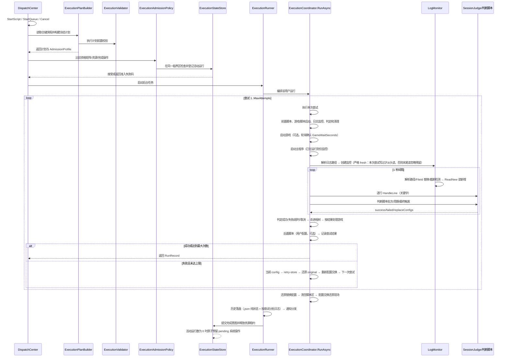
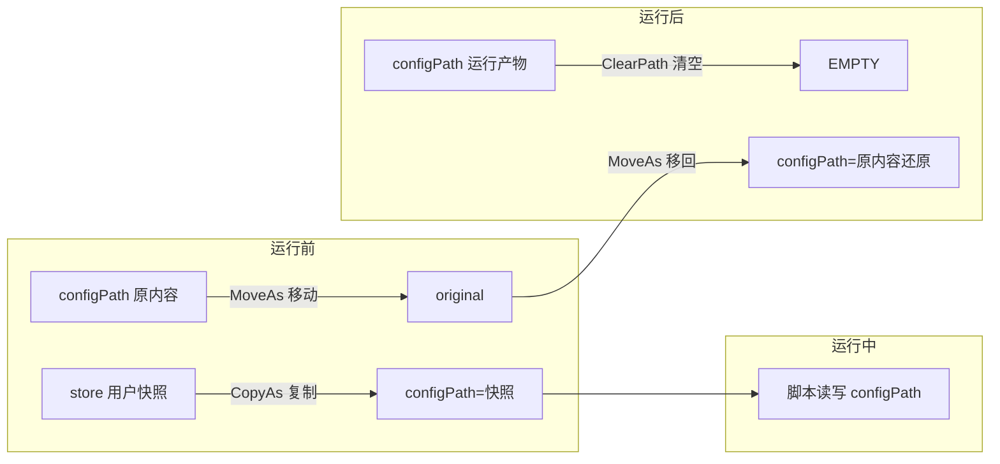
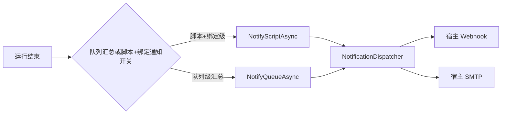

# NexusPipeline（枢链）核心设计说明

> 本文档解释 NexusPipeline 的**设计理念**与**核心功能运行的具体步骤**：机制为什么这样设计、运行时会发生什么。
> 开发者导航（模块边界/依赖方向/扩展落点）见 [ARCHITECTURE.md](ARCHITECTURE.md)；版本历史见 [CHANGELOG.md](../CHANGELOG.md)；用户操作说明见 [README.md](../README.md)。

---

## 目录

1. [设计理念](#1-设计理念)
2. [核心概念](#2-核心概念)
3. [核心运行流程](#3-核心运行流程)
   - [3.5 MCP Agent 控制面](#35-mcp-agent-控制面)
4. [配置交换机制](#4-配置交换机制)
5. [完成判定机制](#5-完成判定机制)
6. [日志监控机制](#6-日志监控机制)
7. [通知与数据落盘](#7-通知与数据落盘)
8. [已知行为与边界](#8-已知行为与边界)
9. [相关文档](#9-相关文档)

---

## 1. 设计理念

NexusPipeline 定位为**本地游戏自动化脚本管家**：一个常驻托盘的 Windows 服务，代替用户按计划启动/重试/关闭任意外部脚本（exe / bat / cmd 等），并管理多账号配置、判定脚本运行结果、推送通知。核心理念：

- **本地优先、少外部依赖**：所有产品能力内置于单个 exe（.NET 8 WinForms 托盘 + HttpListener + 零构建静态 Web UI）。不依赖云平台、数据库或前端构建环境；发布物为框架依赖的单文件，运行机器需安装 .NET 8 Desktop Runtime。
- **直接接管脚本进程**：宿主以管理员身份创建进程、捕获输出、监控日志、强制清理进程树，脚本自身无需任何改造；bat 经 `cmd /d /s /c` 包装以规避 ShellExecute 弹窗陷阱。
- **多用户配置隔离（配置交换）**：全局用户通过脚本绑定参与多个脚本实例；每个绑定各存一份配置快照，运行前把绑定快照交换到 configPath，运行后还原现场。数据保全序：**original（原配置）> config（运行时生效）> store（用户快照，可重建）**。
- **判定交给用户**：运行结果由「完成判定」驱动——优先判断脚本（用户自写 JS/Python，专用插件判定由插件固化脚本驱动），其次成功/失败关键字；未配置任何判定时按「进程自行退出」判成功。判定输入为**本次尝试日志段**，跨尝试互不污染。
- **日志即真相**：宿主通过监控脚本**日志文件**判定运行状态，不只看进程退出码，因此日志监控对文件「重建/截断/追加」三种形态都必须可靠；同路径文件替换使用**文件身份（FileId）检测**，避免旧句柄继续指向已归档文件。
- **失败可重试、崩溃可自愈**：每次尝试失败按 `MaxAttempts` 自动重试；判断脚本可返回 `replaceConfigs` 替换配置后再试；配置交换用 `.session` 标记 + swap-backup 双保险，宿主启动时或后台延迟自动还原。
- **可扩展插件**：managed-code 插件通过独立 `NexusPipeline.Plugin.Abstractions` Plugin API v1.4 使用宿主通用用户数据、声明式 UI、作用域数据、历史展示、插件 Web API、用户列表徽章、用户运行事件、HTTP、日志、通知和调度端口；启用且兼容的插件可通过独立 Frontend API 1.2 加载同源 ES module/CSS，扩展页面路由、导航、slot、主题、服务端同步壁纸和运行画面 sidecar；专项插件继续采用**数据化目录形态**（`plugin.json` + `data/` 推导配置与判断脚本），数据 capability 通过 `capabilities` key 登记，旧 `supportsEmulator` 继续兼容。
- **插件分发与运行解耦**：插件仓库以固定官方 `catalog.json` 提供版本和 SHA256，安装包在本地完成校验后以 pending 事务跨重启交换；宿主更新只替换宿主文件，用户插件目录持续保留。
- **宿主网络出口可控**：外部 HTTP 请求统一经过可即时读取设置的网络出口，支持无代理、系统代理和自定义 HTTP/HTTPS 代理；本机控制面、MCP、SMTP 与插件子进程保持原有网络边界。

## 2. 核心概念

| 概念 | 说明 |
|---|---|
| 脚本实例（ScriptInstance） | 一次可运行的脚本单元：主程序/参数/根目录/配置路径/日志路径/游戏配置/运行设置；参与运行的用户由全局用户绑定解析 |
| 全局用户（NexusUser） | 具有稳定 `UserId` 的账号实体：可改用户名、全局优先级、头像和插件用户设置；可绑定多个脚本实例 |
| 用户脚本绑定（UserScriptBinding） | 用户与脚本的运行关系：参与运行开关、配置快照、前置/后置脚本、用户通知开关和 SMTP 收件人覆盖 |
| 调度队列（DispatchQueue） | 按 Index 顺序链式执行一组脚本实例（每实例内仍按用户串行）；可定时/启动时自动运行，结束可执行完成操作 |
| 尝试（RunAttempt） | 一次尝试 = 一次完整的进程启动→监控→判定→清理；失败按 MaxAttempts 重试 |
| 运行（RunRecord） | 一次「脚本实例 × 全局用户绑定」的完整运行（含全部尝试），落盘历史（.json 纯状态 + 按尝试分批日志） |
| 运行状态（RunSession） | 一次运行的状态/元数据对象；不再承担完整流程，流程由 `ExecutionCoordinator` 编排 |
| 执行计划（ScriptExecutionPlan / QueueExecutionPlan） | 从仓储快照构建并冻结本次脚本/队列的任务、脚本、用户、资源和完成操作描述；运行期间不回读共享仓储 |
| 执行准入 profile（ExecutionAdmissionProfile） | 描述脚本/队列的并行分类、资源集合和完成操作；队列分类在计划创建时固定 |
| 执行门禁（ExecutionValidator） | 执行前的脚本/队列/用户/进程冲突与限制校验；不创建运行任务 |
| 执行准入策略（ExecutionAdmissionPolicy） | 纯逻辑比较资格矩阵、重复目标、资源冲突、完成操作兼容性和待执行系统操作 |
| 执行状态存储（ExecutionStateStore） | 在同一临界区完成准入检查、活动运行登记、profile 资源租约释放和完成意图协调 |
| 执行运行器（ExecutionRunner） | 负责后台脚本/队列生命周期、用户串行、历史落盘、通知和完成意图提交 |
| 系统操作执行器（SystemActionExecutor） | 负责运行组空闲后的完成操作 arm、真实 60 秒倒计时与取消 |
| 尝试执行 | `ExecutionCoordinator` 直接承接前/后置脚本、脚本监控、判定和资源清理调用 |
| 完成判定（SessionJudge） | 判断脚本/关键字两模式的判定状态机，每尝试独立实例 |
| 运行预算（RunBudget） | 贯穿一次完整运行的总超时预算；重试、前置/后置脚本和命令超时共享剩余时间 |
| 配置交换（ConfigSwap） | 运行前 configPath ↔ 用户快照的交换机制（见第 4 节） |
| 配置事务（ConfigurationTransaction） | 封装 prepare/retry/sync/replace/rollback 原语；保持现有 ConfigSwap 磁盘协议 |
| 配置运行作用域（ConfigRunSession） | 编排一次运行的事务动作并固定最终收尾顺序 |
| 日志监控（LogMonitor） | 对脚本日志文件的增量读取器，支持追加/截断/替换三种文件形态（见第 6 节） |
| 插件 capability | 与插件身份/元数据分离的可查询能力；C# 按接口注册，数据化插件按 key 登记 |
| 插件仓库 catalog | 固定官方源发布的插件索引；客户端校验 schema、名称、SemVer、宿主兼容性、包 URL、大小和 SHA256 |
| 插件 pending 事务 | 插件包下载并校验后写入 staging 与 `pending.json`，下次启动在插件扫描前完成安装、更新或卸载 |
| 宿主外部 HTTP 出口 | 依据 `ProxyMode` 选择无代理、系统代理或自定义代理；外部请求读取最新设置，loopback 强制直连 |
| 执行应用端口（IExecutionService / IFrozenQueueExecutionService） | Web、Scheduler 与常驻服务 CLI 通道共享的启动/取消入口，由 `DispatchCenter` 直接实现 |
| 控制面（Control API） | 常驻服务拥有运行时数据与执行状态；Web、CLI、manage 通过本机 HTTP 控制 API 提交查询与变更 |

## 3. 核心运行流程

### 3.1 脚本运行完整链路

一次「脚本实例 × 用户」的运行由 `ExecutionRunner` 驱动。入口先由 `ExecutionPlanBuilder` 从仓储快照构建计划，再经 `ExecutionValidator` 完成运行前校验；`DispatchCenter` 将计划 profile 交给 `ExecutionStateStore`，由 `ExecutionAdmissionPolicy` 在同一临界区完成资格矩阵、资源租约和完成操作兼容性判断。通过后由 `ExecutionCoordinator.RunAsync` 编排，队列、手动和 CLI 入口均直接汇聚到 `DispatchCenter`；`RunSession` 只保存状态，单次尝试由协调器直接执行：



**分步细节（ExecutionCoordinator 单次尝试流程内）：**

1. **前置检查**：`IsScriptRunning` 检测运行时启动目标是否已在运行（按解析后的进程名，含自重启产物兜底）；已运行 → 先按启动目标强制结束并确认退出，再重新启动监管。
2. **启动游戏（可选）**：`LaunchGame=true` 且已填游戏路径时，校验可执行 → 启动（bat 经 cmd 包装并接管输出）→ 每 1 秒轮询 `GameWaitSeconds` 秒确认进程出现 → 超时本次尝试失败。未填写路径则跳过并提示。
3. **启动主程序**：`ResolveLaunchTarget` 解析运行时启动目标（Args 以显式路径开头时=管理端/执行端分离场景，`?` 后为参数）→ CreateProcess 重定向 stdio（无窗口）→ bat 自动 `cmd /d /s /c` 包装（规避 0x800700E8）→ 740（要求管理员）明确报错、禁止降级提权。
4. **日志监控初始化**：脚本启动后按 `LogPath` 格式严格解析（`LogPattern.ResolveFile`，文件不存在返回 null）；文件存在时按**尝试开始前长度快照**判定：尝试开始前不存在的文件从头读，已有残留从尝试开始时长度续读；残留被启动后追加写也不会进入判定输入——无松弛窗口，忽略运行前已有内容。
5. **监控循环（每 1 秒）**：
   - 重新解析日志路径；路径变化（日期轮换/通配取新）→ 重新监控；
   - 同路径文件被**替换**（move 归档后重建/删除重建，`LogMonitor.FileReplaced` 对比卷序列号+文件索引）→ 重开从头读；
   - 文件被**截断**（`ReadNew` 检测 `Length < position`）→ 部分截断（缩短未归零）从新文件尾续读，避免已读旧行重复进入判定；长度归零从头重读；
    - 读取新增内容 → 逐行送入判定（关键字）→ 追加运行日志与 UI 日志。
6. **判定分支**：
   - 失败关键字命中 → 立即终止本次尝试（杀进程树）；
   - 成功关键字命中 → 等待脚本自行退出（最多 60 秒，超时杀进程仍判成功）；
   - 判断脚本模式 → 批次触发/周期触发/最终触发（见第 5 节）；
   - 无任何判定且进程退出 → 按「进程自行退出」判定成功（未配置判定时）；配置了判定但无命中 → 失败。
7. **超时**：启动后 `LogStallTimeoutMinutes` 无任何日志条目、或日志超过该时长无更新、或未找到日志文件 → 失败；`RunBudget` 集中计算 `TotalTimeoutMinutes` 的 elapsed/remaining，按**整个运行（含全部重试与前置/后置脚本）**计时，超时判定失败且不再重试；判断脚本执行仍保持独立 30 秒上限。
8. **尝试结束清理**：`RunAttemptFinalizer` 统一承载进程树清理和游戏/模拟器策略（Toolhelp 快照 + BFS 逐进程强杀，**与 `GameExe` 同名的进程树排除在外**、生杀归游戏管理）；**任务失败时无条件强制结束游戏进程**；成功时按 `ForceCloseGame` 设置决定是否关闭游戏。
9. **重试**：失败且未达 `MaxAttempts` → 将最终 config 保存到运行期 `retry-store`，恢复 original 真实现场，再重新执行完整配置交换；每尝试独立 LogMonitor 与 SessionJudge；判断脚本返回的 `replaceConfigs` 在**尝试收尾、杀进程确认退出后**应用，供下一轮工作快照使用。
10. **运行收尾（finally）**：`ConfigRunSession` 固定执行自动更新配置收尾同步（config → store 全量镜像，仅开关开时）→ 还原配置替换（swap-backup → config）→ 清空判断脚本目录 → 配置交换还原现场（original → config）。同步先于插队还原与配置交换还原，确保 store 看到脚本最终态，同时避免恢复动作覆盖用户快照。

### 3.2 队列执行链路


- 队列任务按 `Index` 升序；每脚本实例内按**全局用户顺序过滤出已启用绑定**后串行轮换；队列之间按准入矩阵并行，任一用户取消则中断当前队列后续任务。
- 队列任务数大于零、全部引用可解析脚本实例、每个脚本 `GameMode == "emulator"`、ADB 端点格式有效且专项插件声明支持模拟器时归类为 `EmulatorOnly`；任意数量 `EmulatorOnly` 可并行，最多一个 `Standard` 队列。空队列、缺失引用、无效端点和其他无法证明为纯模拟器的情况归类为 `Standard`。
- 独立脚本不占用 `Standard` 队列名额，但与队列共同申请脚本 ID、用户数据键、解析后的启动目标、进程基名、配置路径、日志路径模式、前/后置脚本可执行文件和模拟器 ADB 端点资源租约；同一资源或配置父子路径冲突时准入失败，无法证明日志模式互不重叠时按冲突处理。
- 队列级汇总通知只在 `queue.NotifyEnabled=true` 时发送；用户级脚本通知须同时满足 `script.NotifyEnabled=true` 与 `binding.NotifyEnabled=true`，SMTP 收件人为空时继承全局设置。
- 脚本实例绑定的数据化专项插件缺失、类型不匹配或运行态不可用时，前端显示状态徽章并收紧脚本编辑、用户配置和队列任务入口；运行入口保留队列生命周期，写入错误日志与失败历史后跳过该脚本实例，继续处理队列中的后续任务。
- 专项插件可用性门禁在 Application Command 层统一执行：`UserCommands` 的现代与兼容绑定新增/编辑、`ScriptCommands`、配置编辑和队列写入共享同一策略；门禁在配置快照和持久化之前完成。解除绑定、删除脚本和从队列移除任务等清理操作保持可用。
- `ExecutionValidator` 发现专项插件不可用时保留执行计划创建路径，由 `ExecutionRunner` 记录失败历史、写入可读原因并跳过脚本；队列后续任务继续执行。插件启停和安装更新仍按重启后生效的生命周期约定处理。
- 完成操作（退出/休眠/重启/关机）以完成意图提交；第一个非 `none` 意图提交时并行运行组立即进入 `Closing`，后续脚本、队列和 `none` 完成操作队列均不得加入；只有全部活动运行释放后才创建 pending action，执行或取消后才重新开放。相同操作合并，存在不同非空操作时由准入策略拒绝；任务失败仍照常提交完成意图，取消队列跳过。休眠/重启/关机执行前 Web 界面显示 60 秒倒计时卡片可取消（重启/关机走 Windows 倒计时 `shutdown /t 60`，`shutdown /a` 取消；休眠走应用内 60 秒延迟，取消后不执行；倒计时为真实墙钟不随测试时间加速缩放；exit 退出软件立即执行不可取消）。

并行准入发生在 `ExecutionStateStore` 的同一临界区：先检查 pending 系统操作和运行组状态，再由 `ExecutionAdmissionPolicy` 比较队列类别、资源集合与完成操作，最后同时登记 `RunningExecution` 和 profile。执行计划、队列与脚本快照和涉及配置数据的破坏性 CRUD 共享协调域；配置/用户数据正在被活动执行引用时，Web 返回 HTTP 409 及稳定冲突码。执行释放时移除 profile 租约并追加完成意图；最后一个活动运行释放时原子创建 pending 系统操作，新的启动在 pending 清除或取消前保持拒绝。

### 3.3 手动执行脚本

- 指定用户：只运行该用户；未指定：按启用用户顺序全部运行一次。
- 冲突检查：脚本启动目标已在运行时沿用既有进程检测；脚本和队列入口统一走资源租约准入，队列计划中的已运行脚本或与活动执行共享脚本/进程/配置/模拟器端点资源时返回准入错误。
- 取消：`Cancel` 通过 CancellationToken 中断当前尝试（杀进程树）并标记 cancelled，后续任务不再执行。

### 3.4 统一控制面与 CLI

常驻服务是运行时数据、执行状态和持久化写入的拥有者。Web 请求、正式 CLI 和 `manage` 交互菜单都通过同一组 `/api/*` 控制端点进入服务，服务内部继续复用 `DispatchCenter`、`ConfigEditCommands`、执行准入、配置交换和各资源的持久化事务。CLI 进程只承担参数解析、目标解析、请求发送和结果格式化，不持有第二套配置写入路径。

正式 CLI 的协议边界如下：

- 命令采用 `status`、`script`、`user`、`queue`、`run`、`history`、`settings`、`plugin`、`update`、`maintenance` 和 `system-action` 等 noun/subcommand；`run-script`、`run-queue`、`cancel` 等旧入口继续作为兼容别名。
- 复杂 payload 统一使用 `--file <json 文件>` 或 `--file -`（标准输入），避免把领域对象拆成大量命令行开关。
- `user global-settings` 管理用户的 General、Notification、Advanced BindingOverrides；`plugin store` 管理官方插件仓库事务；`plugin user-settings` 管理通用插件用户设置贡献，命令均通过 Control API 复用宿主服务。
- `--json` 输出稳定 envelope；标准输出只承载协议数据，连接诊断和运行进度转到标准错误。退出码按参数/校验、找不到或歧义、资源冲突、服务不可用、禁止、执行失败、取消/超时和内部错误分层。
- 目标解析先按大小写不敏感的完整 ID 匹配，再按大小写不敏感的唯一名称匹配；名称匹配不唯一时保留候选 ID 并返回 `ambiguous_target`，禁止静默选择首项。
- Control API 服务发现只接受 `/api/status` 返回的 `service=NexusPipeline`、`controlApiVersion=1` 和 `1024–65535` 范围内的 `actualPort`；状态、CRUD 与运行轮询使用短请求超时，通知测试和更新检查使用长同步超时。

轻量模式仍启动 Control API，监听地址固定为 `127.0.0.1`，仅关闭静态 Web UI 与浏览器自动打开。这样命令行自动拉起服务、脚本化调用和本机管理菜单在轻量模式下仍共享同一运行时状态。

### 3.5 MCP Agent 控制面

v0.10.5 在同一个 `nexus-pipeline.exe` 进程内嵌 MCP Server。现有 `HttpListener` 继续承载 Web UI 与 Control API，MCP 使用官方 `ModelContextProtocol.AspNetCore` 的 Streamable HTTP transport，端点为：

```text
http://127.0.0.1:<McpPort>/mcp
```

MCP 的启动条件和运行语义如下：

- `McpEnabled` 默认关闭；关闭时进程不创建 MCP Kestrel listener。
- `McpPort` 默认 `58732`，有效范围为 `1024–65535`。端口是 Agent 配置的一部分，发生占用时记录错误并保持 MCP 不可用，Control API 继续工作，端口不会自动漂移。
- `LightweightMode` 保留 Control API；MCP 是否启动仍由 `McpEnabled` 独立决定，Web UI 继续关闭。
- 宿主停止时按 MCP → Scheduler/恢复任务 → Web → 插件的顺序执行清理；MCP 停止异常只记录诊断，不阻断其余清理步骤。

工具按风险分层。只读工具读取状态、脚本、用户、用户全局设置、绑定、队列、运行、历史、插件、插件商店和脱敏插件设置；常规变更工具提交运行/取消、资源 CRUD、安全设置白名单更新、商店 catalog 刷新和非敏感插件设置；`McpAllowDestructiveTools` 默认关闭，只有显式开启并重启服务后才注册删除、密钥、插件开关、插件安装/更新/卸载、服务重启、应用更新和遗留数据清理工具。工具元数据和调用前的应用策略同时参与风险控制，队列完成后的休眠、重启、关机、退出等系统操作保持由本地管理路径配置。

v0.10.6 对 MCP 控制面采用以下行为契约：

- NexusPipeline 信任同一台计算机上的本机进程；loopback、Host、Origin 与请求体限制用于网络和网页边界，MCP 不增加本机进程认证令牌或 SID 鉴权。
- `McpAllowDestructiveTools` 是 Agent 工具分类与产品护栏，不承担执行沙箱职责，也不改变通用脚本可执行目标的既有产品能力。
- `run_queue` 在提交执行前复核队列快照的 `CompletionAction`；任何非 `none` 动作都返回稳定的 `dangerous_completion_action`，既有 Web/本地队列仍可按本地设置执行完成操作。
- 服务重启统一经过 `HostRestartCoordinator`：接受请求时由 `ExecutionStateStore` 原子取得 `HostMaintenanceLease`，租约立即冻结新的运行、配置编辑和宿主配置写入；子进程拉起失败释放租约，子进程已拉起后租约持续到旧进程退出。
- `/api/settings/test` 的通知失败使用非 2xx 与 `notification_test_failed`；CLI 根据服务端错误码生成失败 envelope 和非零退出码。
- `/api/status` 是 Control API 的身份握手，包含 `service=NexusPipeline` 与 `controlApiVersion=1`，CLI 不接受缺少身份或端口越界的其他 HTTP 2xx 响应。
- `list_plugins`、`/api/plugins` 和 `/api/status` 使用共享 `PluginManagementView`，统一表达 schema 2 的 `artifactName`、展示元数据、替换关系、商店归属和 pending 事务；插件详情通过专用 detail API 提供 README 与完整更新记录。
- 插件用户全局设置通过现有声明式 contribution contract 提供通用读取、字段校验和写入；读取时 `secret` 只返回 `configured`，MCP 的 `set/clear` 需要敏感操作授权。
- 执行预览端点按插件声明的 `execution-preview-client`、启用状态和前端存在进行准入，宿主继续负责当前运行目标与截图采集。

MCP 适配层只接收类型化参数，经过 `McpToolContext` 解析稳定 ID/唯一名称，再进入 Application Commands 和已有核心服务。它不复用 Web handler 或 CLI 路由，也不提供万能 CLI/API/shell 工具。运行类调用立即返回 `runId`，Agent 通过 `get_run` 轮询活动或最近完成的运行；业务错误保留在结构化工具结果内：

```json
{
  "ok": false,
  "errorCode": "resource_busy",
  "errorMessage": "脚本正在运行，无法修改",
  "candidates": [],
  "data": null
}
```

MCP 的网络边界独立于 Web 的远程访问设置：Kestrel 只监听 loopback，Host 仅允许 `127.0.0.1`、`localhost` 和 `::1`，Origin 必须为相同 loopback 主机与 MCP 端口，请求体上限为 2 MiB。`get_settings` 对 Webhook、SMTP 和访问令牌只返回空值或 `enc:***` 占位符；secret mutation 只接受显式高风险工具，值经过既有 DPAPI 存储且不会进入返回值或 `Audit.Mcp` 日志。

## 4. 配置交换机制

### 4.1 数据目录

```
data/{脚本Id}/{UserId}/
├── store/          用户配置快照（添加用户时从 configPath 复制；运行后可自动更新回写，任务完成记录/计数保留延续；可重建）
├── store.previous/ 上一份完整用户快照（自动更新事务保留，崩溃恢复用）
├── store.tmp       自动更新事务临时目录
├── retry-store/    当前运行重试轮临时快照，不等同于用户永久 store
├── original/       运行前 configPath 原内容（移动进来，运行后移回；崩溃恢复保底）
├── script/         判断脚本工作目录（运行期间可读写，结束后清空）
├── swap-backup/    配置替换备份（首次替换前复制原文件 + .meta 清单）
├── edit-hidden/    编辑会话隐藏配置暂存（编辑期间 config 同目录其他配置暂移至此，会话结束/重启恢复时移回）
└── .session        会话标记（崩溃恢复用）
```

`NexusUser.Id` 是配置数据目录、运行期配置交换和恢复扫描的唯一存储键；`NexusUser.Name` 仅用于展示与旧 API 的用户查找。旧用户名目录属于惰性遗留，运行和恢复均跳过，兼容 API 先按 Name 解析当前全局用户，再使用解析出的 UserId 访问数据。磁盘 `.session` 的 `UserName` 字段继续承载该存储键，以保持已有现场可读。

### 4.2 运行前（PrepareForRun）与运行后（RestoreAfterRun）



1. **运行前**：`.session` 标记先行写入 → configPath 内容整体**移动**到 original → store 快照**复制**回 configPath（运行生效配置）。任一步失败自动回滚并还原现场。
2. **运行后**：清空 configPath（删除运行产物）→ original **移动**还原 → 清除标记。
3. **编辑配置**复用同一机制（PrepareForEdit/CommitEdit/CancelEdit），运行与编辑经 `ScriptConfigGate` 互斥。

### 4.3 插队替换配置（replaceConfigs）

- 判断脚本返回 `failed` + `replaceConfigs`（相对 script 目录路径）时：宿主把 script 目录内对应文件复制覆盖到 config 对应位置；替换在**尝试收尾、杀进程确认退出后应用**，避免进程仍持有配置文件时出现文件占用或半写窗口。**首次替换前**备份原文件到 swap-backup（`.meta` 记录 configPath 与新增文件清单）。
- config 为单文件时，replaceConfigs 项必须等于该文件名（忽略大小写）才允许替换。
- 本次尝试失败后先将最终 config 保存到 retry-store，恢复 original 真实现场，再重新执行完整配置交换加载下一轮；可多轮替换，计入 MaxAttempts。
- 运行结束从 swap-backup 还原全部被替换文件、删除替换期间新增的文件、清空 script 目录（有用户时配置交换亦还原，备份为双保险）。

### 4.4 崩溃恢复（自愈）

- **启动恢复（RecoverInterrupted）**：扫描全部残留 `.session` 标记与 swap-backup，自动还原；原配置区为空时，编辑会话生成的模板由 `GeneratedTemplate` 驱动 `DoRestore` 清理，非模板会话只清除标记并保留未改变的现场。
- **后台延迟重试**：还原失败（文件被孤儿进程占用）时进入待办队列，每 10 秒重试直至成功或进程退出。
- 数据保全序保证：任何时刻崩溃（含移动配置前后）都可从 original 完整还原现场。
- **数据目录命名迁移**：启动恢复前将旧残留目录名迁移到当前名称（`config`→`store`、`cache`→`original`、`edit-hide`→`edit-hidden`、`replace-backup`→`swap-backup`），迁移幂等，目标名已存在时跳过。
- **Missing 形态还原**：`DoRestore` 在 original 为空且原形态为 Missing（运行/编辑前 config 位置不存在）时，删除会话期间在 config 位置产生的文件/目录，恢复为“不存在”；删除失败则保留标记交由自愈/后台重试。
- **收尾顺序**：运行收尾固定为「杀脚本进程并确认退出 → 按设置处理游戏进程 → 配置交换还原」，确保还原前进程已完全退出。

### 4.5 自动更新配置：config → store 反向同步

`ScriptInstance.AutoUpdateConfig`（**默认开**，专项脚本由后端强制恒开）允许运行产生的配置更改（任务完成记录、运行计数和脚本新增任务）**反向同步回用户快照 store**（config → store 全量镜像），供下次运行延续。同步先写入 `store.tmp`，成功后将旧快照保留为 `store.previous`，再以目录移动完成替换。

**触发时机**：

| 时机 | 条件 | 说明 |
|---|---|---|
| ① 首次检测 | 运行开始 `ScaledSeconds(15)` 后主监控循环内**一次性**同步，`attempt.Number==1` 才执行 | 捕获脚本启动后自行更新的任务配置；**关/开模式共有**；并入主循环避免与收尾还原竞态；前置稳定性双采样（两次采样不一致 = 脚本仍在写 → 跳过，等待下次运行） |
| ② 收尾同步 | 每次运行收尾（成功/失败/达最大次数/**cancelled**/总超时）在 finally 中执行 | 仅 `AutoUpdateConfig=true`；config 此刻为脚本最终态；在**插队还原与配置交换还原之前**执行 |

**同步语义**（`UserConfigManager.SyncConfigToStore` → `ConfigSwapSession`，`WithSwapLock` 内）：

- **事务化全量镜像**：先复制 config → store.tmp（全部文件），复制期间源配置变化则放弃本次同步；成功后将旧 store 移动为 store.previous，再将 store.tmp 移动为 store，避免逐文件写入造成混合快照。
- **插队文件（swap-backup/.meta 清单内）**：有还原描述（`script/config-restore.json`）时**先还原任务启停为初始值再写入**（初始启停 + 运行后计数/其他字段，供下次运行延续）；无还原描述时从旧 store 保留原文件，不写入插队编排产物。
- **还原描述契约**（专项判断脚本首次触发时写入，跨尝试只写一次，随 `CleanupScriptArea` 清空；宿主仅执行不解析插件语义）：`{"files":[{"file":"相对config路径","toggles":[{"type":"array","path":"instances[id=main].tasks","keyField":"id","enabledField":"enabled","initial":{...}}|{"type":"map","path":"TaskEnabledList","initial":{...}}]}]}`——array 按 keyField 匹配 initial 设 enabledField（**未覆盖元素不动**）、map 逐键设布尔（**未覆盖键不动**）；路径 DSL 支持 `标识符[下标].标识符` 与 `标识符[key=value].标识符`。契约全文见 `PLUGIN_API.md`「配置还原描述」。

**守护机制**（防止坏态写入并污染快照）：

1. **会话有效性**：`.session` 存在且 Phase=run 才同步（防 15s 首次检测与收尾还原的时序异常）。
2. **内容有效性**：config 缺失/为空/文件数骤降一半以上 → 跳过；明确 JSON 内容执行语法校验，非 JSON 文本不强行解析；解析失败视为脚本被杀瞬间半写 → 跳过整个同步，保留旧快照。
3. **稳定性检查**：短间隔两次采样不一致，或复制期间源配置再次变化（脚本或外部守护进程仍在写）→ 放弃本次事务，保留旧快照。
4. 同步失败仅告警，**不阻断**收尾还原；临时目录清理失败或旧快照替换失败时保留 `store.tmp`/`store.previous`，下次启动恢复。

**与既有机制的关系**：收尾顺序固定为「自动更新同步 → 插队还原（swap-backup → config）→ 配置交换还原（original → config）」——同步读的是脚本最终态，插队/交换还原在同步之后把 config 还原为运行前现场；store 则保留同步后的「启停还原 + 计数延续」内容供下次运行。

## 5. 完成判定机制

### 5.1 判定优先级

判断脚本（启用即优先，忽略关键字）→ 成功/失败关键字（组内逗号 AND——整个尝试日志中分别出现即命中，跨行累积且顺序无关；换行 OR）→ 无任何配置按「进程自行退出」判定成功。

> **专用插件判定**：专项脚本实例的判断脚本由插件固化（`ApplyProfile` 保存时覆盖 `JudgeScriptEnabled/Language/JudgeScript`，用户不可编辑），判定走脚本模式，同时强制清空自定义关键字字段。

### 5.2 判断脚本输入与触发

- **输入 JSON**：脚本字段 + 用户 + `config`（运行时生效配置，只读）与 `script` 目录（可读写）全递归文件清单 + `scriptDir` + **本次尝试日志段**（按尝试切片，上次尝试的失败/成功行不跨尝试污染判定；超过 4MB 仅提供尾部并置 `logTruncated=true`）。
- **触发时机**：① 每次日志新增批次触发一次（串行不叠加）；② 日志阻塞（进程存活、已有日志但 30 秒无新内容）周期触发一次（不重置无更新超时）；③ 主进程退出且本次尝试无判定结果时**最终触发一次**（日志超时/未找到日志文件失败路径同样补最终触发，判断脚本可借此返回替换配置再重试）。
- **输出契约**：stdout 尾行 JSON `{"status":"success|failed","reason":"必填","notifyText":"可选","replaceConfigs":[...]}`；无输出/非 JSON/缺字段 = 继续运行；单次执行 30 秒上限；执行错误 = 警告 + 继续运行。
- **边界**：JS 内置 Jint 引擎（`nexus.readFile` 限 config/script 范围、单文件 2MB；`nexus.writeFile` 防 `../` 与绝对路径逃逸；无 Node 库）；Python 用系统 `python.exe`（`sys.argv[1]` 输入 JSON 路径）。

### 5.3 判断脚本信任边界

判断脚本是**用户自己编写并配置**的代码，宿主把它当作**可信用户域**执行：

- 契约上 config 目录**只读**、script 目录**可读写**——JS 引擎在宿主内强制执行（`nexus.readFile` 白名单 + `nexus.writeFile` 防逃逸）；**Python 解释器是独立系统进程，这些读写边界无法在技术上强制**，只以文档契约为准（信任边界，非缺陷）。
- 判断脚本能观测的是：脚本字段（快照）、用户、config/script 文件清单、本次尝试日志段；能影响的是：判定结果、通知正文、`replaceConfigs` 配置替换。超出这些的能力一律不会提供给解释器执行环境。
- 判断脚本运行在可信网络中、避免在脚本中处理敏感数据，是用户的职责；宿主不把 Python 解释器当作沙箱。

### 5.4 关键字模式

- 成功/失败关键字：每行一组，组内逗号分隔为 AND、换行之间为 OR；失败命中立即终止本次尝试，成功命中等待退出 60 秒。无任何配置时按「进程自行退出」判定成功。
- 专用插件判定：判断脚本由插件固化（用户不可编辑，前端专项弹窗不渲染自定义完成标志区；后端 `ApplyProfile` 兜底清空关键字字段），判定完全由插件固化判断脚本驱动。

## 6. 日志监控机制

### 6.1 日志路径解析（LogPattern.ResolveFile）

- 严格按用户给出的格式匹配：目录 → 目录内最新文件（旧配置兼容）；无占位符无通配 → 精确文件；`{YYYY-MM-DD}` 等日期占位符 → 当天精确匹配；`*` 通配 → 目录内通配取最新修改。**禁止格式外猜测**；文件不存在返回 null。

### 6.2 增量读取与三种文件形态

LogMonitor 持有文件句柄（`FileShare.ReadWrite | FileShare.Delete`）按 position 增量读取：

| 文件形态 | 场景 | 检测机制 | 处理 |
|---|---|---|---|
| 追加 | 脚本持续写入 | 正常 ReadNew | 增量读取 |
| 截断 | `type nul > log.txt` / 脚本自清空 | `_stream.Length < _position` | 部分截断（缩短未归零）从新文件尾续读，避免已读旧行重复进入判定；长度归零从头重读 |
| **替换** | move 归档后重建 / 删除重建 | `FileReplaced`：`GetFileInformationByHandle` 对比**卷序列号+文件索引（FileId）**；FileId 不可用时回退创建时间 | 重开文件从头读 |

- **为什么不用创建时间（FileStamp）单独检测替换**：move+重建后新文件的 CreationTime 可能与旧文件相同，单独依赖它会让监控句柄继续指向已改名的旧文件。FileId 能区分同路径下的不同文件；能力不可用时再回退创建时间。
- **忽略运行前已有内容**：尝试开始前记录日志文件快照（存在性 + 长度）；不存在的文件从头读，已有残留从尝试开始时长度续读，残留内容不进入判定输入与运行日志。
- **监控循环检测顺序**：路径变化（轮换）→ FileId 替换 → 截断 → 读新增。

### 6.3 超时语义

- `LogStallTimeoutMinutes`：启动后未产生任何日志条目 / 日志超过该时长无更新 / 配置了日志路径但未找到文件 → 本次尝试失败。
- `TotalTimeoutMinutes`：按**整个运行**（含全部重试与前置/后置脚本）计时，超时判定失败且不再重试。

## 7. 通知与数据落盘

### 7.1 通知分发



- **用户脚本级**：实例开启通知且绑定开启用户通知后，在最终运行阶段（一次成功/多次尝试后成功/多次失败后）发送该用户运行状态；SMTP 收件人按绑定级覆盖或继承全局设置。
- **队列级**：队列开启通知后忽略实例级，统一在队列结束后汇总发送所有脚本状态（`· {ScriptName}：成功（...）/失败（...）`，按 record.Status 非 FinalStatus）。
- 判断脚本返回的 `notifyText` 替换脚本级通知正文（`CustomNotifyText`，不落盘）；队列级汇总不使用。
- 多通道并存（内置 Webhook/SMTP 独立开关并行），单通道异常隔离不阻塞；密钥 DPAPI 加密（`enc:` 前缀）存 settings.json。

### 7.2 历史与日志落盘

- 每次「脚本实例 × 全局用户绑定」运行结束保存（纯状态 + 按尝试分批日志）：
  - `history/YYYY-MM-DD/HH-mm-ss.json`：**纯运行状态**（PascalCase，Attempts/FinalStatus/每次尝试详情（含各尝试 `LogFile` 引用）等，**不含任何日志内容**；同秒冲突加 `-1` 后缀）；
  - `history/YYYY-MM-DD/HH-mm-ss-{尝试号}.log`：**每次尝试一个独立日志文件**，保存脚本日志全文（20MB 截断；空日志写「（未配置日志路径或未监控到脚本日志）」兜底）——重试失败按尝试分批标号，排查清晰；
  - 控制台输出（stdout/stderr）**不再落盘**（运行中实时显示仍保留）；历史详情按尝试展示各日志文件尾部。
- `FinalStatus`：success（一次成功且日志无错误关键字）/ partial（重试>1 或日志含 ERROR|错误|异常|失败）/ failed / cancelled。
- `PluginHistory`：运行落盘前由已注册插件生成的纯文本展示快照；单贡献 16 KiB、单次运行总量 64 KiB，插件异常不会影响运行结果，卸载插件后历史仍保留快照。
- 保留天数 `HistoryRetentionDays`（默认 7）每日清理一次（启动时 + 调度器每日首次 tick）；上限由 `config/limits.json` 的 `MaxHistoryRetentionDays` 约束（默认 180、允许 1-365）；管理器日志 `logs/nexus-pipeline-YYYY-MM-DD.log` 同样按保留天数清理。
- 审计行 `[审计] 来源 | 操作（详情）`，来源 web/manage/cli/scheduler/system；`GET /api/status` 轮询豁免不记录。

### 7.3 插件仓库与安装事务

官方插件源固定为 `FlappiBakuse/NexusPipeline-Plugins`。每个正式插件目录维护 `plugin.json`（运行时事实）与 `store.json`（商店展示元数据），仓库工具据此生成根目录 `catalog.json`。schemaVersion 2 的 manifest 必须使用小写 kebab-case 机器 ID，并声明严格区分大小写的 `artifactName`；源码目录、宿主安装目录、发行目录和 ZIP 名称均使用 artifactName，配置、密钥、作用域和偏好仍使用机器 ID。catalog 条目包含名称、正式 artifactName、显示信息、SemVer、插件类型、最低宿主版本、官方 raw 包地址、包大小、SHA256 和最近更新记录；需要更换机器标识的插件额外声明 `replaces`。客户端对 catalog 做 schema、重复名称、artifactName、官方 URL、版本、大小、SHA256、changelog 和 replacement 唯一性校验，并将最近成功目录缓存到 `.nxp/state/plugins/catalog-cache.json`。宿主保留 catalog 作为高效索引，新增插件由自身 manifest/store 驱动生成。

插件页默认显示「插件仓库」，提供浏览、安装、更新和卸载；「本地插件」继续显示当前运行目录的分组与启停状态。仓库请求在内存缓存有效期内复用结果；过期请求失败时显示经校验的磁盘缓存并标记为 stale，没有可用缓存则返回仓库不可用状态。

插件安装/更新按以下顺序执行：

1. 从 catalog 下载包，限制响应大小并校验声明大小与 SHA256；
2. 将 ZIP 解压到 `.nxp/state/plugins/staging/`，拒绝绝对路径、`..`、重复条目、越界路径和超过资源上限的压缩内容；
3. 检查根 `plugin.json` 与 catalog 的名称、artifactName、版本、类型、API 和 capability 一致，并验证数据插件文件或 managed-code 入口程序集存在；
4. 写入带有机器 ID、artifactName 和来源物理目录名的 `pending.json`，返回“重启后生效”；
5. 下次启动按“完成旧 pending 事务 → 迁移旧插件物理布局 → 升级 pending/ownership 状态 → `PluginManager.LoadAll`”的顺序执行。`PluginInstallRecovery` 使用 artifactName 进行目录交换，声明 `replaces` 时同时迁移旧插件配置、密钥、作用域和插件偏好。交换前失败会恢复旧插件，交换完成后的 journal 可幂等重试；同一 artifact 存在多个大小写目录时保留全部现场并暂停相关自动安装/更新。

插件状态持久化在 `.nxp/state/plugins/`：`catalog-cache.json` 为目录缓存，`ownership.json` 为商店安装版本和 SHA 归属，`pending.json` 为跨重启事务，`staging/` 与 `backup/` 为操作现场。卸载只依赖本地插件目录和归属记录，catalog 暂不可用时仍可创建卸载事务；本地已安装但已从 catalog 移除的插件以 `unlisted` 状态保留卸载入口。现有用户 `plugins/` 在 v0.10.7 → v0.10.8 升级时保留；宿主更新器只交换 exe 与 `wwwroot/`。

插件配置、密钥和作用域 JSON 解析失败时保留 `.corrupt-<timestamp>-<guid>` 现场，再以空值继续运行；后续写入不会覆盖原始损坏文件。managed-code 生命周期初始化、启动和停止均有 20 秒截止时间；用户运行事件在插件作用域中跟踪，并在清理时执行有界排空。

managed-code 插件可以通过 Plugin API v1.4 注册用户列表徽章、通用 UI 贡献、作用域数据、插件 Web API 和历史展示。宿主通过 `GET /api/plugin-contributions/user-list-badges` 一次读取全部用户的聚合展示数据，按插件贡献提供的顺序投影并校验；用户列表不理解具体插件业务，单个处理器异常也不会阻断其他用户或插件的徽章读取。插件徽章读取应使用本地状态，不能在列表请求中执行网络签到。Frontend API 1.2 插件以 `web/` 下的 ES module/CSS 扩展页面；启用且兼容的插件会直接加载前端资源。外观服务由 `AppearanceService` 提供服务端同步配置和壁纸文件，插件前端通过 `host.appearance.wallpaperStore` 访问；运行预览服务由宿主按活动执行目标提供，前端通过 sidecar slot 展示。

### 7.4 宿主代理设置与网络边界

设置页提供三个代理模式：

| 模式 | 宿主外部 HTTP 行为 |
|---|---|
| `none` | 直接连接 |
| `system` | 使用 Windows `HttpClientHandler` 的系统代理设置 |
| `http` | 使用设置中的 HTTP/HTTPS 代理地址，可附带用户名和 DPAPI 加密密码 |

`OutboundHttpClientProvider` 为每次请求按当前设置创建 client，因此保存代理后新请求立即读取新配置。插件 catalog、插件包、软件更新和 Webhook 统一使用该出口；SMTP、Control API、MCP、本地 loopback 请求和插件子进程保持各自网络行为。localhost、`127.0.0.1` 与 `::1` 始终直连。设置 API 只返回代理密码占位符，密码不会进入界面响应、审计详情或日志。

### 7.5 运行状态目录与旧布局迁移

正常服务运行产生的三类内部状态集中在安装目录下的 `.nxp/`：

```text
.nxp/
├── runtime/
│   ├── service.pid
│   └── web.port
└── state/
    ├── scheduler-state.json
    └── recovery/                    # 新旧状态冲突时保留旧文件
```

`service.pid` 与 `web.port` 是可重建的 ephemeral runtime metadata；服务正常退出时清理，旧根目录标记在取得单实例互斥体后作为 stale marker 删除。`scheduler-state.json` 保存定时 occurrence、重试状态、冻结队列计划及恢复所需快照，属于 internal durable runtime state，不按缓存处理。

升级自旧布局时，`RuntimeStateLayout` 在服务获得单实例 ownership 后执行幂等迁移：旧 scheduler state 且新文件不存在时用同卷原子移动；新旧同时存在时新位置保持权威，旧文件移动到 `.nxp/state/recovery/scheduler-state.legacy-conflict-<timestamp>.json`，任何一份数据都不会静默覆盖。迁移失败保留旧现场，后续启动继续重试。CLI 端口发现保留新路径、旧根目录和配置端口漂移的读取顺序一个版本周期。

`.nxp-update/`、`.nxp-backup/`、`.nxp-version` 与根目录 update worker 继续作为更新 crash-recovery protocol 的组成部分，保持原路径和生命周期。

## 8. 已知行为与边界

以下行为属**设计语义**（如实记录，非缺陷）：

1. **配置交换清除运行产物**：运行结束时 `DoRestore` 清空 configPath 再还原现场，**运行期间脚本写入 configPath 内的文件（含脚本日志文件）会被删除**。日志文件的安全保存依赖宿主历史落盘（.json + 按尝试分批 .log），脚本自身文件请避免放在 configPath 内。自动更新配置开启时，脚本写入的任务完成记录/运行计数/新增任务会在收尾同步进用户快照 store；配置本体仍还原为运行前现场，但快照内容延续到下次运行（详见 4.5）。
2. **同一用户尝试间的日志残留**：配置还原只在**整个运行结束**时执行，尝试之间 log.txt 保留（监控已按末尾读+严格 fresh 处理，无害）。
3. **配置 JSON 无事务锁**：服务运行期间不建议另一个实例同时修改配置。
4. **定时触发为每分钟秒级检测**：服务在该分钟内处于运行状态即可触发，错过整点不补跑；触发时通过统一计划与准入流程。重复目标、标准队列占用、资源冲突、pending 系统操作和运行组收尾等瞬时准入冲突进入待重试触发，资源释放后继续尝试；计划校验失败和完成操作不兼容等永久错误消费本次触发并记录失败。
5. **生产与测试权限分层**：正式版构建使用 requireAdministrator，普通用户启动正式程序返回权限错误（exit 2）；开机自启为计划任务（onlogon + highest）。`codex` UI/System Smoke 使用 `NexusTestHost=true` 的隔离 Test Host，服务、API、进程与更新事务以本地反馈语义运行；`admin` UI/System Smoke 使用生产 release，并在 Administrator / High Integrity 或 System Integrity 下由 GitHub CI 验证真实门禁。两种模式共享业务断言，运行模式由统一测试入口显式选择。
6. **远程访问**：默认仅绑定 `127.0.0.1`；开启后绑定 `http://+:{port}/`（禁止 `0.0.0.0`），远程请求须 `Authorization: Bearer <token>`，自动添加防火墙入站规则；局域网设备须用本机局域网 IP 访问。
7. **进程名检测的权衡**：`IsExeRunning` 按进程名（不含扩展名）检测，同名无关进程可能误报（防重复启动的保守权衡）；bat 经 cmd 包装无法按名检测，直接放行。
8. **判断脚本输入为本次尝试日志段**：跨尝试的失败/成功行不进入判定输入；如确需跨尝试信息，请通过 `script` 目录的持久文件自行记录。

### 8.1 已接受的设计约束

以下行为经审计确认为**既定语义**，保持现状并以文档/测试锁死，不按缺陷修复：

| 项 | 语义 | 锁死方式 |
|---|---|---|
| 判断脚本（尤其 Python）可读写边界无法技术强制 | 信任边界：config 只读 + script 可读写以契约约束，宿主不把解释器当沙箱（见 §5.3） | 文档 §5.3 |
| 定时触发为秒级 tick，跨整点/休眠错过不补跑 | 该分钟内处于运行状态即可触发，错过即错过 | 文档 §8 第 4 条 + L1 测试 `ScheduledTrigger_DoesNotBackfillMissedOccurrence` |
| `IsExeRunning` 按进程名检测同名进程可能误报 | 保守优先：宁可误报防重复启动 | 文档 §8 第 7 条 |
| 通知单通道失败仅告警不阻断 | 一通道异常不影响其余通道与运行流程 | 文档 §7.1 + 既有测试 |
| 首次配置同步在运行开始约 15 秒后执行一次 | 关闭自动更新时也执行首次检测；收尾同步仅在自动更新开启时执行 | `RunSession.ShouldRunFirstSync` 与配置同步回归测试 |
| 快速失败可能错过首次配置同步 | 自动更新开启时由收尾同步兜底；关闭时不产生收尾快照 | 运行时序约束与配置同步测试 |

## 9. 相关文档

- [README.md](../README.md)：用户文档（功能、安装、快速上手、常见问题）
- [ARCHITECTURE.md](ARCHITECTURE.md)：开发者导航（模块边界、依赖方向、扩展落点）
- [DEVELOPMENT.md](DEVELOPMENT.md)：开发环境搭建与调试指南（编译、运行、Debug）
- [RELEASING.md](RELEASING.md)：发布流程手册（tag / release / 资产）
- [CONTRIBUTING.md](../CONTRIBUTING.md)：协作规范（Issue / PR / 提交信息 / 测试流程）
- [ROADMAP.md](ROADMAP.md)：版本路线与后续开发清单
- [KNOWN_ISSUES.md](KNOWN_ISSUES.md)：已知问题台账
- [CHANGELOG.md](../CHANGELOG.md)：版本历史
- [PLUGIN_API.md](PLUGIN_API.md)：专项插件（数据化形态）开发指南
- [NexusPipeline-Plugins 前端插件指南](https://github.com/FlappiBakuse/NexusPipeline-Plugins/blob/main/docs/FRONTEND_PLUGIN.md)：Frontend API 模块、UI slot、主题和发布包约定
