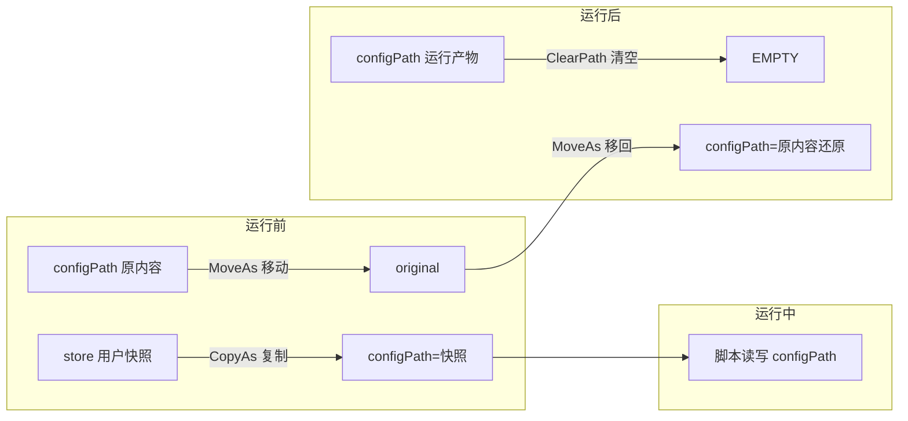

# 配置编辑与交换

## 配置会话边界


## 运行时目录与快照

```
data/{脚本Id}/{UserId}/
├── store/            唯一权威用户配置快照（可重建）
├── store-meta.json   快照归属元数据（schema/generation、配置定位/形态与 profile 指纹）
├── .session          会话主标记（崩溃恢复用）
├── .session.bak      会话冗余标记（主标记损坏时使用）
└── work/             会话与增量事务工作区
    ├── original/       运行前 configPath 原内容（移动进来，运行后移回；崩溃恢复保底）
    ├── script/         判断脚本工作目录（运行期间可读写，结束后清空）
    ├── swap-backup/    配置替换备份（首次替换前复制原文件 + .meta 清单）
    ├── edit-isolation/ 编辑事务候选隔离区（文件/目录候选原现场与会话清单按条目保存）
    └── store-txn/      增量快照事务（manifest、stage、rollback、commit）
```

`store/` 是空闲态唯一的完整持久快照；运行期间由于外部 `configPath` 可能位于不同磁盘，允许同时存在 `store/` 与实际被脚本使用的 `configPath`。增量事务只在 `work/store-txn/` 暂存本轮新增/变更文件及被替换/删除文件的 rollback 副本，成功提交后清理。启动维护只清理当前协议产生的空闲工作目录和运行时 staging；遇到当前协议之外的目录、字段或事务现场时保留现场并记录告警，不猜测其含义。升级前请备份整个 NexusPipeline 数据目录，尤其是配置、历史、用户数据和自定义插件。

通用判断脚本属于宿主配置资产，路径为 `config/judge-scripts/<scriptId>.js|py`。源码通过临时文件原子替换；脚本实例删除、语言切换和未引用资产会进入 `orphaned/` 隔离目录。专项判断脚本保留在插件目录，由 `PluginType + RootPath` 解析当前 profile。

运行期截图保存在内存中的 `RunScreenshotStore`；每次 Attempt 独立保留最多 8 张，超出后按 FIFO 淘汰。PC 游戏目标在运行期间由宿主以约 1 秒间隔维护一张最近有效的原分辨率 JPEG 帧，缓存最多保留 2 秒且只属于当前 Attempt。截图请求先尝试当前游戏窗口；窗口已消失或当前进程句柄不可用时，若最近帧仍在有效期内则直接使用该帧。缓存只存在内存中，运行结束释放，不增加关闭游戏前的等待或抢拍阶段。运行收尾时，当前各 Attempt 保留的截图与 JSON、Attempt 日志一起写入独立运行目录：

```text
history/YYYY-MM-DD/<用户昵称>/<脚本实例名称>-<HH-mm-ss>/
├── HH-mm-ss.json
├── HH-mm-ss-1.log
├── HH-mm-ss-1-s1.jpg
└── HH-mm-ss-2-s1.jpg
```

`NexusUser.Id` 是配置数据目录、运行期配置交换和恢复扫描的唯一存储键；`NexusUser.Name` 用于展示和当前用户查找。配置交换会话使用当前全局用户绑定的 ID 目录，磁盘 `.session` 的 `UserId` 字段记录会话所属用户。

附加配置路径使用冻结的路径与文件/目录形态参与会话；宿主在修改前写入 manifest，并以 stage、backup、commit 事务完成快照交换。准备失败、启动中断或收尾失败时按 manifest 恢复，无法确认归属的现场保留并告警。历史详情中的受保护图片由前端通过带认证的 Blob 请求加载，Object URL 随弹窗关闭释放。


## 运行前后交换与编辑



1. **运行前**：store 快照为空且 configPath 存在时，先把现场配置**复制**为初始快照 → `.session` 主/备标记先行写入 → configPath 内容整体**移动**到 original → store 快照**复制**回 configPath（运行生效配置）。当前 profile 的配置定位或文件/目录形态与 `store-meta.json` 不一致时，新位置缺失会阻断本次运行并保留旧快照；新位置存在时按当前配置重新建立唯一 store、更新当前元数据，不跨配置定位复用旧快照内容。
2. **运行后**：清空 configPath（删除运行产物）→ original **移动**还原 → 清除标记。
3. **编辑配置**：有快照时复用交换机制（PrepareForEdit/CommitEdit/CancelEdit）；无快照的首次编辑须显式选择方式。`fresh` 按插件声明确定新配置输入，候选原现场进入 `work/edit-isolation`，目标软件在空目标上生成配置；`reuse` 将全部候选原现场进入隔离区，再把选中候选复制为工作副本。编辑期间的附加配置进入 `original-extra` 并复制为工作副本，保存时写入 `store-extra`。done、cancel 和崩溃恢复都会按 `.session` 清单还原主配置、兄弟候选和附加现场；fresh 输入及首次 reuse 选中的候选输入均在主快照成功提交后写入用户绑定，取消或失败不会锁定候选。运行与编辑经 `ScriptConfigGate` 互斥。

数据化专项插件可声明 `configEdit` 与 `configEditor`。编辑器脚本在目标软件启动前执行，读取 `nexus.input.mode`、`configInputName`、`configInputValue` 和附加工作副本；主配置根保持受限只读，脚本异常或超时会使准备失败并触发回滚。

编辑会话启动的可见进程绑定专属 Job Object，并保存启动时的 PID、StartTimeUtc 和映像身份。Web UI 启动编辑请求时临时在浏览器标题加入随机 token，宿主捕获包含该 token 的本机顶层窗口及其所有者身份；编辑程序出现首个可见 GUI 窗口后，宿主再次校验浏览器 HWND、所有者 PID、StartTimeUtc 和映像身份，并用 `SetWindowPos(HWND_BOTTOM)` 后置该浏览器窗口。窗口 token 缺失、身份变化或系统调用失败时，编辑流程继续执行。完成、取消、自然退出、启动异常、恢复扫描和服务关闭都会取消窗口后置任务并等待其结束；该行为不改变运行阶段的游戏窗口前置能力。编辑收尾优先使用 Job Object 加身份确认的快速清理路径；Job 不可用、进程脱离或检测到同名进程身份变化时，回退为按已捕获身份清理并保留稳定退出确认，不把其他用户打开的同名窗口纳入目标。

配置路径的准备步骤按声明顺序执行；任一路径失败时，宿主逆序还原本次已准备路径并阻断运行，避免主配置在附加配置不完整时启动。运行前写入的会话标记同时覆盖主配置与附加配置现场。


## 失败尝试的配置替换

- 判断脚本返回 `failed` + `replaceConfigs`（相对 script 目录路径）时：宿主把 script 目录内对应文件复制覆盖到 config 对应位置；替换在**尝试收尾、杀进程确认退出后应用**，避免进程仍持有配置文件时出现文件占用或半写窗口。**首次替换前**备份原文件到 swap-backup（`.meta` 记录 configPath 与新增文件清单）。
- config 为单文件时，replaceConfigs 项必须等于该文件名（忽略大小写）才允许替换。
- 本次尝试失败后，进程确认退出即可直接复用当前活动 config；`replaceConfigs` 在下一次尝试开始前继续应用。
- 运行结束从 swap-backup 还原全部被替换文件、删除替换期间新增的文件、清空 script 目录（有用户时配置交换亦还原，备份为双保险）。


## 运行结果同步到快照

`ScriptInstance.AutoUpdateConfig`（**默认开**，专项脚本由后端强制恒开）允许运行产生的配置更改（任务完成记录、运行计数和脚本新增任务）**反向同步回用户快照 store**（config → store 按文件差异同步），供下次运行延续。空闲态只保留一份完整 store；同步期间在 `work/store-txn/` 只暂存变更文件与 rollback 副本。

**触发时机**：

| 时机 | 条件 | 说明 |
|---|---|---|
| ① 首次检测 | 运行开始 `ScaledSeconds(15)` 后主监控循环内**一次性**同步，`attempt.Number==1` 才执行 | 捕获脚本启动后自行更新的任务配置；**关/开模式共有**；并入主循环避免与收尾还原竞态；前置稳定性双采样（两次采样不一致 = 脚本仍在写 → 跳过，等待下次运行） |
| ② 收尾同步 | 每次运行收尾（成功/失败/达最大次数/**cancelled**/总超时）在 finally 中执行 | 仅 `AutoUpdateConfig=true`；config 此刻为脚本最终态；在**插队还原与配置交换还原之前**执行 |

**同步语义**（`UserConfigManager.SyncConfigToStore` → `ConfigSwapSession`，`WithSwapLock` 内）：

- **增量事务**：先扫描 config 与 store 建立 O(N) 差异清单，只把新增/变更文件写入 `stage/`，把将被替换/删除的旧文件写入 `rollback/`，再写入 manifest；逐文件提交后写 `commit.json`，最后更新 generation 元数据。未变化文件始终保留在原 store 中。
- **插队文件（swap-backup/.meta 清单内）**：有还原描述（`script/config-restore.json`）时**先还原任务启停为初始值再写入**（初始启停 + 运行后计数/其他字段，供下次运行延续）；无还原描述时从旧 store 保留原文件，不写入插队编排产物。
- **还原描述契约**（专项判断脚本首次触发时写入，跨尝试只写一次，随 `CleanupScriptArea` 清空；宿主仅执行不解析插件语义）：`{"files":[{"file":"相对config路径","toggles":[{"type":"array","path":"instances[id=main].tasks","keyField":"id","enabledField":"enabled","initial":{...}}|{"type":"map","path":"TaskEnabledList","initial":{...}}|{"type":"boolArray","path":"TASK_ORDER_GROUP.ALL_PIPELINES[0].TASK_ONOFF","initial":[...]}]}]}`——array 按 keyField 匹配 initial 设 enabledField（**未覆盖元素不动**）、map 逐键设布尔（**未覆盖键不动**）、boolArray 按下标还原布尔数组（短于 initial 视为失败）；路径 DSL 支持 `标识符[下标].标识符` 与 `标识符[key=value].标识符`。契约全文见 [Plugin API 数据化契约](../reference/plugin-api/data-specialized.md) 的「配置还原描述」。

**守护机制**（防止坏态写入并污染快照）：

1. **会话有效性**：`.session` 存在且 Phase=run 才同步（防 15s 首次检测与收尾还原的时序异常）。
2. **内容有效性**：config 缺失/为空/文件数骤降一半以上 → 跳过；明确 JSON 内容执行语法校验，非 JSON 文本不强行解析；解析失败视为脚本被杀瞬间半写 → 跳过整个同步，保留旧快照。
3. **稳定性检查**：短间隔两次采样不一致，或复制期间源配置再次变化（脚本或外部守护进程仍在写）→ 放弃本次事务，保留旧快照。
4. 同步失败仅告警，**不阻断**收尾还原；未写入 commit 标记的事务下次启动按 manifest 回滚，已写入 commit 标记的事务补写下一代元数据后清理；manifest/commit 损坏时保留 store 与隔离现场并阻断继续写入，等待人工核查。

**与既有机制的关系**：收尾顺序固定为「自动更新同步 → 插队还原（swap-backup → config）→ 配置交换还原（original → config）」——同步读的是脚本最终态，插队/交换还原在同步之后把 config 还原为运行前现场；store 则保留同步后的「启停还原 + 计数延续」内容供下次运行。
