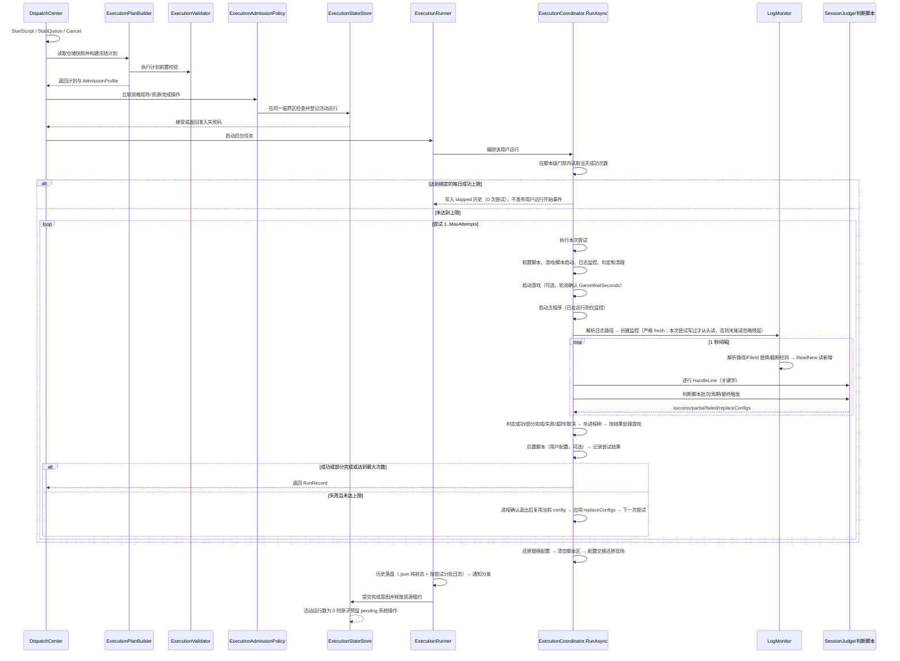

# 执行与资源生命周期

## 核心运行流程

专项任务的每次主执行尝试在前置脚本之后再次检查当前配置。若首次检查阻断，任务报告没有执行尝试；若第一次已实际执行、准备重试也已通过，但下一次检查才阻断，历史保留第一次的任务事实和最终业务状态，并附上本次准入停止信息。被阻断的轮次没有第二次主程序执行；该轮若运行了用户前置脚本，其日志与停止记录仍保留。

### 脚本运行完整链路

一次「脚本实例 × 用户」的运行由 `ExecutionRunner` 驱动。入口先由 `ExecutionPlanBuilder` 从仓储快照构建计划，再经 `ExecutionValidator` 完成运行前校验；`DispatchCenter` 将计划 profile 交给 `ExecutionStateStore`，由 `ExecutionAdmissionPolicy` 在同一临界区完成资格矩阵、资源租约和完成操作兼容性判断。通过后由 `ExecutionCoordinator.RunAsync` 编排，队列、手动和 CLI 入口均直接汇聚到 `DispatchCenter`；`RunSession` 只保存状态，单次尝试由协调器直接执行：

**分步细节（ExecutionCoordinator 单次尝试流程内）：**

1. **前置检查**：`IsScriptRunning` 检测运行时启动目标是否已在运行（按解析后的进程名，含自重启产物兜底）；已运行 → 先按启动目标强制结束并确认退出，再重新启动监管。
2. **启动游戏（可选）**：`LaunchGame=true` 且已填游戏路径时，校验可执行 → 启动（bat 经 cmd 包装并接管输出）→ 每 1 秒轮询 `GameWaitSeconds` 秒确认进程出现 → 超时本次尝试失败。未填写路径则跳过并提示。
3. **启动主程序**：`ResolveLaunchTarget` 解析运行时启动目标（Args 以显式路径开头时=管理端/执行端分离场景，`?` 后为参数）→ CreateProcess 重定向 stdio（无窗口）→ bat 自动 `cmd /d /s /c` 包装（规避 0x800700E8）→ 740（要求管理员）明确报错、禁止降级提权。
4. **日志监控初始化**：脚本启动后按 `LogPath` 格式严格解析（`LogPattern.ResolveFile`，文件不存在返回 null）；文件存在时按**尝试开始前长度快照**判定：尝试开始前不存在的文件从头读，已有残留从尝试开始时长度续读；残留被启动后追加写也不会进入判定输入——无松弛窗口，忽略运行前已有内容。
5. **监控循环（每 1 秒）**：
   - 重新解析日志路径；路径变化（日期轮换/通配取新）→ 重新监控；
   - 同路径文件被**替换**（move 归档后重建/删除重建，`LogMonitor.FileReplaced` 对比卷序列号+文件索引）→ 重开从头读；
   - 文件被**截断**（`ReadNew` 检测 `Length < position`）→ 部分截断（缩短未归零）从新文件尾续读，避免已读旧行重复进入判定；长度归零从头重读；
    - 读取新增内容 → 逐行送入判定（关键字）→ 追加运行日志与 UI 日志。
6. **判定分支**：
   - 失败关键字命中 → 立即终止本次尝试（杀进程树）；
   - 成功关键字命中 → 等待脚本自行退出（最多 60 秒，超时杀进程仍判成功）；
   - 判断脚本模式 → 批次触发/周期触发/最终触发（见[完成判定](judgement-logs.md#完成判定)），可得到 success 或 partial；
   - 无任何判定且进程退出 → 按「进程自行退出」判定成功（未配置判定时）；配置了判定但无命中 → 失败。
7. **超时**：`LogStallTimeoutMinutes=-1` 时跳过日志无更新超时检查，其余有效值在启动后无任何日志条目、日志超过该时长无更新或未找到日志文件时判定失败；`RunBudget` 集中计算 `TotalTimeoutMinutes` 的 elapsed/remaining，按**整个运行（含全部重试与前置/后置脚本）**计时，`TotalTimeoutMinutes=-1` 时不设总时长上限，其余有效值到时判定失败且不再重试；判断脚本执行仍保持独立 30 秒上限。
8. **尝试结束清理**：`RunAttemptFinalizer` 统一承载进程树清理和游戏/模拟器策略（Toolhelp 快照 + BFS 逐进程强杀，**与 `GameExe` 同名的进程树排除在外**、生杀归游戏管理）；**任务失败时无条件强制结束游戏进程**；成功或部分完成时按 `ForceCloseGame` 设置决定是否关闭游戏。
9. **重试**：失败且未达 `MaxAttempts` → 进程确认退出后继续复用当前活动 `config`，在下一轮开始前应用判断脚本返回的 `replaceConfigs`；每次尝试仍独立 LogMonitor 与 SessionJudge。
10. **运行收尾（finally）**：`ConfigRunSession` 固定执行自动更新配置收尾同步（按文件差异写入 store，仅开关开时）→ 还原配置替换（swap-backup → config）→ 清空判断脚本目录 → 配置交换还原现场（original → config）。同步先于插队还原与配置交换还原，确保 store 看到脚本最终态，同时避免恢复动作覆盖用户快照。

### 手动执行脚本

- 指定用户：只运行该用户；未指定：按启用用户顺序全部运行一次。
- 冲突检查：脚本启动目标已在运行时沿用既有进程检测；脚本和队列入口统一走资源租约准入，队列计划中的已运行脚本或与活动执行共享脚本/进程/配置/模拟器端点资源时返回准入错误。
- 取消：`Cancel` 通过 CancellationToken 中断当前尝试（杀进程树）并标记 cancelled，后续任务不再执行。
