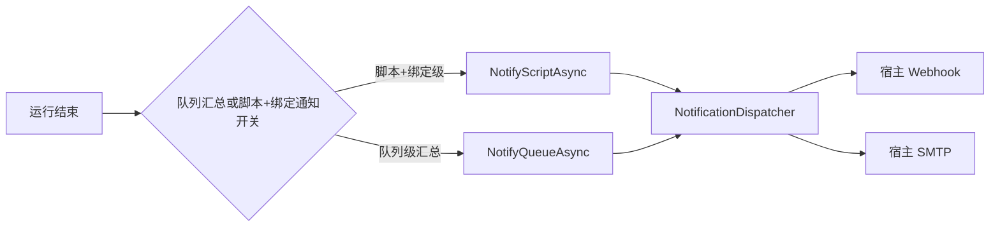

# 通知与可观测性

### 7.1 通知分发

- **用户脚本级**：有效绑定开启用户通知后，在最终运行阶段（一次成功/多次尝试后成功/部分完成/多次失败后/已跳过）发送该用户运行状态；SMTP 收件人按绑定级覆盖或继承全局设置。
- **队列级**：队列开启通知后，在队列结束时汇总发送所有脚本状态（`· {ScriptName}：成功（...）/部分完成（...）/失败（...）/已跳过（...）`，按 `record.Status`）。
- 判断脚本返回的 `notifyText` 替换脚本级通知正文（`CustomNotifyText`，不落盘）；`notifyScreenshotId` 选择最终 Attempt 的脚本级通知附图，单个 Attempt 的截图池最多 8 张且 FIFO 淘汰；队列级汇总不使用运行截图。
- 多通道并存（内置 Webhook/SMTP 独立开关并行），单通道异常隔离不阻塞；密钥 DPAPI 加密（`enc:` 前缀）存 settings.json。
- Webhook 截图由全局开关控制；Discord 支持 multipart 附件，企业微信支持图片消息，飞书、钉钉和 Slack 使用各自的最小应用级上传凭据，Generic 通过模板图片占位符接入。SMTP 截图作为 JPEG MIME 附件发送。

### 7.4 宿主代理设置与网络边界

设置页提供三个代理模式：

| 模式 | 宿主外部 HTTP 行为 |
|---|---|
| `none` | 直接连接 |
| `system` | 使用 Windows `HttpClientHandler` 的系统代理设置 |
| `http` | 使用设置中的 HTTP/HTTPS 代理地址，可附带用户名和 DPAPI 加密密码 |

`OutboundHttpClientProvider` 为每次请求按当前设置创建 client，因此保存代理后新请求立即读取新配置。插件 catalog、插件包、软件更新和 Webhook 统一使用该出口；SMTP、Control API、MCP、本地 loopback 请求和插件子进程保持各自网络行为。localhost、`127.0.0.1` 与 `::1` 始终直连。设置 API 只返回代理密码占位符，密码不会进入界面响应、审计详情或日志。
