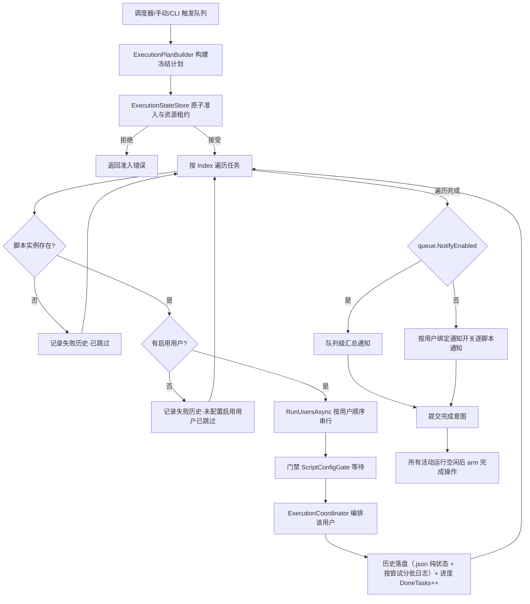

# 调度与去重

### 3.2 队列执行链路

- 队列任务保存时按 `Index` 升序对 `ScriptInstanceId` 去重，同一脚本实例只保留排序列表中的第一项；运行时按任务顺序执行，每脚本实例内按**全局用户顺序过滤出已启用绑定**后串行轮换；队列之间按准入矩阵并行，任一用户取消则中断当前队列后续任务。
- 队列定时列表保存时按列表顺序处理；同一启用状态且执行时间相同的定时列表合并星期选择并集，保留排序列表中的第一项，后续重复项移除。
- 调度中心启用实时画面时，日志卡片与实时画面卡片共享拉伸高度并对齐上下边界；日志最小高度跟随实时画面卡片最小高度，最大高度为该最小高度的 2.5 倍。
- 运行观察通过 `GET /api/events` 提供 SSE：服务端使用 Bearer 认证、15 秒注释心跳和每连接 256 项有界队列；连接断开或队列溢出时前端回到 `/api/status` 同步，运行日志按 200ms 窗口批量发布并在每个运行结束前刷出尾批次。
- SSE 使用 `event` 字段承载 `run.status`、`run.log`、`system.action`、`host.status`、`stream.ready` 和 `stream.missed`，数据统一为 `{schemaVersion, sequence, timestamp, data}`；事件总线不执行网络写入，也不保留 replay journal，前端按运行 ID 与日志序列去重。
- 队列任务数大于零、全部引用可解析脚本实例、每个脚本 `GameMode == "emulator"`、ADB 端点格式有效且专项插件声明支持模拟器时归类为 `EmulatorOnly`；任意数量 `EmulatorOnly` 可并行，最多一个 `Standard` 队列。空队列、缺失引用、无效端点和其他无法证明为纯模拟器的情况归类为 `Standard`。
- 独立脚本不占用 `Standard` 队列名额，但与队列共同申请脚本 ID、用户数据键、解析后的启动目标、进程基名、配置路径、日志路径模式、前/后置脚本可执行文件和模拟器 ADB 端点资源租约；同一资源或配置父子路径冲突时准入失败，无法证明日志模式互不重叠时按冲突处理。
- 队列级汇总通知只在 `queue.NotifyEnabled=true` 时发送；用户级脚本通知由有效绑定的 `binding.NotifyEnabled=true` 决定，SMTP 收件人为空时继承全局设置。
- 有效绑定的 `MaxSuccessfulRunsPerDay=-1` 表示不限制；达到正数上限后，在脚本级配置门禁内写入 `skipped` 历史，记录 0 次尝试，不发布用户运行开始事件，也不计入成功次数；只有 `success` 记录计入成功次数，`partial`、失败、取消和已跳过记录均不计入。
- 脚本实例绑定的数据化专项插件缺失、类型不匹配或运行态不可用时，前端显示状态徽章并收紧脚本编辑、用户配置和队列任务入口；运行入口保留队列生命周期，写入错误日志与失败历史后跳过该脚本实例，继续处理队列中的后续任务。
- 专项插件可用性门禁在 Application Command 层统一执行：`UserCommands` 的绑定新增/编辑、`ScriptCommands`、配置编辑和队列写入共享同一策略；门禁在配置快照和持久化之前完成。解除绑定、删除脚本和从队列移除任务等清理操作保持可用。
- `ExecutionValidator` 发现专项插件不可用时保留执行计划创建路径，由 `ExecutionRunner` 记录失败历史、写入可读原因并跳过脚本；队列后续任务继续执行。插件启停和安装更新仍按重启后生效的生命周期约定处理。
- 完成操作（退出/休眠/重启/关机）以完成意图提交；第一个非 `none` 意图提交时并行运行组立即进入 `Closing`，后续脚本、队列和 `none` 完成操作队列均不得加入；只有全部活动运行释放后才创建 pending action，执行或取消后才重新开放。相同操作合并，存在不同非空操作时由准入策略拒绝；任务失败仍照常提交完成意图，取消队列跳过。休眠/重启/关机执行前 Web 界面显示 60 秒倒计时卡片可取消（重启/关机走 Windows 倒计时 `shutdown /t 60`，`shutdown /a` 取消；休眠走应用内 60 秒延迟，取消后不执行；倒计时为真实墙钟不随测试时间加速缩放；exit 退出软件立即执行不可取消）。

并行准入发生在 `ExecutionStateStore` 的同一临界区：先检查 pending 系统操作和运行组状态，再由 `ExecutionAdmissionPolicy` 比较队列类别、资源集合与完成操作，最后同时登记 `RunningExecution` 和 profile。执行计划、队列与脚本快照和涉及配置数据的破坏性 CRUD 共享协调域；配置/用户数据正在被活动执行引用时，Web 返回 HTTP 409 及稳定冲突码。执行释放时移除 profile 租约并追加完成意图；最后一个活动运行释放时原子创建 pending 系统操作，新的启动在 pending 清除或取消前保持拒绝。
